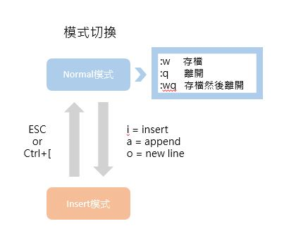

# 📝 期末作業
## 📖 簡介
>主題 : kilo<br>
>作者 : 劉怡謙<br>
>學號 : 110810519<br>
>作品 : 本程式修改自Salvatore Sanfilippo github 專案，並非100%原創，在我理解後加上註解，但是因為我還沒辦法完全理解，故只有部分註解，其餘部分我會在理解後補上<br>
>介紹 : Kilo 是一個不到 1K 行代碼的小型編輯器，由 Salvatore Sanfilippo aka antirez 編寫，並在 BSD 2 條款許可下發布<br>
>授權申明 : 
>>* [kilo.c LICENSE](https://github.com/antirez/kilo/blob/master/LICENSE)
>>* [My_LICENSE](LICENSE.md)

## 📖 文字編輯器 : 下面以Vim作為介紹
* Vim 是 Git 的預設編輯器
* Vim 主要常用的有幾個模式：Normal 模式以及 Insert 模式
### 🔖 操作說明如下：

1. Normal 模式，又稱命令模式，在這個模式下，無法輸入文字，僅能進行複製、貼上、存檔或離開動作
2. 要開始輸入文字，需要先按下 `i`、`a` 或 `o` 這三個鍵其中一個進入 Insert 模式，便能開始打字。其中，`i` 表示 `insert`，`a` 表示 `append`，而 `o` 則是表示會新增一行並開始輸入
3. 在 Insert 模式下，按下 `ESC` 鍵或是 `Ctrl + [` 組合鍵，可退回至 Normal 模式<br>
4. 在 Normal 模式下，按下 `:w` 會進行存檔，按下 `:q` 會關閉這個檔案（但若未存檔會提示先存檔再離開），而 `:wq` 則是存檔完成後直接關閉這個檔案
### 🔖 指令說明如下：
#### 👉 編輯模式 ：
| 指令 | 說明 |
| ---- | ---- |
| i | 在游標位置進入編輯模式 |
| I | 在游標行的第一個非空白字元進入編輯模式 |
| a | 在游標位置後進入編輯模式 |
| A | 在游標行的最後一個字元進入編輯模式 |
| o | 向下新增一行，並進入編輯模式 |
| O | 向上新增一行，並進入編輯模式 |
| cc | 刪除游標行，並進入編輯模式 |
| `ESC` | 取消指令或退出編輯模式 |
#### 👉 游標移動 ：
| 指令 | 說明 |
| ---- | ---- |
| gg | 移到第一行 |
| I | 移到最後一行 |
| G | 移動到第 n 行 |
| 行數 → G | 在游標行的最後一個字元進入編輯模式 |
| 0 | 移動到該行最前面 |
| $ | 移動到該行最後面 |
| 字數 → `Space` | 向右移動 n 個字元 |
| 行數 → `Enter` | 向下移動 n 行 |
#### 👉 標記與複製 ：
| 指令 | 說明 |
| ---- | ---- |
| v | 開始字串標記 |
| V | 開始行標記 |
| v → `Ctrl`-V | 開始行標記 |
| d | 刪除標記的內容 |
| y | 複製標記的內容 |
| yy | 複製游標行 |
| yG | 複製游標行到最後一行 |
| y1G | 複製游標行到第一行 |
| y$ | 複製游標處到最後一個字元 |
| y0 | 複製游標處到第一個字元 |
| p | 在下一行貼上複製或刪除的內容 |
| P | 在上一行貼上複製或刪除的內容 |
| `Ctrl`-R → 0 | 在下一行貼上複製或刪除的內容，適用於編輯模式及指令行 |
#### 👉 搜尋與取代 ：
| 指令 | 說明 |
| ---- | ---- |
| /搜尋字串 | 向下搜尋字串 |
| /\c搜尋字串 | 向下搜尋字串，不分大小寫 |
| 將游標移到字串上，直接按 "*" 也可以做向下搜尋 |  |
| ?搜尋字串 | 向上搜尋字串 |
| ?\c搜尋字串 | 向上搜尋字串，不分大小寫 |
| :set ic | 搜尋時不分大小寫 |
| :set noic | 搜尋時要分大小寫 |
| n | 	繼續下一個搜尋結果 |
| N | 繼續上一個搜尋結果 |
| :起始行,終止行s/搜尋字串/取代字串/gic | 從第 n 行到第 n 行取代字串 (後面的 g: 整行全部, i: 不分大小寫,c: 詢問) |
| :%s/搜尋字串/取代字串/g | 全部取代字串 (後面的 g: 整行全部, i: 不分大小寫,c: 詢問) |
#### 👉 刪除 :
| 指令 | 說明 |
| ---- | ---- |
| dd | 刪除游標行 |
| dG | 刪除游標行到最後一行 |
| d1G | 刪除游標行到第一行 |
| d$ | 刪除游標處到最後一個字元 |
| d0 | 刪除游標處到第一個字元 |
#### 👉 檔案功能 :
| 指令 | 說明 |
| ---- | ---- |
| :w | 存檔 (加 ! 表示強制存檔) |
| :w 檔案名稱 | 另存新檔 |
| :wq | 存檔並退出 vi |
| :e 檔案名稱 | 編輯其它檔案 |
| :e! | 還原至檔案編修前的狀態 |
| :r 檔案名稱 | 讀入檔案內容，並加到游標行的後面 |
| :n | 切換到下一個開啟的檔案 |
| :N | 切換到上一個開啟的檔案 |
| :set nu | 顯示行號 |
| :set nonu | 取消行號顯示 |
| :files | 列出所有開啟的檔案 |
#### 👉 視窗分割 :
| 指令 | 說明 |
| ---- | ---- |
| :new | 新增水平視窗 |
| :new 檔案名稱 | 新增水平視窗，並在新增的視窗載入檔案 |
| :vnew | 新增垂直視窗 |
| :vnew 檔案名稱 | 新增垂直視窗，並在新增的視窗載入檔案 |
| `Ctrl`-W → `方向鍵` | 切換視窗 |
| :only | 僅保留目前的視窗 |
#### 👉 其它 :
| 指令 | 說明 |
| ---- | ---- |
| J | 將游標行與下一行合併 |
| u | 還原指令 |
| [Ctrl]-R | 重做指令 |
| . | 重覆上一個指令 |
| ! 命令 | 執行 linux 指令，並顯示執行結果 |
| :q | 退出 vi (加 ! 表示強制退出) |

## 📖 Code連結
* [老師提供的kilo.c](https://gitlab.com/ccc109/sp/-/tree/master/C8-kilo/kilo1.0)
* [我加註解的kilo.c](kilo2.c)

### 使用方法 : 
* `CTRL-S` : 儲存
* `CTRL-Q` : 離開
* `CTRL-F` : 在文件中查詢字符串（`ESC`退出查詢）


## 📖 更改後的Makefile
* 因為有新舊版程式需要編譯，所以自行修改Makefile
* [Makefile](Makefile)
* 更改後的Makefile :
```
TARGET = kilo kilo2

all: $(TARGET)

kilo: kilo.c
	$(CC) -o kilo kilo.c -Wall -W -pedantic -std=c99

kilo2: kilo2.c
	$(CC) -o kilo2 kilo2.c -Wall -W -pedantic -std=c99

clean:
	rm kilo
	rm kilo2
```

## 💻 程式實際操作結果


#### The result of execution
```
user@user:~/sp109b/my final_project$ ls
kilo2.c  kilo.c  Makefile  README.md  test.c  構建文本編輯器
user@user:~/sp109b/my final_project$ make
cc -o kilo kilo.c -Wall -W -pedantic -std=c99
cc -o kilo2 kilo2.c -Wall -W -pedantic -std=c99
user@user:~/sp109b/my final_project$ ls
kilo  kilo2  kilo2.c  kilo.c  Makefile  README.md  test.c  構建文本編輯器
user@user:~/sp109b/my final_project$ ./kilo2 test.c
```
```
if (x>5)
{
    t=1;
}
else if (x<=0){
    t=2;
}
else{
    t=3;
}
~
~
~
~
~
~
~
~
~
~
~
~
~
~
~
~
~
~
test.c - 10 lines                                                          1/10
HELP: Ctrl-S = save | Ctrl-Q = quit
```

## 📖 參考資料
* [文本編輯器](https://zh.wikipedia.org/wiki/%E6%96%87%E6%9C%AC%E7%BC%96%E8%BE%91%E5%99%A8)
* [超簡明 Vim 操作介紹](https://gitbook.tw/chapters/command-line/vim-introduction.html)
* [[Linux] vi 與 vim 指令一覽表整理](https://code.yidas.com/linux-vi-vim-command/)
* [Salvatore Sanfilippo(kilo作者)的github](https://github.com/antirez/kilo)
* [Build Your Own Text Editor](https://viewsourcecode.org/snaptoken/kilo/)


🖊️ editor : yi-chien Liu