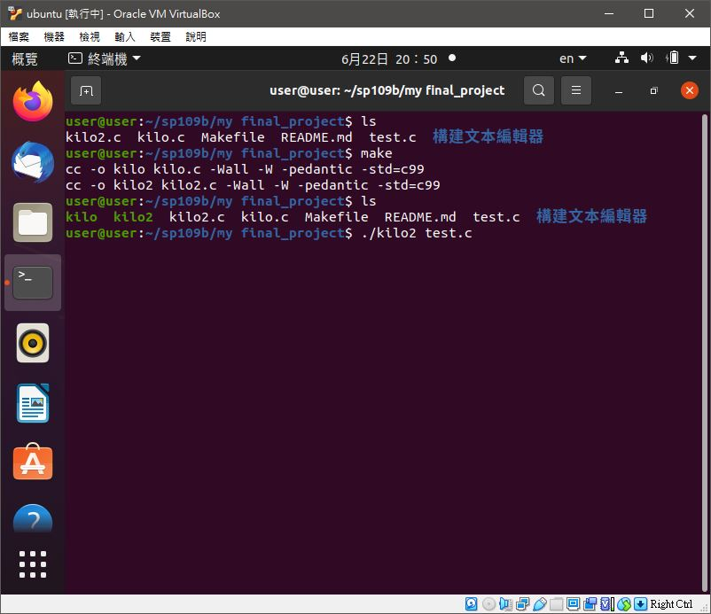
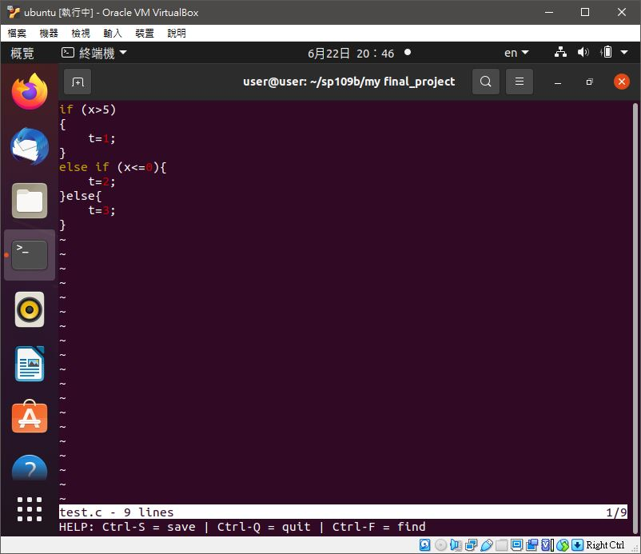

# 📝 期末作業
## 📖 簡介
>主題 : kilo<br>
>作者 : 劉怡謙<br>
>學號 : 110810519<br>
>作品 : 本程式修改自Salvatore Sanfilippo github 專案，並非100%原創，在我理解後加上註解，但是因為我還沒辦法完全理解，故只有部分註解，其餘部分我會在理解後補上<br>
>介紹 : Kilo 是一個不到 1K 行代碼的小型編輯器，由 Salvatore Sanfilippo aka antirez 編寫，並在 BSD 2 條款許可下發布<br>
>授權申明 : 
>>* [kilo.c LICENSE](https://github.com/antirez/kilo/blob/master/LICENSE)
>>* [My_LICENSE](LICENSE.md)

## 📖 
## 📖 Code
* [老師提供的kilo.c](https://gitlab.com/ccc109/sp/-/tree/master/C8-kilo/kilo1.0)
* [我加註解的kilo.c](kilo2.c)

>Keys : <br>
```
CTRL-S: Save
CTRL-Q: Quit
CTRL-F: Find string in file (ESC to exit search, arrows to navigate)
```

## 📖 更改後的Makefile
* 因為有新舊版程式需要編譯，所以自行修改Makefile
* [Makefile](Makefile)
```
TARGET = kilo kilo2

all: $(TARGET)

kilo: kilo.c
	$(CC) -o kilo kilo.c -Wall -W -pedantic -std=c99

kilo2: kilo2.c
	$(CC) -o kilo2 kilo2.c -Wall -W -pedantic -std=c99

clean:
	rm kilo
	rm kilo2
```

## 💻 程式實際操作結果


#### The result of execution
```
user@user:~/sp109b/my final_project$ ls
kilo2.c  kilo.c  Makefile  README.md  test.c  構建文本編輯器
user@user:~/sp109b/my final_project$ make
cc -o kilo kilo.c -Wall -W -pedantic -std=c99
cc -o kilo2 kilo2.c -Wall -W -pedantic -std=c99
user@user:~/sp109b/my final_project$ ls
kilo  kilo2  kilo2.c  kilo.c  Makefile  README.md  test.c  構建文本編輯器
user@user:~/sp109b/my final_project$ ./kilo2 test.c
```
```
if (x>5)
{
    t=1;
}
else if (x<=0){
    t=2;
}
else{
    t=3;
}
~
~
~
~
~
~
~
~
~
~
~
~
~
~
~
~
~
~
test.c - 10 lines                                                          1/10
HELP: Ctrl-S = save | Ctrl-Q = quit
```

## 📖 參考資料
* https://github.com/antirez/kilo
* https://viewsourcecode.org/snaptoken/kilo/


🖊️ editor : yi-chien Liu