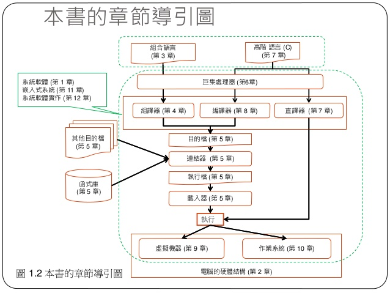
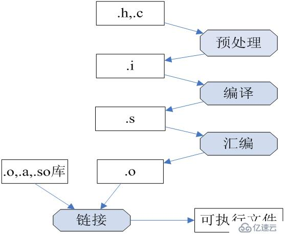
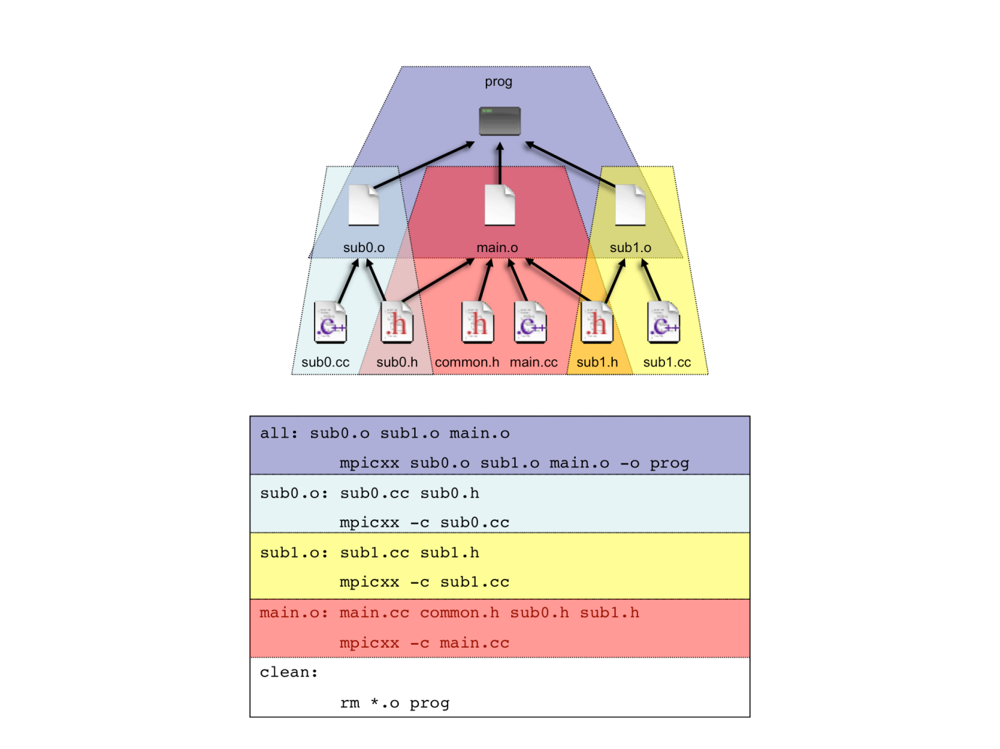
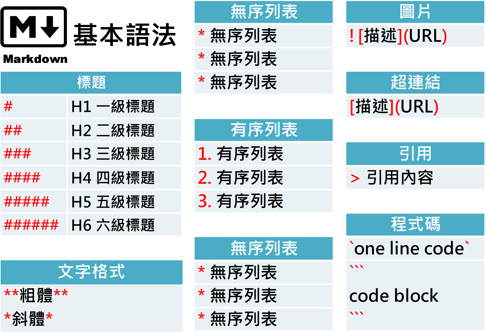

# 📝系統程式第一週筆記20210224
## 👉評分方式 
* 期中成績(=筆記) 40%
* 期末成績(=專案) 40%
* 上課問問題 20%
## 📖 系統程式教學順序


## 📖 系統程式 & 系統軟體
### 系統程式(System programming)
* 系統程式設計，是針對電腦系統軟體開發而進行的編程活動
* 系統程式設計，主要是為電腦硬體提供相對應的軟體服務
* 系統程式通常與其執行機器的架構是有密切的關係:組譯器, 編譯器,作業系統
### 系統軟體(System Software)
* 設計給程式設計師使用的軟體稱為系統軟體，設計給一班大眾使用的則稱為影用軟體
* 常見的系統軟體包含：作業系統 (operating system)、編譯器 (compiler)、直譯器 (interpreter)、連結器 (linker)、載入器 (loader)、組譯器 (assembly)、除錯器 (debugger)、硬體驅動程式 (driver)、公用程式


## 📢遇到困難
* Q.問題:打gcc跑出gcc not found   
* A.解決方式:上網收尋<br>
[用VScode編譯並執行c/c++程式](https://ithelp.ithome.com.tw/articles/10212393)<br>(控制台->內容->進階系統設定->環境變數)


## 📖 什麼是[gcc](https://kknews.cc/zh-tw/code/jlzpaae.html)??

* gcc是"GNU Compiler Collection"的縮寫，從字面意思可以知道它是一個編譯器集。gcc不止可以編譯器c語言，還能用於c++，java，object-C等語言程序。但是在這裡，我們的嵌入式學習中，目前只去關注gcc在C語言方面的編譯功能
### 1.字尾和檔案間的關係
檔案字尾 | 檔案類型
-----|--------
.c | 需作前置處理 (preprocess) 的 C 語言原始程式
.i | 不需作前置處理的 C 語言原始程式
.m |  Objective-C 的原始程式，且必需和程式庫 'libobjc.a' 連結才能執行
.h | 預處理檔案
.cc .cxx .C | 需作前置處理的 C++ 語言原始程式
.ii | 不需作前置處理的 C++ 語言原始程式
.s | 組合語言檔
.S | 需作前置處理的組合語言檔
.o | 目標檔案
.a | 歸檔庫檔案
### 2.常用參數
參數 | 功能
-----|--------
-c | 只編譯不連結，產生.o 檔(目的檔)
-S | 輸出組譯碼產生組合語言
-E | 顯示預處理文件
-o filename | 指定輸出檔名
-I | 指定header文件路徑
-L | 增加 library 檔案的搜尋路徑
-l | 指定連結的函式庫
-Wall | 顯示所有的警告訊息
-g | 編入除錯資訊 (使用 GDB 除錯時用)
### 3.最佳化
* -Os, -O0, -O1, -O2, -O3,
(-O0 表示沒有優化，-O1 為缺省值，-O3 優化級別最高)


##  📖 什麼是[Makefile](https://hackmd.io/@sysprog/SySTMXPvl)??

### 1.常用符號
符號 | 功能
-----|--------
$@ | 該規則的目標文件(Target file)
$* | 代表 targets 所指定的檔案，但不包含副檔名
$< | 依賴文件列表中的第一個依賴文件 (Dependencies file)
$^ | 依賴文件列表中的所有依賴文件
$? | 依賴文件列表中新於目標文件的文件列表
?= | 若變數未定義，則替它指定新的值
:= | make 會將整個 Makefile 展開後，再決定變數的值
####  範例：   
```
%.o: %.c
    gcc -c $< -o $@

$< : 屬於第一條件，也就是 foo.c
$@ : 屬於目標條件，也就是 foo.o
```
### 2.特殊字元
* @ : 不要顯示執行的指令
* － : 表示即使該行指令出錯，也不會中斷執行
### 3.於命令列「make」檔案
* make：會把名為 a.out 的執行檔編譯出來
* make clean：會把名為 a.out 的執行檔給刪除


## 📖 什麼是[Markdown](https://gist.github.com/billy3321/1001749662c370887c63bb30f26c9e6e)??

* Markdown 是一種輕量級標記式語言， 它有純文字標記的特性，讓編寫的可讀性提高，這是在以前很多電子郵件中就已經有的寫法，而目前也有很多網站都使用 Markdown 來撰寫說明文件或是在論壇上發表文章與發送訊息。常見網站例如：GitHub、wordpress、Slack、FB Messenger、IT 邦幫忙文章發表等等。


## 📖 編譯式語言&直譯式語言
### 🔖編譯式語言(Compiled language)
* 編譯語言在程式執行前會先透過編譯器將程式碼編譯成計算機所看的懂的機器碼，最後再執行。
* 編譯式語言多半會是靜態語言，它們會事先定義的型別、型別檢查 與擁有高效能的執行速度等特性。
### 🔖直譯式語言(Interpreted language)
* 直譯語言在執行時會一行一行的動態將程式碼直譯為機器碼，並執行。
* 直譯語言多半以動態語言為主，具有靈活的型別處理，動態生成與程式彈性，但速度會比編譯式語言要慢一些。

## 📖 GCC 開發環境
### 輸出 a.out
```
yichien@MSI MINGW64 /d/VScode/WP/ccc/109b/sp109b/sp/02-gcc/00-hello (master)
$ gcc hello.c

yichien@MSI MINGW64 /d/VScode/WP/ccc/109b/sp109b/sp/02-gcc/00-hello (master)
$ ./hello
hello 雿末!
```
### 使用 -o 參數 
##### 輸出檔案名稱為hello
```
yichien@MSI MINGW64 /d/VScode/WP/ccc/109b/sp109b/sp/02-gcc/00-hello (master)
$ gcc hello.c -o hello

yichien@MSI MINGW64 /d/VScode/WP/ccc/109b/sp109b/sp/02-gcc/00-hello (master)
$ ./hello
hello 雿末!
```
### 編譯成執行檔 -- 輸出 a.out/a.exe
```
yichien@MSI MINGW64 /d/VScode/WP/ccc/109b/sp109b/sp/02-gcc/01-basic (master)
$ gcc sum.c

yichien@MSI MINGW64 /d/VScode/WP/ccc/109b/sp109b/sp/02-gcc/01-basic (master)
$ ./a
sum(10)=55
```
### 編譯成執行檔 -- 使用 -o 參數
```
yichien@MSI MINGW64 /d/VScode/WP/ccc/109b/sp109b/sp/02-gcc/01-basic (master)
$ gcc sum.c -o sum

yichien@MSI MINGW64 /d/VScode/WP/ccc/109b/sp109b/sp/02-gcc/01-basic (master)
$ ./sum
sum(10)=55
```
### 直接編譯連結

```
yichien@MSI MINGW64 /d/VScode/WP/ccc/109b/sp109b/sp/02-gcc/02-link (master)
$ gcc main.c sum.c -o run

yichien@MSI MINGW64 /d/VScode/WP/ccc/109b/sp109b/sp/02-gcc/02-link (master)
$ ./run
sum(10)=55
```

### 產生組合語言

```
yichien@MSI MINGW64 /d/VScode/WP/ccc/109b/sp109b/sp/02-gcc/02-link (master)
$ gcc -S main.c -o main.s

yichien@MSI MINGW64 /d/VScode/WP/ccc/109b/sp109b/sp/02-gcc/02-link (master)
$ gcc -S sum.c -o sum.s
```

### 組譯後連結

```
yichien@MSI MINGW64 /d/VScode/WP/ccc/109b/sp109b/sp/02-gcc/02-link (master)
$ gcc main.c sum.s -o run

yichien@MSI MINGW64 /d/VScode/WP/ccc/109b/sp109b/sp/02-gcc/02-link (master)
$ ./run
sum(10)=55
```

### 產生目的檔

```
yichien@MSI MINGW64 /d/VScode/WP/ccc/109b/sp109b/sp/02-gcc/02-link (master)
$ gcc -c sum.c -o sum.o

yichien@MSI MINGW64 /d/VScode/WP/ccc/109b/sp109b/sp/02-gcc/02-link (master)
$ gcc -c main.c -o main.o
```

### 連結目的檔

```
yichien@MSI MINGW64 /d/VScode/WP/ccc/109b/sp109b/sp/02-gcc/02-link (master)
$ gcc main.o sum.o -o run

yichien@MSI MINGW64 /d/VScode/WP/ccc/109b/sp109b/sp/02-gcc/02-link (master)
$ ./run
```


🖊️ editor : yi-chien Liu


