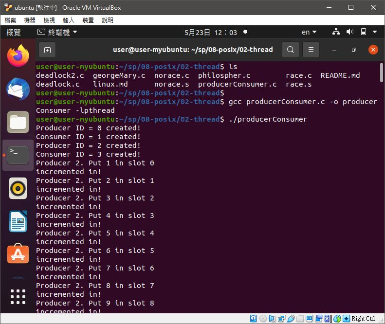
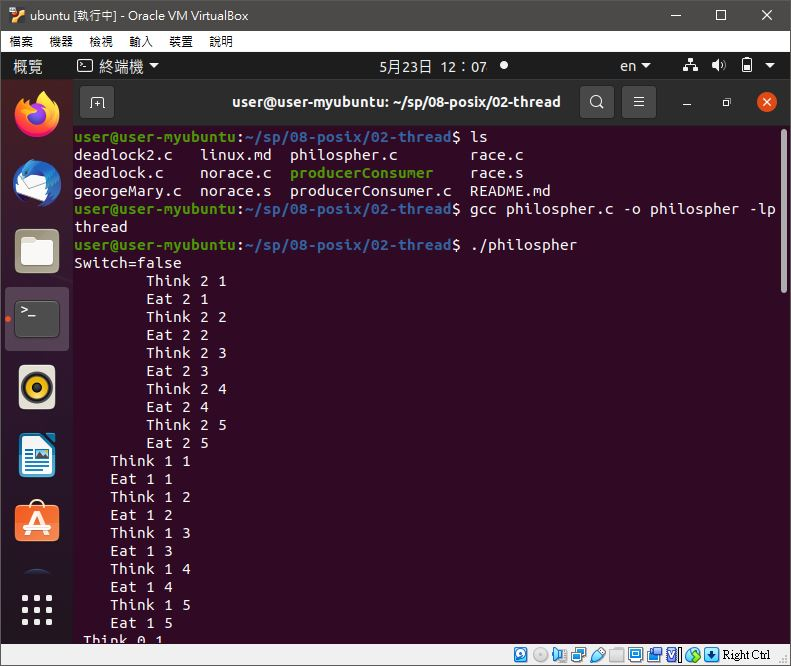

# 📝系統程式第十週筆記20210505
## 📖 Producer Consumer（生產者消費者問題）
## 📖 semaphore
## 💻 程式實際操作
### 🔗 08-posix/02-thread/producerConsumer 

<details>
  <summary><b>Show code</b></summary>

  ```
#include <stdio.h>
#include <pthread.h>
#include <semaphore.h>
#include <stdlib.h>

void *producer (void *) ;
void *consumer(void *) ;
sem_t empty, full, mutex ;

int buffer[10] /*note extra long space!*/ ;
int ID[10] ;
int in = 0 ; int out = 0 ;
int BUFFER_SIZE = 10 ;
int nextProduced = 0 ;

int main() {
    int i ;
    pthread_t TID[10] ;

    sem_init(&empty, 0, 10) ;
    sem_init(&full, 0, 0) ;
    sem_init(&mutex, 0, 1) ;

    for(i = 0; i < 10; i++) {
        ID[i] = i ;
        buffer[i] = -1 ;
    }

    //for(i = 0; i < 5000; i += 2) {
        pthread_create(&TID[0], NULL, producer, (void *) &ID[0]) ;
        printf("Producer ID = %d created!\n", 0) ;
        pthread_create(&TID[1], NULL, consumer, (void *) &ID[1]) ;
        printf("Consumer ID = %d created!\n", 1) ;

        pthread_create(&TID[2], NULL, producer, (void *) &ID[2]) ;
        printf("Producer ID = %d created!\n", 2) ;
        pthread_create(&TID[3], NULL, consumer, (void *) &ID[3]) ;
        printf("Consumer ID = %d created!\n", 3) ;
    //}

    for(i = 0; i < 10 ; i++) {
        pthread_join(TID[i], NULL) ;
    }
}

void *producer(void *Boo) {
    int *ptr;
    int ID;
    ptr = (int *) Boo;
    ID = *ptr;
    while (1) {
        nextProduced++; //Producing Integers
        /* Check to see if Overwriting unread slot */
        sem_wait(&empty);
        sem_wait(&mutex);

        if (buffer[in] != -1) {
            printf("Synchronization Error: Producer %d Just overwrote %d from Slot %d\n", ID, buffer[in], in);
            exit(0);
        }

        /* Looks like we are OK */
        buffer[in] = nextProduced;
        printf("Producer %d. Put %d in slot %d\n", ID, nextProduced, in);
        in = (in + 1) % BUFFER_SIZE;
        printf("incremented in!\n");

        sem_post(&mutex);
        sem_post(&full);
    }
 }

void *consumer (void *Boo) {
    static int nextConsumed = 0 ;
    int *ptr ;
    int ID ;
    ptr = (int *) Boo ;
    ID = *ptr ;
    while (1) {
        sem_wait(&full);
        sem_wait(&mutex);

        nextConsumed = buffer[out];
        /*Check to make sure we did not read from an empty slot*/
        if (nextConsumed == -1) {
            printf("Synch Error: Consumer %d Just Read from empty slot %d\n", ID, out) ;
            exit(0) ;
        }
        /* We must be OK */
        printf("Consumer %d Just consumed item %d from slot %d\n", ID, nextConsumed, out) ;
        buffer[out] = -1 ;
        out = (out + 1) % BUFFER_SIZE;

        sem_post(&mutex);
        sem_post(&empty);
    }
}
  ```
</details>

#### The result of execution
```
user@user-myubuntu:~/sp/08-posix/02-thread$ gcc producerConsumer.c -o producerConsumer -lpthread
user@user-myubuntu:~/sp/08-posix/02-thread$ ./producerConsumer
Producer ID = 0 created!
Consumer ID = 1 created!
Producer ID = 2 created!
Consumer ID = 3 created!
Producer 2. Put 1 in slot 0
incremented in!
Producer 2. Put 2 in slot 1
incremented in!
```

### 🔗 08-posix/02-thread/philospher 
<details>
  <summary><b>Show code</b></summary>

  ```
#include <stdio.h>
#include <pthread.h>
#include <semaphore.h>
typedef	enum { False=0, True=1 } bool ;

#define N 5 /* Number of times each philosopher tries to eat */
#define P 3 /* Number of philosophers */

sem_t Room;
sem_t Fork[P];
bool Switch ;

void *tphilosopher(void *ptr) {
    int i, k = *((int *) ptr);
    for(i = 1; i <= N; i++) {
        printf("%*cThink %d %d\n", k*4, ' ', k, i);
        if(Switch) {
            sem_wait(&Room) ;
        }
        sem_wait(&Fork[k]) ;
        sem_wait(&Fork[(k+1) % P]) ;
        printf("%*cEat %d %d\n", k*4, ' ', k, i);
        sem_post(&Fork[k]) ;
        sem_post(&Fork[(k+1) % P]) ;
        if(Switch) {
            sem_post(&Room) ;
        }
    }
    pthread_exit(0);
}

int main(int argc, char * argv[]) {
    int i, targ[P];
    pthread_t thread[P];
    sem_init(&Room, 0, P-1);    
    Switch = (argc > 1); /* Room semaphore on/off */
    printf("Switch=%s\n",(Switch?"true":"false"));
    for(i=0;i<P;i++) {
        sem_init(&Fork[i], 0, 1);    
    }
    for(i=0;i<P;i++) {
        targ[i] = i;
        pthread_create(&thread[i], NULL, &tphilosopher,(void *) &targ[i]);
    }
    for(i=0;i<P;i++) {
        pthread_join(thread[i], NULL);
    }
    for(i=0;i<P;i++) {
        sem_destroy(&Fork[i]);
    }
    sem_destroy(&Room);
    return 0;
}
  ```
</details>

#### The result of execution
```
user@user-myubuntu:~/sp/08-posix/02-thread$ gcc philospher.c -o philospher -lpthread
user@user-myubuntu:~/sp/08-posix/02-thread$ ./philospher 
Switch=false
        Think 2 1
        Eat 2 1
        Think 2 2
        Eat 2 2
        Think 2 3
        Eat 2 3
        Think 2 4
        Eat 2 4
        Think 2 5
        Eat 2 5
    Think 1 1
    Eat 1 1
    Think 1 2
    Eat 1 2
    Think 1 3
    Eat 1 3
    Think 1 4
    Eat 1 4
    Think 1 5
    Eat 1 5
 Think 0 1
 Eat 0 1
 Think 0 2
 Eat 0 2
 Think 0 3
 Eat 0 3
 Think 0 4
 Eat 0 4
 Think 0 5
 Eat 0 5
```
* 三個哲學家 三隻筷子 一人吃五次

## 📖 補充資料
* [Dijkstra算法](http://nthucad.cs.nthu.edu.tw/~yyliu/personal/nou/04ds/dijkstra.html)
* [哲學家用餐問題](https://zh.wikipedia.org/wiki/%E5%93%B2%E5%AD%A6%E5%AE%B6%E5%B0%B1%E9%A4%90%E9%97%AE%E9%A2%98)
* [生產者消費者問題](https://zh.wikipedia.org/wiki/%E7%94%9F%E4%BA%A7%E8%80%85%E6%B6%88%E8%B4%B9%E8%80%85%E9%97%AE%E9%A2%98?fbclid=IwAR1QCqhZ57x1X0UI1wZsPfEDrQlEwkw3l8CbZW5XTkWiKOeZKoZnKluhzxM)


🖊️editor : yi-chien Liu


