# 📝系統程式第十一週筆記20210512

## 💻 程式實際操作
### 🔗 08-posix/03-fork/01-hello/fork1
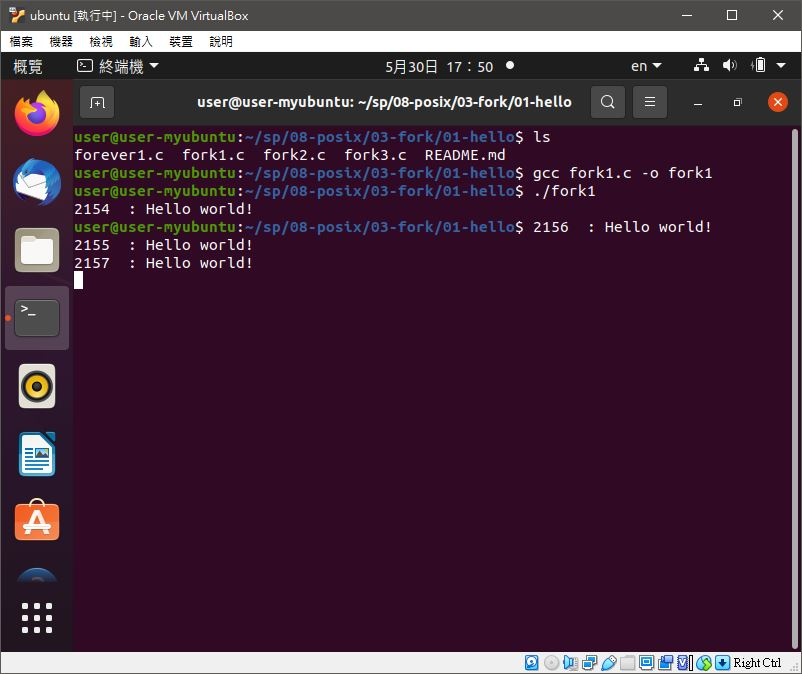
<details>
  <summary><b>Show code</b></summary>

  ```
#include <stdio.h> 
#include <sys/types.h> 
#include <unistd.h>

int main() { 
    fork(); // 一個行程分叉成父子兩個行程
    fork(); // 兩個行程又分別分叉出兩對父子，所以變成四個行程。
    printf("%-5d : Hello world!\n", getpid());
}
  ```
</details>

#### The result of execution
```
user@user-myubuntu:~/sp/08-posix/03-fork/01-hello$ gcc fork1.c -o fork1
user@user-myubuntu:~/sp/08-posix/03-fork/01-hello$ ./fork1
2154  : Hello world!
user@user-myubuntu:~/sp/08-posix/03-fork/01-hello$ 2156  : Hello world!
2155  : Hello world!
2157  : Hello world!
```

### 🔗 08-posix/03-fork/01-hello/fork2
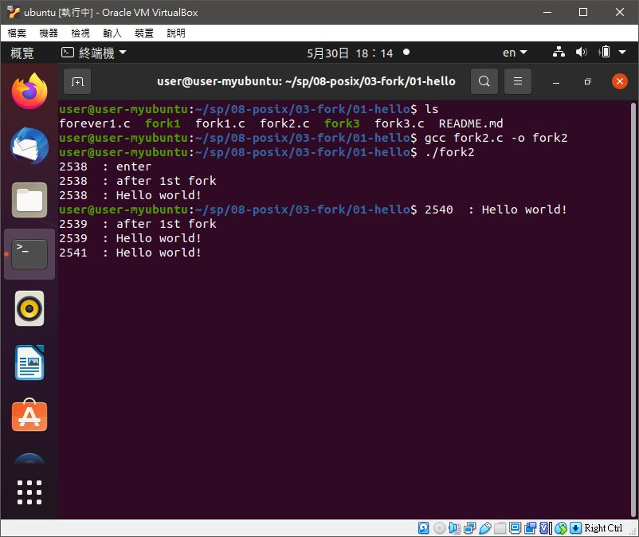
<details>
  <summary><b>Show code</b></summary>

  ```
#include <stdio.h> 
#include <sys/types.h> 
#include <unistd.h>

int main() { 
    printf("%-5d : enter\n", getpid());
    fork(); // 一個行程分叉成父子兩個行程
    printf("%-5d : after 1st fork\n", getpid());
    fork(); // 兩個行程又分別分叉出兩對父子，所以變成四個行程。
    printf("%-5d : Hello world!\n", getpid());
}
  ```
</details>

#### The result of execution
```
user@user-myubuntu:~/sp/08-posix/03-fork/01-hello$ gcc fork2.c -o fork2
user@user-myubuntu:~/sp/08-posix/03-fork/01-hello$ ./fork2
2241  : enter
2241  : after 1st fork
2241  : Hello world!
user@user-myubuntu:~/sp/08-posix/03-fork/01-hello$ 2243  : Hello world!
2242  : after 1st fork
2242  : Hello world!
2244  : Hello world!
```

### 🔗 08-posix/03-fork/01-hello/fork3
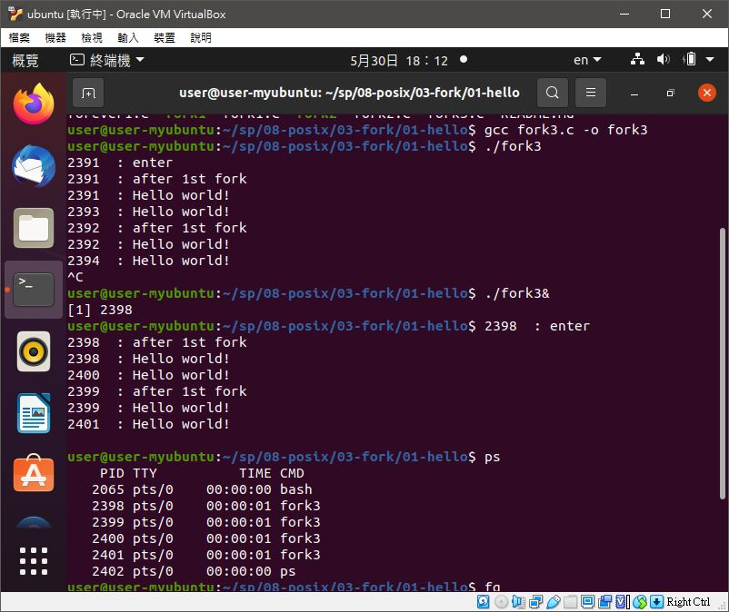
<details>
  <summary><b>Show code</b></summary>

  ```
#include <stdio.h> 
#include <sys/types.h> 
#include <unistd.h>

int main() { 
    printf("%-5d : enter\n", getpid());
    fork(); // 一個行程分叉成父子兩個行程
    printf("%-5d : after 1st fork\n", getpid());
    fork(); // 兩個行程又分別分叉出兩對父子，所以變成四個行程。
    printf("%-5d : Hello world!\n", getpid());
    while (1) {}
}
  ```
</details>

#### The result of execution
```
user@user-myubuntu:~/sp/08-posix/03-fork/01-hello$ gcc fork3.c -o fork3
user@user-myubuntu:~/sp/08-posix/03-fork/01-hello$ ./fork3
2391  : enter
2391  : after 1st fork
2391  : Hello world!
2393  : Hello world!
2392  : after 1st fork
2392  : Hello world!
2394  : Hello world!
```

### 🔗 08-posix/03-fork/03-exec/execvp1 

<details>
  <summary><b>Show code</b></summary>

  ```
#include <stdio.h>
#include <unistd.h>

int main() {
  char *arg[] = {"ls", "-l", NULL };
  printf("execvp():before\n");
  execvp(arg[0], arg);
  printf("execvp():after\n");
}
  ```
</details>

#### The result of execution
```
user@user-myubuntu:~/sp/08-posix/03-fork/03-exec$ gcc execvp1.c -o execvp1
user@user-myubuntu:~/sp/08-posix/03-fork/03-exec$ ./execvp1 
execvp():before
總用量 28
drwxrwxr-x 2 user user  4096  5月 21 14:06 backup
-rwxrwxr-x 1 user user 16792  5月 30 20:14 execvp1
-rw-rw-r-- 1 user user   176  5月 21 14:06 execvp1.c
user@user-myubuntu:~/sp/08-posix/03-fork/03-exec$ ls -l
總用量 28
drwxrwxr-x 2 user user  4096  5月 21 14:06 backup
-rwxrwxr-x 1 user user 16792  5月 30 20:14 execvp1
-rw-rw-r-- 1 user user   176  5月 21 14:06 execvp1.c
```
* execvp > 行程替換 替換成 `ls -l`

### 🔗 08-posix/03-fork/04-system/system1 
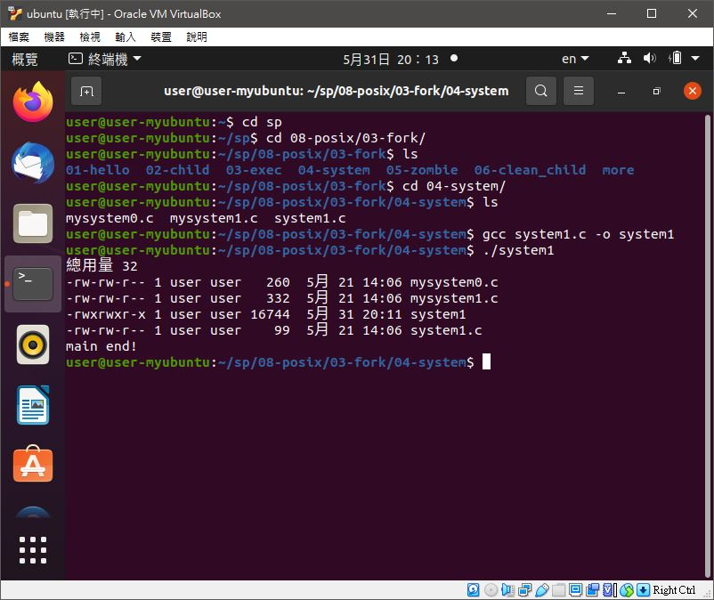
<details>
  <summary><b>Show code</b></summary>

  ```
#include <stdio.h>
#include <stdlib.h>

int main() {
  system("ls -l");
  printf("main end!\n");
}

  ```
</details>

#### The result of execution
```
user@user-myubuntu:~/sp/08-posix/03-fork/04-system$ gcc system1.c -o system1
user@user-myubuntu:~/sp/08-posix/03-fork/04-system$ ./system1 
總用量 32
-rw-rw-r-- 1 user user   260  5月 21 14:06 mysystem0.c
-rw-rw-r-- 1 user user   332  5月 21 14:06 mysystem1.c
-rwxrwxr-x 1 user user 16744  5月 31 20:11 system1
-rw-rw-r-- 1 user user    99  5月 21 14:06 system1.c
main end!
```

### 🔗 08-posix/03-fork/04-system/mysystem1  
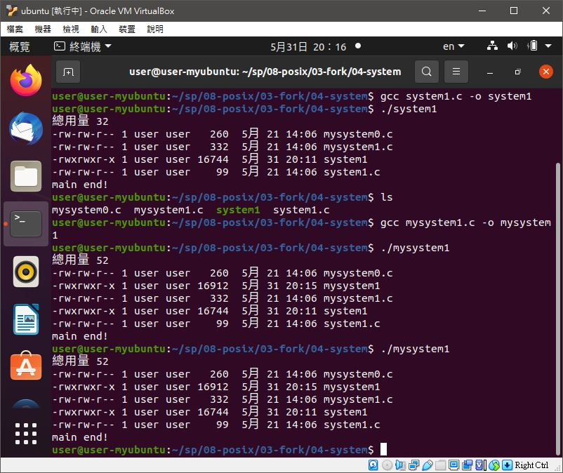
<details>
  <summary><b>Show code</b></summary>

  ```
#include <stdio.h>
#include <unistd.h>
#include <sys/types.h> 
#include <sys/wait.h>

int mysystem(char *arg[]) {
  if (fork()==0) {
    execvp(arg[0], arg); // child : exec("ls -l")
  }
  int status;
  wait(&status);
  return status;
}

int main() {
  char *arg[] = {"ls", "-l", NULL };
  mysystem(arg);
  printf("main end!\n");
}
  ```
</details>

#### The result of execution
```
user@user-myubuntu:~/sp/08-posix/03-fork/04-system$ gcc mysystem1.c -o mysystem1
user@user-myubuntu:~/sp/08-posix/03-fork/04-system$ ./mysystem1 
總用量 52
-rw-rw-r-- 1 user user   260  5月 21 14:06 mysystem0.c
-rwxrwxr-x 1 user user 16912  5月 31 20:15 mysystem1
-rw-rw-r-- 1 user user   332  5月 21 14:06 mysystem1.c
-rwxrwxr-x 1 user user 16744  5月 31 20:11 system1
-rw-rw-r-- 1 user user    99  5月 21 14:06 system1.c
main end!
```

### 🔗 08-posix/03-fork/05-zombie/zombie 
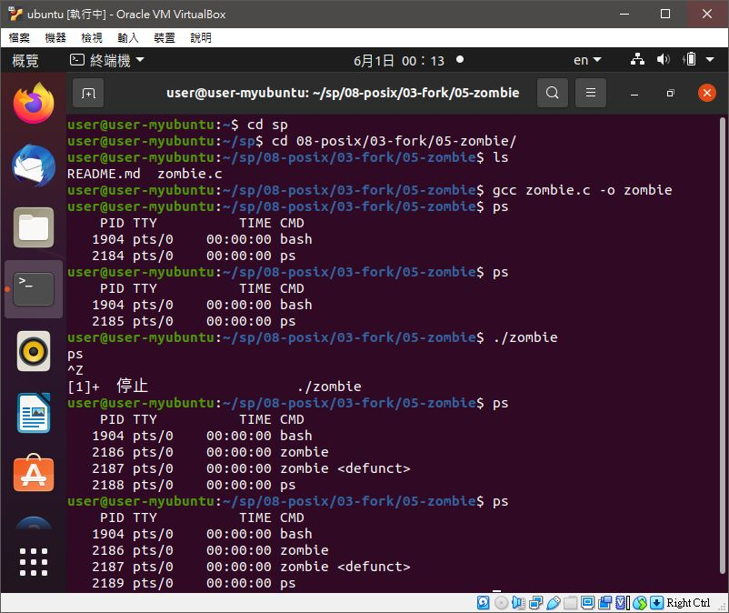
<details>
  <summary><b>Show code</b></summary>

  ```
#include <stdlib.h>
#include <sys/types.h>
#include <unistd.h>
int main () {
  pid_t child_pid;
  /* Create a child process. */
  child_pid = fork ();
  if (child_pid > 0) {
    /* This is the parent process. Sleep for a minute. */
    sleep (60);
  } else {
    /* This is the child process. Exit immediately. */
    exit (0);
  }
  return 0;
}
  ```
</details>

#### The result of execution
```
user@user-myubuntu:~/sp/08-posix/03-fork/05-zombie$ gcc zombie.c -o zombie
user@user-myubuntu:~/sp/08-posix/03-fork/05-zombie$ ./zombie 
ps
^Z
[1]+  停止                  ./zombie
user@user-myubuntu:~/sp/08-posix/03-fork/05-zombie$ ps
    PID TTY          TIME CMD
   1904 pts/0    00:00:00 bash
   2186 pts/0    00:00:00 zombie
   2187 pts/0    00:00:00 zombie <defunct>
   2188 pts/0    00:00:00 ps
```
* 因為父行程還存在，子行程還沒被回收，所以稱為殭屍形成

### 🔗 08-posix/04-fs/01-echo/echo1
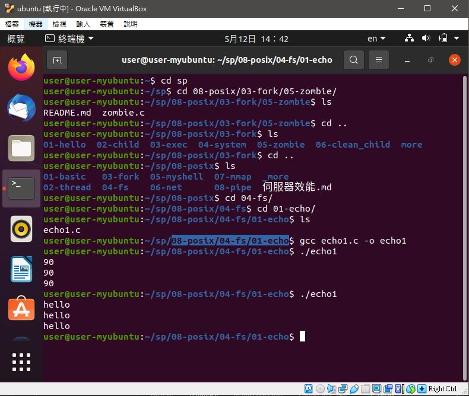
<details>
  <summary><b>Show code</b></summary>

  ```
#include <stdio.h>
#include <unistd.h>
#define SMAX 128

int main() {
  char line[SMAX];
  int n = read(0, line, SMAX); // 從 0 (標準輸入 stdin:鍵盤) 讀入一行字 line
  line[n] = '\0';              // 設定字串結尾
  write(1, line, n);           // 將 line 輸出到 1 (標準輸出 stdout)
  write(2, line, n);           // 將 line 輸出到 2 (標準錯誤 stderr)
}
  ```
</details>

#### The result of execution
```
user@user-myubuntu:~/sp/08-posix/04-fs/01-echo$ gcc echo1.c -o echo1
user@user-myubuntu:~/sp/08-posix/04-fs/01-echo$ ./echo1
hello
hello
hello
```
* `int n = read(0, line, SMAX);`  n 是指 read 讀到多少個 byte

### 🔗 08-posix/04-fs/01-fecho/fecho1
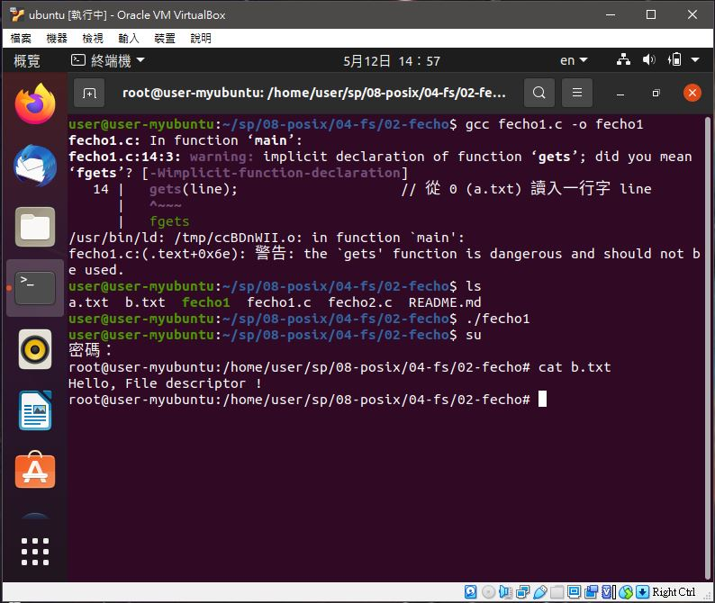
<details>
  <summary><b>Show code</b></summary>

  ```

  ```
</details>

#### The result of execution
```
user@user-myubuntu:~/sp/08-posix/04-fs/02-fecho$ gcc fecho1.c -o fecho1
user@user-myubuntu:~/sp/08-posix/04-fs/02-fecho$ ./fecho1
```

### 🔗 08-posix/04-fs/01-fecho/fecho2
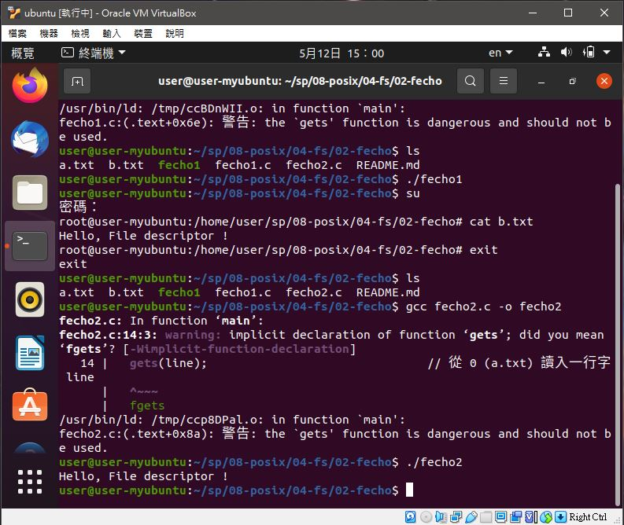
<details>
  <summary><b>Show code</b></summary>

  ```

  ```
</details>

#### The result of execution
```
user@user-myubuntu:~/sp/08-posix/04-fs/02-fecho$ gcc fecho2.c -o fecho2
user@user-myubuntu:~/sp/08-posix/04-fs/02-fecho$ ./fecho2
Hello, File descriptor !
```

### 🔗 08-posix/05-myshell/v1/myshell 
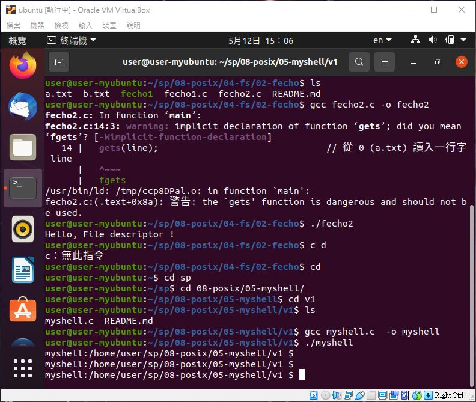
<details>
  <summary><b>Show code</b></summary>

  ```

  ```
</details>

#### The result of execution
```
user@user-myubuntu:~/sp/08-posix/05-myshell/v1$ gcc myshell.c  -o myshell
user@user-myubuntu:~/sp/08-posix/05-myshell/v1$ ./myshell 
myshell:/home/user/sp/08-posix/05-myshell/v1 $ 
```

### 🔗 08-posix/05-myshell/v2/myshell 
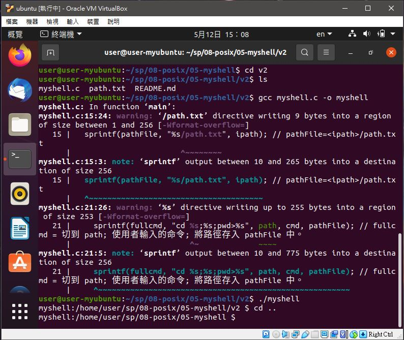
<details>
  <summary><b>Show code</b></summary>

  ```

  ```
</details>

#### The result of execution
```
user@user-myubuntu:~/sp/08-posix/05-myshell/v2$ gcc myshell.c -o myshell
user@user-myubuntu:~/sp/08-posix/05-myshell/v2$ ./myshell 
myshell:/home/user/sp/08-posix/05-myshell/v2 $ cd ~
myshell:/home/user $ exit
```


🖊️editor : yi-chien Liu

https://www.facebook.com/ccckmit/videos/10158962564926893