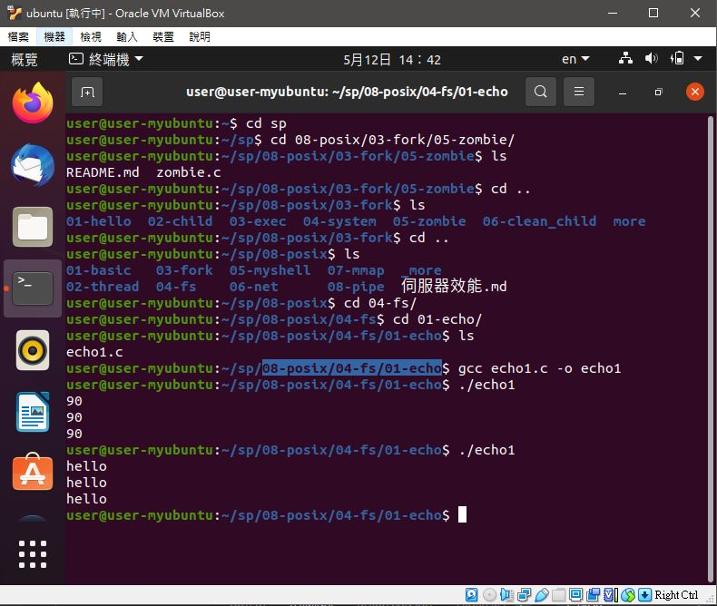
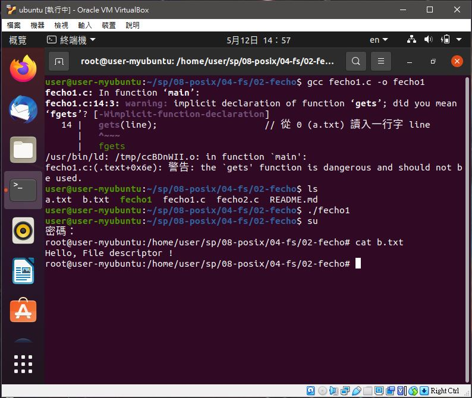
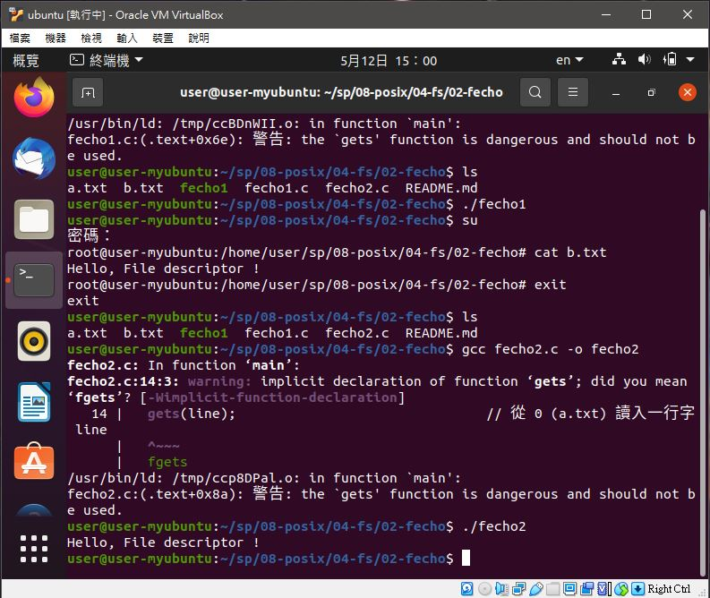
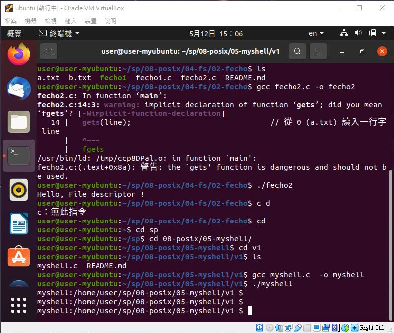
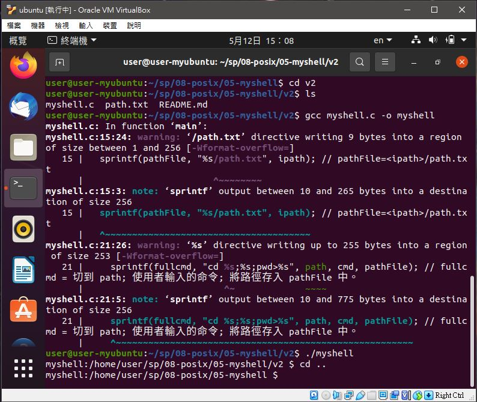

# 📝系統程式第十一週筆記20210512


## 💻 程式實際操作
### 🔗 08-posix/03-fork/01-hello/fork1

#### The result of execution
```
user@user-myubuntu:~/sp/08-posix/03-fork/01-hello$ gcc fork1.c -o fork1
user@user-myubuntu:~/sp/08-posix/03-fork/01-hello$ ./fork1
2647  : Hello world!
user@user-myubuntu:~/sp/08-posix/03-fork/01-hello$ 2649  : Hello world!
2648  : Hello world!
2650  : Hello world!
```


### 🔗 08-posix/04-fs/01-echo/echo1

#### The result of execution
```
user@user-myubuntu:~/sp/08-posix/04-fs/01-echo$ gcc echo1.c -o echo1
user@user-myubuntu:~/sp/08-posix/04-fs/01-echo$ ./echo1
hello
hello
hello
```

### 🔗 08-posix/04-fs/01-fecho/fecho1

#### The result of execution
```
user@user-myubuntu:~/sp/08-posix/04-fs/02-fecho$ gcc fecho1.c -o fecho1
user@user-myubuntu:~/sp/08-posix/04-fs/02-fecho$ ./fecho1
```

### 🔗 08-posix/04-fs/01-fecho/fecho2

#### The result of execution
```
user@user-myubuntu:~/sp/08-posix/04-fs/02-fecho$ gcc fecho2.c -o fecho2
user@user-myubuntu:~/sp/08-posix/04-fs/02-fecho$ ./fecho2
Hello, File descriptor !
```

### 🔗 08-posix/05-myshell/v1/myshell 

#### The result of execution
```
user@user-myubuntu:~/sp/08-posix/05-myshell/v1$ gcc myshell.c  -o myshell
user@user-myubuntu:~/sp/08-posix/05-myshell/v1$ ./myshell 
myshell:/home/user/sp/08-posix/05-myshell/v1 $ 
```

### 🔗 08-posix/05-myshell/v2/myshell 

#### The result of execution
```
user@user-myubuntu:~/sp/08-posix/05-myshell/v2$ gcc myshell.c -o myshell
user@user-myubuntu:~/sp/08-posix/05-myshell/v2$ ./myshell 
myshell:/home/user/sp/08-posix/05-myshell/v2 $ cd ~
myshell:/home/user $ exit
```
