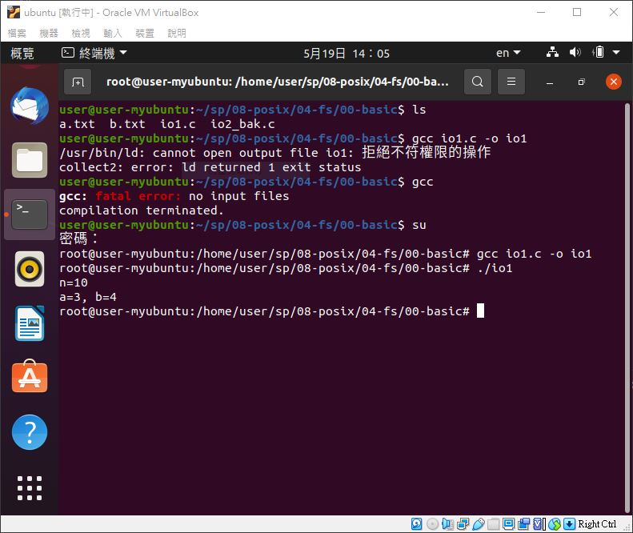
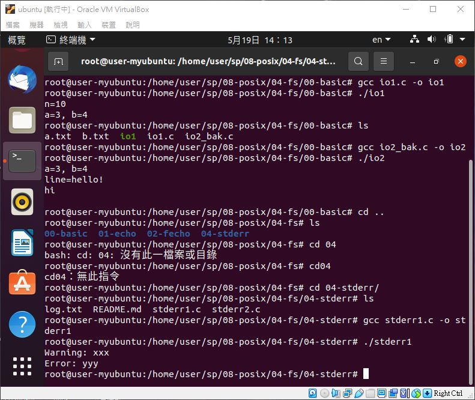
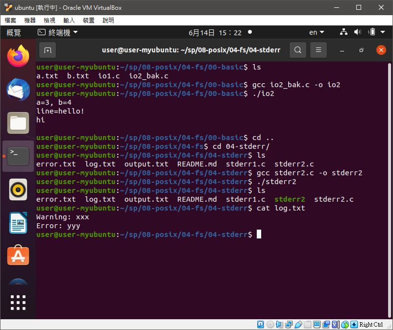
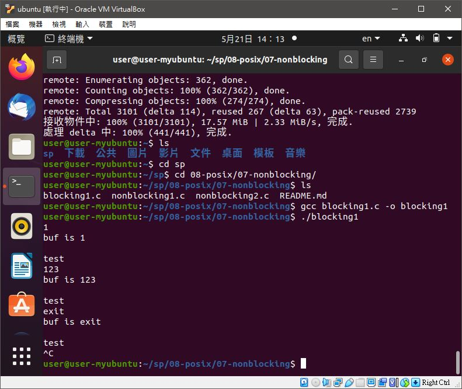
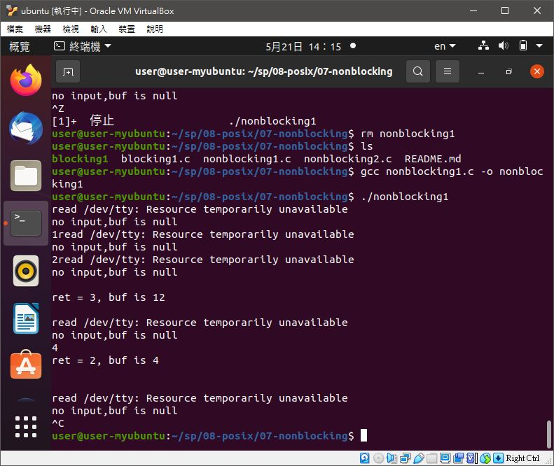
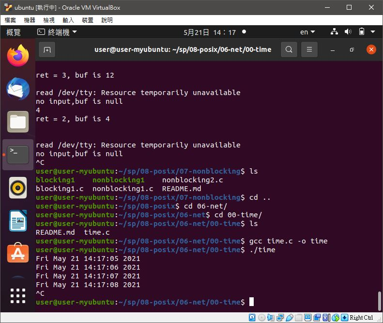
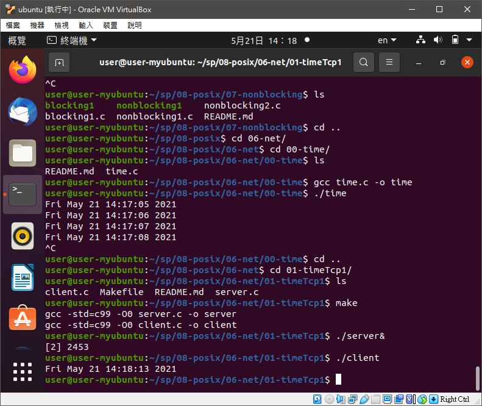
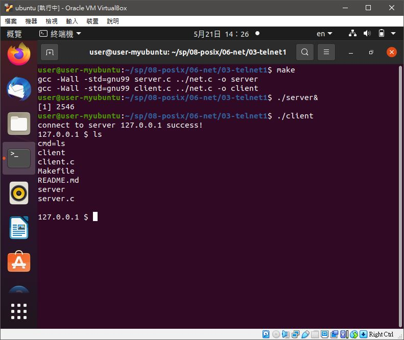

# 📝系統程式第十二週筆記20210519

## 💻 程式實際操作
### 🔗 08-posix/04-fs/00-basic/io1

<details>
  <summary><b>Show code</b></summary>

  ```
#include <stdio.h>
#include <unistd.h>
#include <sys/types.h>
#include <sys/stat.h>
#include <fcntl.h>
#define SMAX 128

int main() {
  int a = open("a.txt", O_RDWR); 
  int b = open("b.txt", O_CREAT|O_RDWR, 0644); //0644(讀取權限):自己、同一群組、所有其他人
  char text[SMAX];
  int n = read(a, text, SMAX);
  printf("n=%d\n", n);
  write(b, text, n);
  printf("a=%d, b=%d\n", a, b);
}
  ```
</details>

#### The result of execution
```
root@user-myubuntu:/home/user/sp/08-posix/04-fs/00-basic# gcc io1.c -o io1
root@user-myubuntu:/home/user/sp/08-posix/04-fs/00-basic# ./io1
n=10
a=3, b=4
```

### 🔗 08-posix/04-fs/00-basic/io2


<details>
  <summary><b>Show code</b></summary>

  ```
#include <stdio.h>
#include <unistd.h>
#include <sys/types.h>
#include <sys/stat.h>
#include <fcntl.h>
#define SMAX 128

int main() {
  int a = open("a.txt", O_RDWR);
  int b = open("b.txt", O_WRONLY | O_APPEND | O_CREAT, 0644);
  char line[SMAX];
  int n = read(a, line, SMAX);
  write(b, line, n);
  printf("a=%d, b=%d\n", a, b);
  printf("line=%s\n", line);
}
  ```
</details>

#### The result of execution
```
user@user-myubuntu:~/sp/08-posix/04-fs/00-basic$ gcc io2_bak.c -o io2
user@user-myubuntu:~/sp/08-posix/04-fs/00-basic$ ./io2
a=3, b=4
line=hello!
hi
```

### 🔗 08-posix/04-fs/04-stderr/stderr1

<details>
  <summary><b>Show code</b></summary>

  ```
#include <stdio.h>

int main() {
  fprintf(stdout, "Some message!\n");
  fprintf(stderr, "Warning: xxx\n");
  fprintf(stderr, "Error: yyy\n");
}
  ```
</details>

#### The result of execution
```
root@user-myubuntu:/home/user/sp/08-posix/04-fs/04-stderr# gcc stderr1.c -o stderr1
root@user-myubuntu:/home/user/sp/08-posix/04-fs/04-stderr# ./stderr1 
Warning: xxx
Error: yyy
```
#### 補充: [link](https://linuxize.com/post/bash-redirect-stderr-stdout/)
```
yichien@MSI MINGW64 /d/VScode/WP/ccc/sp109b/my note/WEEK12/code (master)
$ ./stderr1 1>output.txt
Warning: xxx
Error: yyy

yichien@MSI MINGW64 /d/VScode/WP/ccc/sp109b/my note/WEEK12/code (master)
$ ./stderr1 2>error.txt
Some message!
```

### 🔗 08-posix/04-fs/04-stderr/stderr2

<details>
  <summary><b>Show code</b></summary>

  ```
#include <stdio.h>
#include <unistd.h>
#include <fcntl.h>

int main() {
  int fdb = open("log.txt", O_CREAT|O_RDWR, 0644);  // 打開檔案 log.txt 並取得代號 fdb
  dup2(fdb, 2); // 複製 fdb 檔案描述子到 2 (stderr)
  fprintf(stderr, "Warning: xxx\n");
  fprintf(stderr, "Error: yyy\n");
}
  ```
</details>

#### The result of execution
```
user@user-myubuntu:~/sp/08-posix/04-fs/04-stderr$ gcc stderr2.c -o stderr2
user@user-myubuntu:~/sp/08-posix/04-fs/04-stderr$ ./stderr2 
user@user-myubuntu:~/sp/08-posix/04-fs/04-stderr$ cat log.txt
Warning: xxx
Error: yyy
```

### 🔗 08-posix/07-nonblocking/blocking1 

<details>
  <summary><b>Show code</b></summary>

  ```
#include<sys/types.h>
#include<sys/stat.h>
#include<fcntl.h>
#include<unistd.h>
#include<stdio.h>
#include<stdlib.h>

int main(int argc, char* argv[])
{
    int fd = open("/dev/tty",O_RDONLY); //Open the standard I / O file, which is blocked.
    if(fd == -1){
        perror("open /dev/tty");
        exit(1);
    }
    int ret = 0;
    char buf[1024] = {0};
    while(1){
        ret = read(fd, buf, sizeof(buf));
        if(ret == -1){
            perror("read");
            exit(1);
        }
        else if(ret == 0)
            printf("buf is null\n");
        else if(ret > 0)
            printf("buf is %s\n",buf);
        printf("test\n");
        sleep(1);
    }
    close(fd);

    return 0;
}
  ```
</details>

* 阻塞式輸入(第18行)
#### The result of execution
```
user@user-myubuntu:~/sp/08-posix/07-nonblocking$ gcc blocking1.c -o blocking1
user@user-myubuntu:~/sp/08-posix/07-nonblocking$ ./blocking1 
1
buf is 1

test
123
buf is 123
```

### 🔗 08-posix/07-nonblocking/nonblocking1 

<details>
  <summary><b>Show code</b></summary>

  ```
#include<sys/types.h>
#include<sys/stat.h>
#include<fcntl.h>
#include<unistd.h>
#include<stdio.h>
#include<stdlib.h>

int main(int argc, char* argv[])
{
    int fd = open("/dev/tty", O_RDONLY | O_NONBLOCK); // O ﹣ Nonblock set file input and output to non blocking
    if(fd == -1){
        perror("open /dev/tty");
        exit(1);
    }
    int ret = 0;
    char buf[1024] = {0};
    while(1){
        ret = read(fd, buf, sizeof(buf));
        if(ret == -1){
            perror("read /dev/tty"); // fputs(stderr, "read /dev/tty")
            printf("no input,buf is null\n");
        }
        else {
            printf("ret = %d, buf is %s\n",ret, buf);
        }
        sleep(1);
    }
    close(fd);

    return 0;
}
  ```
</details>

#### The result of execution
```
user@user-myubuntu:~/sp/08-posix/07-nonblocking$ gcc nonblocking1.c -o nonblocking1
user@user-myubuntu:~/sp/08-posix/07-nonblocking$ ./nonblocking1 
read /dev/tty: Resource temporarily unavailable
no input,buf is null
```

### 🔗 08-posix/06-net/00-time/time

<details>
  <summary><b>Show code</b></summary>

  ```
#include <stdio.h>
#include <unistd.h>
#include <time.h>

int main(int argc, char *argv[]) {
  while(1) {
    time_t ticks = time(NULL);
    printf("%.24s\n", ctime(&ticks));
    sleep(1);
  }
}
  ```
</details>

#### The result of execution
```
user@user-myubuntu:~/sp/08-posix/06-net/00-time$ gcc time.c -o time
user@user-myubuntu:~/sp/08-posix/06-net/00-time$ ./time
Fri May 21 14:17:05 2021
Fri May 21 14:17:06 2021
```

### 🔗 sp/08-posix/06-net/01-timeTcp1/client

<details>
  <summary><b>Show server.c code</b></summary>

  ```
#include <sys/socket.h>
#include <sys/types.h>
#include <netinet/in.h>
#include <netdb.h>
#include <stdio.h>
#include <string.h>
#include <stdlib.h>
#include <unistd.h>
#include <errno.h>
#include <arpa/inet.h>
#include <time.h>
#include <assert.h>
#include <sys/wait.h>

#define PORT 8080

int main(int argc, char *argv[]) {
  int listenfd = socket(AF_INET, SOCK_STREAM, 0);
  assert(listenfd >= 0);
  struct sockaddr_in serv_addr;
  memset(&serv_addr, 0, sizeof(serv_addr));
  serv_addr.sin_family = AF_INET;
  serv_addr.sin_addr.s_addr = htonl(INADDR_ANY);
  serv_addr.sin_port = htons(PORT);

  assert(bind(listenfd, (struct sockaddr*)&serv_addr, sizeof(serv_addr)) >= 0);
  assert(listen(listenfd, 10) >= 0); // 最多十個同時連線
  char sendBuff[1025];
  memset(sendBuff, 0, sizeof(sendBuff));
  while(1) {
    int connfd = accept(listenfd, (struct sockaddr*)NULL, NULL);
    assert(connfd >= 0);
    time_t ticks = time(NULL);
    snprintf(sendBuff, sizeof(sendBuff), "%.24s\r\n", ctime(&ticks));
    assert(write(connfd, sendBuff, strlen(sendBuff)) >=0);
    close(connfd);
    sleep(1);
  }
}
  ```
</details>

<details>
  <summary><b>Show client.c code</b></summary>

  ```
#include <sys/socket.h>
#include <sys/types.h>
#include <netinet/in.h>
#include <netdb.h>
#include <stdio.h>
#include <string.h>
#include <stdlib.h>
#include <unistd.h>
#include <errno.h>
#include <arpa/inet.h>
#include <time.h>
#include <assert.h>
#include <sys/wait.h>

#define PORT 8080

int main(int argc, char *argv[]) {
  struct sockaddr_in serv_addr;
  memset(&serv_addr, 0, sizeof(serv_addr));
  serv_addr.sin_family = AF_INET;
  serv_addr.sin_port = htons(PORT);
  assert(inet_pton(AF_INET, "127.0.0.1", &serv_addr.sin_addr) > 0);

  int sockfd = socket(AF_INET, SOCK_STREAM, 0);
  assert(sockfd >=0);
  assert(connect(sockfd, (struct sockaddr *)&serv_addr, sizeof(serv_addr)) >= 0);
  char recvBuff[1024];
  int n;
  while ((n = read(sockfd, recvBuff, sizeof(recvBuff)-1)) > 0) {
    recvBuff[n] = 0;
    fputs(recvBuff, stdout);
  }
  return 0;
}
  ```
</details>

#### The result of execution
```
user@user-myubuntu:~/sp/08-posix/06-net/01-timeTcp1$ make
gcc -std=c99 -O0 server.c -o server
gcc -std=c99 -O0 client.c -o client
user@user-myubuntu:~/sp/08-posix/06-net/01-timeTcp1$ ./server&
[2] 2453
user@user-myubuntu:~/sp/08-posix/06-net/01-timeTcp1$ ./client
Fri May 21 14:18:13 2021
```

### 🔗 08-posix/06-net/03-telnet1/client

<details>
  <summary><b>Show server.c code</b></summary>

  ```
#include "../net.h"

int serv(int connfd) {
  close(STDOUT_FILENO);                    // 關閉 stdout
  dup2(connfd, STDOUT_FILENO);             // 用 connfd 取代 stdout
  dup2(connfd, STDERR_FILENO);             // 用 connfd 取代 stderr
  while (1) {
    char cmd[SMAX];
    int len = read(connfd, cmd, SMAX);     // 讀入 client 傳來的命令
    if (len <= 0) break;                   // 若沒讀到就結束了！
    strtok(cmd, "\n");                     // 把 \n 去除
    fprintf(stderr, "cmd=%s\n", cmd);      // 印出命令方便觀察
    if (strncmp(cmd, "exit", 4)==0) break; // 若是 exit 則離開！
    system(cmd);                           // 執行該命令 (由於 connfd 取代了 stdout，所以命令的輸出會直接傳回給 client)
    write(connfd, "\n", 1); // 至少要回應 1byte ，否則 client 會讀不到而導致當掉
  }
  close(connfd);            // 關閉連線
  exit(0);                  // 結束此子行程
}

int main(int argc, char *argv[]) {
  int port = (argc >= 2) ? atoi(argv[1]) : PORT;
  net_t net;
  net_init(&net, TCP, SERVER, port, NULL);
  net_bind(&net);
  net_listen(&net);
  while(1) { // 主迴圈：等待 client 連進來，然後啟動 serv 為其服務
    int connfd = net_accept(&net); // 等待連線進來
    assert(connfd >= 0);
    if (fork() <= 0) { // 創建新的行程去服務該連線。
      serv(connfd);    // 子行程開始執行 serv()
    }
  }
}
  ```
</details>

<details>
  <summary><b>Show client.ccode</b></summary>

  ```
  #include "../net.h"

int main(int argc, char *argv[]) {
  int port = (argc >= 2) ? atoi(argv[1]) : PORT;
  char *host = (argc >= 3) ? argv[2] : "localhost";
  net_t net;
  net_init(&net, TCP, CLIENT, port, host);
  net_connect(&net);
  char cmd[SMAX], recvBuff[TMAX], op[SMAX];
  printf("connect to server %s success!\n", net.serv_ip);
  while (1) { // 主迴圈：等待使用者輸入命令，然後發送請求給伺服器，並接收回應。
    printf("%s $ ", net.serv_ip);           // 印出提示訊息
    fgets(cmd, SMAX, stdin);                // 等待使用者輸入命令！
    write(net.sock_fd, cmd, strlen(cmd));   // 將命令傳給 server

    sscanf(cmd, "%s", op);                  // 取得指令
    if (strncmp(op, "exit", 4)==0) break;   // 若是 exit 則離開

    sleep(1);                               // 休息一秒鐘
    int n = read(net.sock_fd, recvBuff, TMAX-1); // 讀取 server 傳回來的訊息
    assert(n > 0);
    recvBuff[n-1] = '\0';                   // 字串結尾，把最後一個 \n 去掉!
    puts(recvBuff);                         // 顯示回應訊息
  }
  close(net.sock_fd);
  return 0;
}
  ```
</details>

#### The result of execution
```
user@user-myubuntu:~/sp/08-posix/06-net/03-telnet1$ make
gcc -Wall -std=gnu99 server.c ../net.c -o server
gcc -Wall -std=gnu99 client.c ../net.c -o client
user@user-myubuntu:~/sp/08-posix/06-net/03-telnet1$ ./server&
[1] 2546
user@user-myubuntu:~/sp/08-posix/06-net/03-telnet1$ ./client
connect to server 127.0.0.1 success!
127.0.0.1 $ ls
cmd=ls
client
client.c
Makefile
README.md
server
server.c
```


🖊️editor : yi-chien Liu
