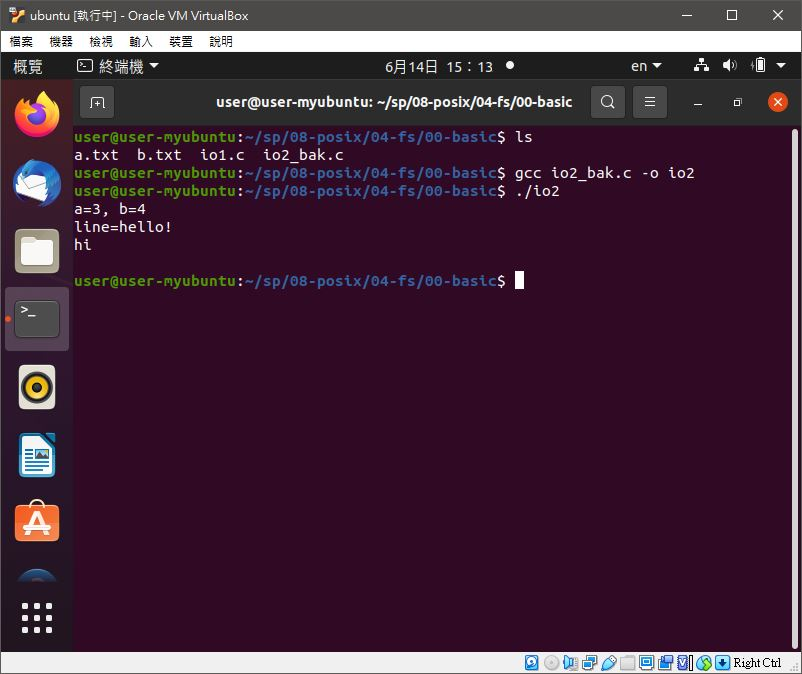

# 📝系統程式第十二週筆記20210519

## 💻 程式實際操作
### 🔗 08-posix/04-fs/00-basic/io1

<details>
  <summary><b>Show code</b></summary>

  ```
#include <stdio.h>
#include <unistd.h>
#include <sys/types.h>
#include <sys/stat.h>
#include <fcntl.h>
#define SMAX 128

int main() {
  int a = open("a.txt", O_RDWR); 
  int b = open("b.txt", O_CREAT|O_RDWR, 0644); //0644(讀取權限):自己、同一群組、所有其他人
  char text[SMAX];
  int n = read(a, text, SMAX);
  printf("n=%d\n", n);
  write(b, text, n);
  printf("a=%d, b=%d\n", a, b);
}
  ```
</details>

#### The result of execution
```
root@user-myubuntu:/home/user/sp/08-posix/04-fs/00-basic# gcc io1.c -o io1
root@user-myubuntu:/home/user/sp/08-posix/04-fs/00-basic# ./io1
n=10
a=3, b=4
```

### 🔗 08-posix/04-fs/00-basic/io2

<details>
  <summary><b>Show code</b></summary>

  ```
#include <stdio.h>
#include <unistd.h>
#include <sys/types.h>
#include <sys/stat.h>
#include <fcntl.h>
#define SMAX 128

int main() {
  int a = open("a.txt", O_RDWR);
  int b = open("b.txt", O_WRONLY | O_APPEND | O_CREAT, 0644);
  char line[SMAX];
  int n = read(a, line, SMAX);
  write(b, line, n);
  printf("a=%d, b=%d\n", a, b);
  printf("line=%s\n", line);
}
  ```
</details>

#### The result of execution
```
user@user-myubuntu:~/sp/08-posix/04-fs/00-basic$ gcc io2_bak.c -o io2
user@user-myubuntu:~/sp/08-posix/04-fs/00-basic$ ./io2
a=3, b=4
line=hello!
hi
```
### 🔗 08-posix/04-fs/04-stderr/stderr1

<details>
  <summary><b>Show code</b></summary>

  ```
  ```
</details>

#### The result of execution
```
root@user-myubuntu:/home/user/sp/08-posix/04-fs/04-stderr# gcc stderr1.c -o stderr1
root@user-myubuntu:/home/user/sp/08-posix/04-fs/04-stderr# ./stderr1 
Warning: xxx
Error: yyy
```

### 🔗 08-posix/07-nonblocking/blocking1 

<details>
  <summary><b>Show code</b></summary>

  ```
  ```
</details>

#### The result of execution
```
user@user-myubuntu:~/sp/08-posix/07-nonblocking$ gcc blocking1.c -o blocking1
user@user-myubuntu:~/sp/08-posix/07-nonblocking$ ./blocking1 
1
buf is 1

test
123
buf is 123
```

### 🔗 08-posix/07-nonblocking/nonblocking1 

<details>
  <summary><b>Show code</b></summary>

  ```
  ```
</details>

#### The result of execution
```
user@user-myubuntu:~/sp/08-posix/07-nonblocking$ gcc nonblocking1.c -o nonblocking1
user@user-myubuntu:~/sp/08-posix/07-nonblocking$ ./nonblocking1 
read /dev/tty: Resource temporarily unavailable
no input,buf is null
```

### 🔗 08-posix/06-net/00-time/time

<details>
  <summary><b>Show code</b></summary>

  ```
  ```
</details>

#### The result of execution
```
user@user-myubuntu:~/sp/08-posix/06-net/00-time$ gcc time.c -o time
user@user-myubuntu:~/sp/08-posix/06-net/00-time$ ./time
Fri May 21 14:17:05 2021
Fri May 21 14:17:06 2021
```

### 🔗 sp/08-posix/06-net/01-timeTcp1/client

<details>
  <summary><b>Show code</b></summary>

  ```
  ```
</details>

#### The result of execution
```
user@user-myubuntu:~/sp/08-posix/06-net/01-timeTcp1$ make
gcc -std=c99 -O0 server.c -o server
gcc -std=c99 -O0 client.c -o client
user@user-myubuntu:~/sp/08-posix/06-net/01-timeTcp1$ ./server&
[2] 2453
user@user-myubuntu:~/sp/08-posix/06-net/01-timeTcp1$ ./client
Fri May 21 14:18:13 2021
```

### 🔗 08-posix/06-net/03-telnet1/client

<details>
  <summary><b>Show code</b></summary>

  ```
  ```
</details>

#### The result of execution
```
user@user-myubuntu:~/sp/08-posix/06-net/03-telnet1$ make
gcc -Wall -std=gnu99 server.c ../net.c -o server
gcc -Wall -std=gnu99 client.c ../net.c -o client
user@user-myubuntu:~/sp/08-posix/06-net/03-telnet1$ ./server&
[1] 2546
user@user-myubuntu:~/sp/08-posix/06-net/03-telnet1$ ./client
connect to server 127.0.0.1 success!
127.0.0.1 $ ls
cmd=ls
client
client.c
Makefile
README.md
server
server.c
```


🖊️editor : yi-chien Liu


https://www.facebook.com/groups/ccccourse/permalink/579583983011917