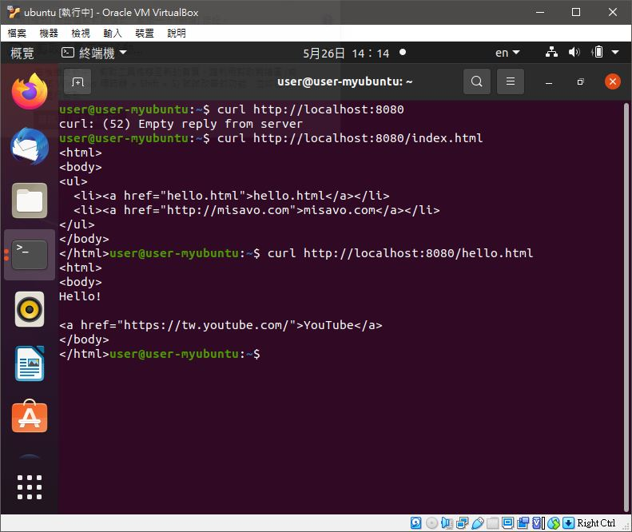

# 📝系統程式第十三週筆記20210526
## HTTP協定


## 💻 程式實際操作
### 🔗 08-posix/06-net/05-http/helloWebServer 

#### The result of execution
```
user@user-myubuntu:~/sp/08-posix/06-net/05-http$ make
gcc -std=c99 -O0 helloWebServer.c ../net.c -o helloWebServer
gcc -std=c99 -O0 headPrintServer.c ../net.c -o headPrintServer
gcc -std=c99 -O0 htmlServer.c ../net.c httpd.c -o htmlServer
user@user-myubuntu:~/sp/08-posix/06-net/05-http$ ./helloWebServer 
Server started at port: 8080
0:got connection, client_fd=4
1:got connection, client_fd=4
```
#### The result of execution (補充)

```
user@user-myubuntu:~$ curl http://localhost:8080
Hello World!
user@user-myubuntu:~$ curl -v http://localhost:8080
*   Trying 127.0.0.1:8080...
* TCP_NODELAY set
* Connected to localhost (127.0.0.1) port 8080 (#0)
> GET / HTTP/1.1
> Host: localhost:8080
> User-Agent: curl/7.68.0
> Accept: */*
> 
* Mark bundle as not supporting multiuse
< HTTP/1.1 200 OK
< Content-Type: text/plain; charset=UTF-8
< Content-Length: 14
< 
Hello World!
* Connection #0 to host localhost left intact
```
### 🔗 08-posix/06-net/05-http/htmlServer  

#### The result of execution
```
user@user-myubuntu:~/sp/08-posix/06-net/05-http$ ./htmlServer 
Server started at port: 8080
===========header=============
GET / HTTP/1.1
Host: localhost:8080
User-Agent: curl/7.68.0
Accept: */*


path=/
not html => no response!
===========header=============
GET /index.html HTTP/1.1
Host: localhost:8080
User-Agent: curl/7.68.0
Accept: */*


path=/index.html
path contain .htm
responseFile:fpath=./web/index.html
===========header=============
GET /hello.html HTTP/1.1
Host: localhost:8080
User-Agent: curl/7.68.0
Accept: */*


path=/hello.html
path contain .htm
responseFile:fpath=./web/hello.html
```
#### The result of execution (補充)

```
user@user-myubuntu:~$ curl http://localhost:8080
curl: (52) Empty reply from server
user@user-myubuntu:~$ curl http://localhost:8080/index.html
<html>
<body> 
<ul>
  <li><a href="hello.html">hello.html</a></li>
  <li><a href="http://misavo.com">misavo.com</a></li>
</ul>
</body>
</html>user@user-myubuntu:~$ curl http://localhost:8080/hello.html
<html>
<body>
Hello! 

<a href="https://tw.youtube.com/">YouTube</a>
</body>
```


🖊️editor : yi-chien Liu