# 📝系統程式第十三週筆記20210526
## HTTP協定
### 🔖 何謂傳輸協定？
以人類來說，在台灣，我們多數使用的是繁體中文，國際之間常見的溝通語言則是英文，套用到機器之間也會有既定的格式和語法。
### 🔖 HTTP 的組成結構
HTTP 的組成結構，分別是 HTTP Request 與 HTTP Response 這兩個大項目
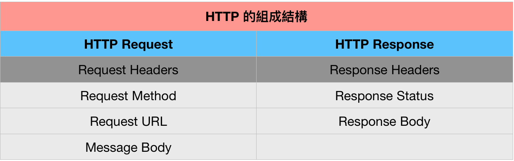
#### 請求時的HTTP Request
從客戶端發出 HTTP Request 時，通常會定義以下的資訊，以瀏覽 Google 首頁為例

常見的 Method 方法如下：
* GET：讀取資料
* POST：新增資料（常搭配 form 標籤使用）
* PATCH：修改資料
* PUT：修改資料（若該筆資料不存在，則自動新增資料）
* DELETE：刪除資料
通常一個 Method 會搭配一個 URL，也會對應伺服器端一組特定的資源，而 Message Body 的內容則取決於每次的動作。
若單純是使用 GET 方法瀏覽網頁，則 Message Body 為空，但是，若以填寫表單為範例，那客戶端就會送出資料，這筆資料就會被傳送到伺服器的資料庫，此時，我們則會使用 POST 方法將資料送進 Message Body，提交給某個指定的 URL，進而建立資料或更新資料。
#### 回傳時的HTTP Request
從伺服器端回傳 HTTP Response 時，通常會定義以下的資訊，以瀏覽 Google 首頁為例
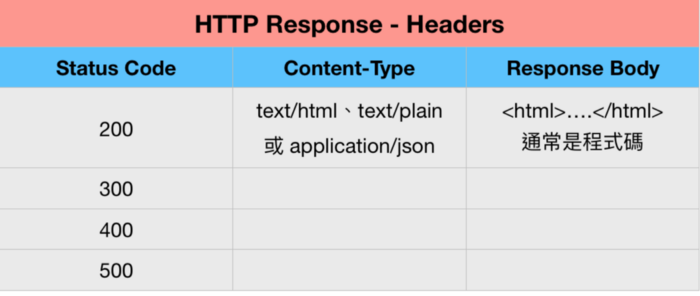
狀態碼 (status code)不僅有助於我們瞭解網路發生問題的原因，也能幫助你與工程師日常的溝通協作，如：
* 1XX 訊息類 (收到請求，請求者繼續執行操作)
* 2XX 成功類 (操作被成功接受並處理)，例如：200 成功回應
* 3XX 重定向類 (需進一步操作才能完成)，例如：301 成功轉向
* 4XX 客戶端錯誤類 (請求語法錯誤或無法完成請求)，例如：404 找不到資源
* 5XX 伺服器錯誤類 (後端的問題)，例如：500 伺服器錯誤

## 💻 程式實際操作
### 🔗 08-posix/06-net/05-http/helloWebServer 
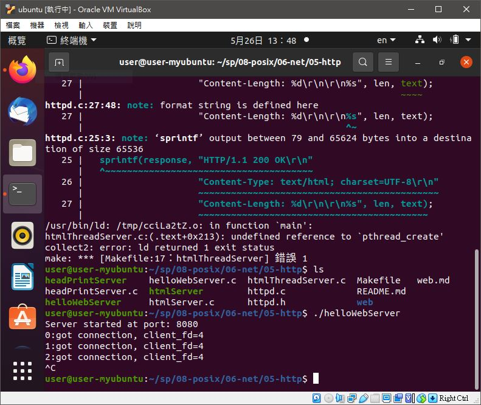
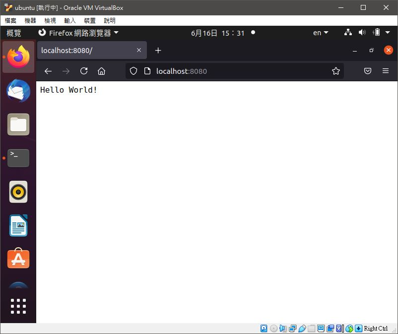
<details>
  <summary><b>Show code</b></summary>

  ```
#include "../net.h"
 
char response[] = "HTTP/1.1 200 OK\r\n"
"Content-Type: text/plain; charset=UTF-8\r\n"
"Content-Length: 14\r\n\r\n"
"Hello World!\r\n";

int main(int argc, char *argv[]) {
  int port = (argc >= 2) ? atoi(argv[1]) : PORT;
	net_t net;
	net_init(&net, TCP, SERVER, port, NULL);
	net_bind(&net);
	net_listen(&net);
  printf("Server started at port: %d\n", net.port);
  int count=0;
  while (1) {
		int client_fd = net_accept(&net);
    printf("%d:got connection, client_fd=%d\n", count++, client_fd);
    int n = write(client_fd, response, strlen(response));
    fsync(client_fd);
    assert(n > 0);
    sleep(1);
    close(client_fd);
  }
}
  ```
</details>

#### The result of execution
```
user@user-myubuntu:~/sp/08-posix/06-net/05-http$ make
gcc -std=c99 -O0 helloWebServer.c ../net.c -o helloWebServer
gcc -std=c99 -O0 headPrintServer.c ../net.c -o headPrintServer
gcc -std=c99 -O0 htmlServer.c ../net.c httpd.c -o htmlServer
user@user-myubuntu:~/sp/08-posix/06-net/05-http$ ./helloWebServer 
Server started at port: 8080
0:got connection, client_fd=4
1:got connection, client_fd=4
```
#### The result of execution (補充)
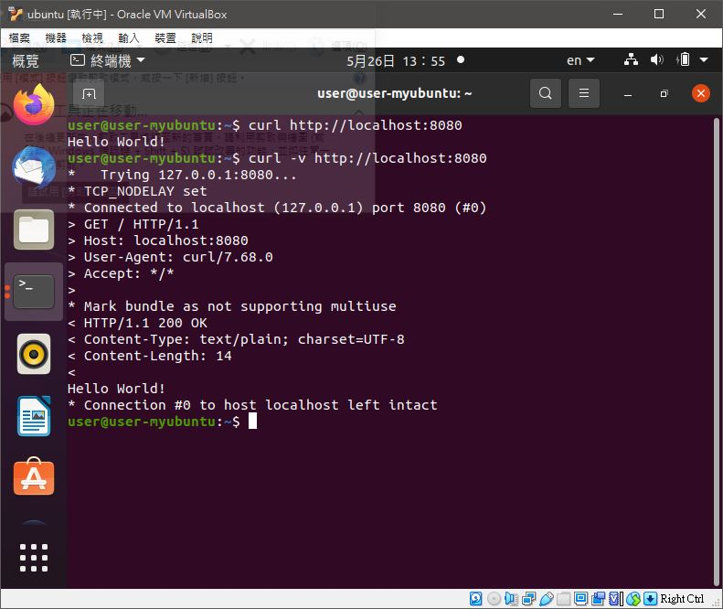
```
user@user-myubuntu:~$ curl http://localhost:8080
Hello World!
user@user-myubuntu:~$ curl -v http://localhost:8080
*   Trying 127.0.0.1:8080...
* TCP_NODELAY set
* Connected to localhost (127.0.0.1) port 8080 (#0)
> GET / HTTP/1.1
> Host: localhost:8080
> User-Agent: curl/7.68.0
> Accept: */*
> 
* Mark bundle as not supporting multiuse
< HTTP/1.1 200 OK
< Content-Type: text/plain; charset=UTF-8
< Content-Length: 14
< 
Hello World!
* Connection #0 to host localhost left intact
```

### 🔗 08-posix/06-net/05-http/htmlServer 
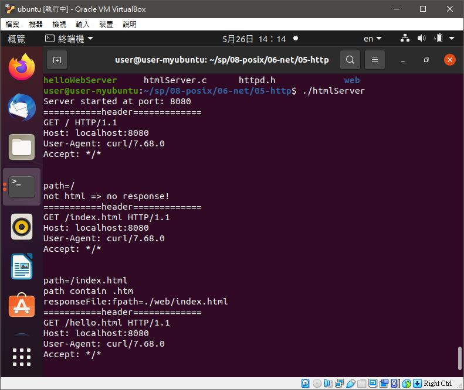
<details>
  <summary><b>Show code</b></summary>

  ```
#include "../net.h"
#include "httpd.h"

int main(int argc, char *argv[]) {
  int port = (argc >= 2) ? atoi(argv[1]) : PORT;
	net_t net;
	net_init(&net, TCP, SERVER, port, NULL);
	net_bind(&net);
	net_listen(&net);
  printf("Server started at port: %d\n", net.port);
  while (1) {
    int client_fd = net_accept(&net);
    if (client_fd == -1) {
      printf("Can't accept");
      continue;
    }
    char header[TMAX], path[SMAX];
    readHeader(client_fd, header);
    printf("===========header=============\n%s\n", header);
    parseHeader(header, path);
    printf("path=%s\n", path);
    if (strstr(path, ".htm") != NULL) {
      printf("path contain .htm\n");
      responseFile(client_fd, path);
    } else {
      printf("not html => no response!\n");
    }
    sleep(1);
    close(client_fd);
  }
}
  ```
</details>
<details>
  <summary><b>Show httpd.c code</b></summary>

  ```
#include "httpd.h"

void readHeader(int client_fd, char *header) {
  int len = read(client_fd, header, TMAX);
  header[len] = '\0';
}

void parseHeader(char *header, char *path) {
  sscanf(header, "GET %s HTTP/", path);
}

void responseFile(int client_fd, char *path) {
  char text[TMAX], response[TMAX], fpath[SMAX];
  sprintf(fpath, "./web%s", path); // ex: fpath = ./web/hello.html
  printf("responseFile:fpath=%s\n", fpath);
  FILE *file = fopen(fpath, "r");
  int len;
  if (file == NULL) {
    strcpy(text, "<html><body><h1>File not Found!</h1></body></html>");
    len = strlen(text);
  } else {
    len = fread(text, 1, TMAX, file);
    text[len] = '\0';
  }
  sprintf(response, "HTTP/1.1 200 OK\r\n"
                    "Content-Type: text/html; charset=UTF-8\r\n"
                    "Content-Length: %d\r\n\r\n%s", len, text);
  write(client_fd, response, strlen(response));
}
  ```
</details>

#### The result of execution
```
user@user-myubuntu:~/sp/08-posix/06-net/05-http$ ./htmlServer 
Server started at port: 8080
===========header=============
GET / HTTP/1.1
Host: localhost:8080
User-Agent: curl/7.68.0
Accept: */*


path=/
not html => no response!
===========header=============
GET /index.html HTTP/1.1
Host: localhost:8080
User-Agent: curl/7.68.0
Accept: */*


path=/index.html
path contain .htm
responseFile:fpath=./web/index.html
===========header=============
GET /hello.html HTTP/1.1
Host: localhost:8080
User-Agent: curl/7.68.0
Accept: */*


path=/hello.html
path contain .htm
responseFile:fpath=./web/hello.html
```

#### The result of execution (補充)
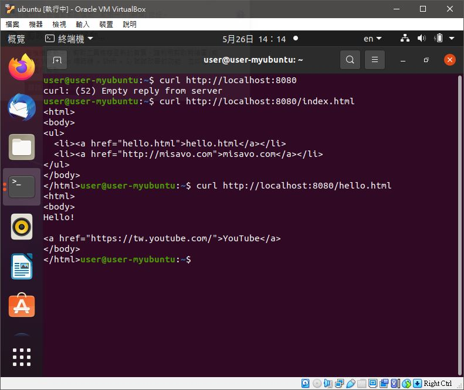
```
user@user-myubuntu:~$ curl http://localhost:8080/index.html
<html>
<body> 
<ul>
  <li><a href="hello.html">hello.html</a></li>
  <li><a href="http://misavo.com">misavo.com</a></li>
</ul>
</body>
</html>user@user-myubuntu:~$ curl http://localhost:8080/hello.html
<html>
<body>
Hello! 

<a href="https://tw.youtube.com/">YouTube</a>
</body>
</html>user@user:~/sp/08-posix/06-net/05-http$ curl -v http://localhost:8080/index.html
*   Trying 127.0.0.1:8080...
* TCP_NODELAY set
* Connected to localhost (127.0.0.1) port 8080 (#0)
>===========header=============
GET /index.html HTTP/1.1
Host: localhost:8080
User-Agent: curl/7.68.0
Accept: */*


path=/index.html
path contain .htm
responseFile:fpath=./web/index.html
 GET /index.html HTTP/1.1
> Host: localhost:8080
> User-Agent: curl/7.68.0
> Accept: */*
> 
* Mark bundle as not supporting multiuse
< HTTP/1.1 200 OK
< Content-Type: text/html; charset=UTF-8
< Content-Length: 142
< 
<html>
<body> 
<ul>
  <li><a href="hello.html">hello.html</a></li>
  <li><a href="http://misavo.com">misavo.com</a></li>
</ul>
</body>
* Connection #0 to host localhost left intact
```

### 🔗 08-posix/07-nonblocking/nonblocking1 

<details>
  <summary><b>Show code</b></summary>

  ```
#include<sys/types.h>
#include<sys/stat.h>
#include<fcntl.h>
#include<unistd.h>
#include<stdio.h>
#include<stdlib.h>

int main(int argc, char* argv[])
{
    int fd = open("/dev/tty", O_RDONLY | O_NONBLOCK); // O ﹣ Nonblock set file input and output to non blocking
    if(fd == -1){
        perror("open /dev/tty");
        exit(1);
    }
    int ret = 0;
    char buf[1024] = {0};
    while(1){
        ret = read(fd, buf, sizeof(buf));
        if(ret == -1){
            perror("read /dev/tty"); // fputs(stderr, "read /dev/tty")
            printf("no input,buf is null\n");
        }
        else {
            printf("ret = %d, buf is %s\n",ret, buf);
        }
        sleep(1);
    }
    close(fd);

    return 0;
}
  ```
</details>

#### The result of execution
```
user@user:~/sp/08-posix/07-nonblocking$ gcc nonblocking1.c -o nonblocking1
user@user:~/sp/08-posix/07-nonblocking$ ./nonblocking1 
read /dev/tty: Resource temporarily unavailable
no input,buf is null
hread /dev/tty: Resource temporarily unavailable
no input,buf is null
elloread /dev/tty: Resource temporarily unavailable
no input,buf is null

ret = 6, buf is hello

read /dev/tty: Resource temporarily unavailable
no input,buf is null
hello
ret = 6, buf is hello
```

### 🔗 08-posix/A1-pipe/01-grep1/grep1
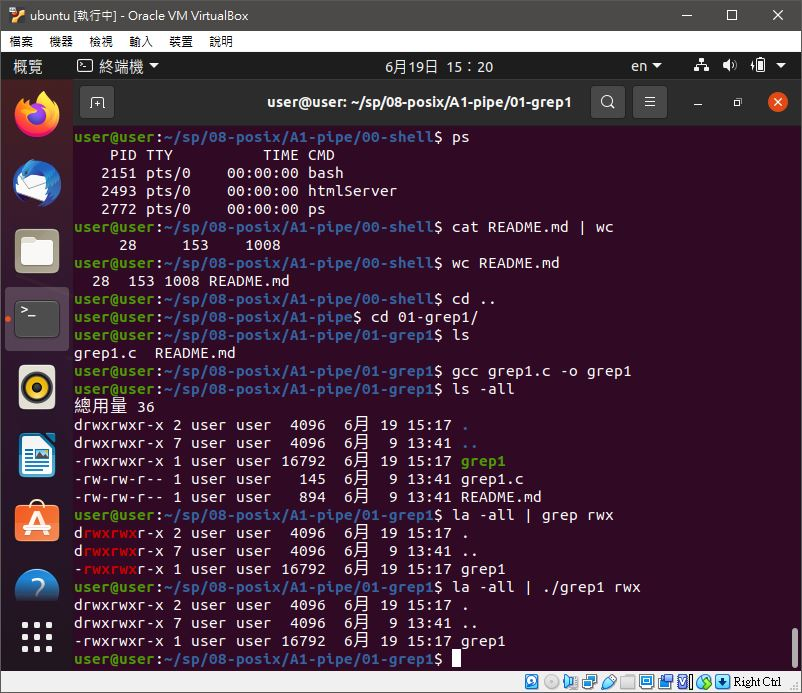
<details>
  <summary><b>Show code</b></summary>

  ```
#include <stdio.h>
#include <stdlib.h>

int main(int argc, char *argv[]) {
  char cmd[100];
  sprintf(cmd, "grep %s", argv[1]);
  system(cmd);
}
  ```
</details>

#### The result of execution
```
user@user:~/sp/08-posix/A1-pipe/01-grep1$ gcc grep1.c -o grep1
user@user:~/sp/08-posix/A1-pipe/01-grep1$ ls -all
總用量 36
drwxrwxr-x 2 user user  4096  6月 19 15:17 .
drwxrwxr-x 7 user user  4096  6月  9 13:41 ..
-rwxrwxr-x 1 user user 16792  6月 19 15:17 grep1
-rw-rw-r-- 1 user user   145  6月  9 13:41 grep1.c
-rw-rw-r-- 1 user user   894  6月  9 13:41 README.md
user@user:~/sp/08-posix/A1-pipe/01-grep1$ la -all | grep rwx
drwxrwxr-x 2 user user  4096  6月 19 15:17 .
drwxrwxr-x 7 user user  4096  6月  9 13:41 ..
-rwxrwxr-x 1 user user 16792  6月 19 15:17 grep1
user@user:~/sp/08-posix/A1-pipe/01-grep1$ la -all | ./grep1 rwx
drwxrwxr-x 2 user user  4096  6月 19 15:17 .
drwxrwxr-x 7 user user  4096  6月  9 13:41 ..
-rwxrwxr-x 1 user user 16792  6月 19 15:17 grep1
```

### 🔗 08-posix/A1-pipe/02-popen/popen1
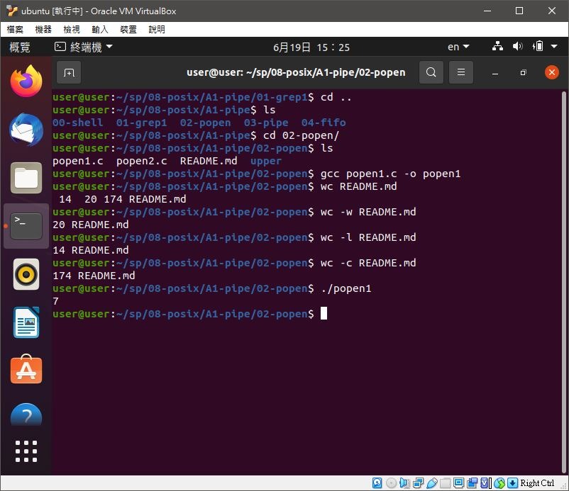
<details>
  <summary><b>Show code</b></summary>

  ```
#include <stdio.h>

int main() {
  char buf[] = "aaa bbb ccc ddd eee fff ggg";
  FILE *fp = popen("wc -w", "w");
  fwrite(buf, sizeof(buf), 1, fp);
  pclose(fp);
}
  ```
</details>

#### The result of execution
```
user@user:~/sp/08-posix/A1-pipe/02-popen$ gcc popen1.c -o popen1
user@user:~/sp/08-posix/A1-pipe/02-popen$ wc README.md 
 14  20 174 README.md
user@user:~/sp/08-posix/A1-pipe/02-popen$ wc -w README.md 
20 README.md
user@user:~/sp/08-posix/A1-pipe/02-popen$ wc -l README.md 
14 README.md
user@user:~/sp/08-posix/A1-pipe/02-popen$ wc -c README.md 
174 README.md
user@user:~/sp/08-posix/A1-pipe/02-popen$ ./popen1 
7
```

### 🔗 08-posix/A1-pipe/02-popen/popen2

<details>
  <summary><b>Show code</b></summary>

  ```
#include <stdio.h>

int main() {
  char buf[10000];
  FILE *fp = popen("ls -all", "r");
  int len = fread(buf, 1, sizeof(buf), fp);
  buf[len] = '\0';
  printf("%s", buf);
  pclose(fp);
}
  ```
</details>

#### The result of execution
```
user@user:~/sp/08-posix/A1-pipe/02-popen$ gcc popen2.c -o popen2
user@user:~/sp/08-posix/A1-pipe/02-popen$ ./popen2
總用量 64
drwxrwxr-x 3 user user  4096  6月 19 15:33 .
drwxrwxr-x 7 user user  4096  6月  9 13:41 ..
-rwxrwxr-x 1 user user 16840  6月 19 15:22 popen1
-rw-rw-r-- 1 user user   164  6月  9 13:41 popen1.c
-rwxrwxr-x 1 user user 16880  6月 19 15:33 popen2
-rw-rw-r-- 1 user user   188  6月  9 13:41 popen2.c
-rw-rw-r-- 1 user user   174  6月  9 13:41 README.md
drwxrwxr-x 2 user user  4096  6月  9 13:41 upper
```

### 🔗 08-posix/A1-pipe/02-popen/upper/upperpipe
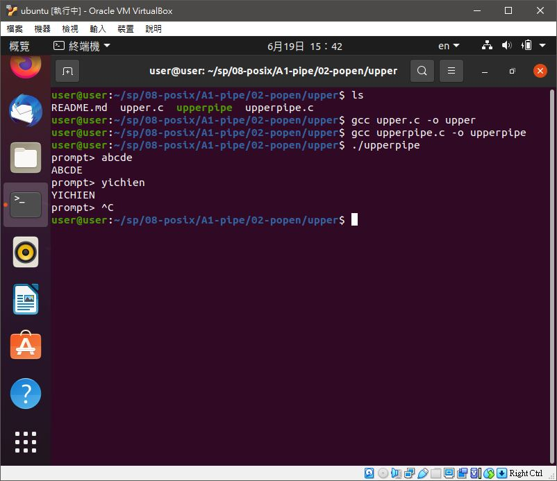
<details>
  <summary><b>Show upperpipe.c code</b></summary>

  ```
#include <stdio.h>
#include <unistd.h>
#include <sys/wait.h>

int main() {
    char line[8192];
    FILE *fpin;
    fpin = popen("./upper", "r");
    for ( ; ; ) {
        fputs("prompt> ", stdout);
        fflush(stdout);
        fgets(line, sizeof(line), fpin); // 注意這行，line 會被 upper 轉為大寫
        fputs(line, stdout);
    }
}
  ```
</details>
<details>
  <summary><b>Show upper.c code</b></summary>

  ```
#include <stdio.h>
#include <ctype.h>

int main() {
    int c;
    while ((c = getchar()) != EOF) {
        if (islower(c)) c=toupper(c);
        if (putchar(c) == EOF) printf("output error!");
        if (c=='\n') fflush(stdout);
    }
}
  ```
</details>

#### The result of execution
```
user@user:~/sp/08-posix/A1-pipe/02-popen/upper$ gcc upper.c -o upper
user@user:~/sp/08-posix/A1-pipe/02-popen/upper$ gcc upperpipe.c -o upperpipe
user@user:~/sp/08-posix/A1-pipe/02-popen/upper$ ./upperpipe 
prompt> abcde
ABCDE
prompt> yichien
YICHIEN
```

### 🔗 08-posix/A1-pipe/03-pipe/pipe1 
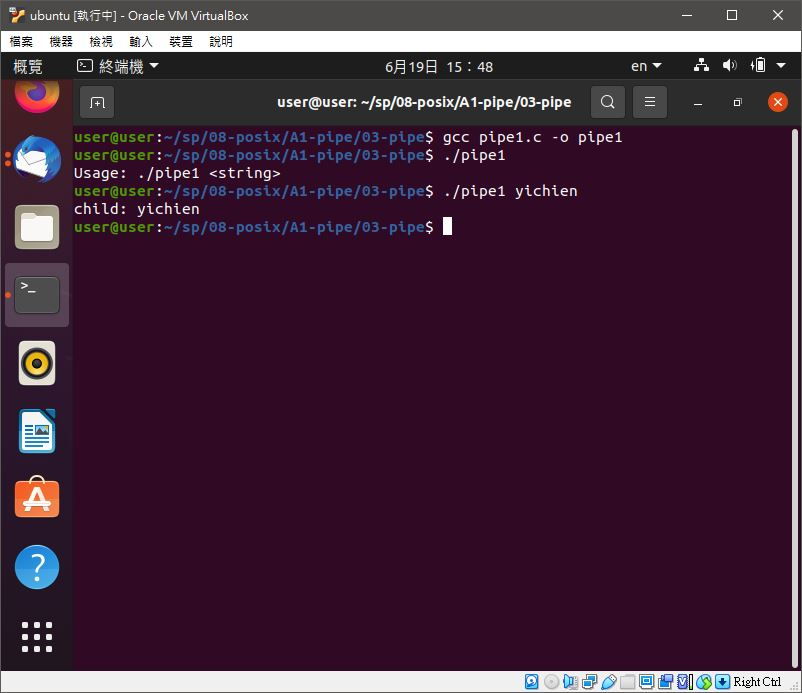
<details>
  <summary><b>Show code</b></summary>

  ```
#include <sys/types.h>
#include <sys/wait.h>
#include <stdio.h>
#include <stdlib.h>
#include <unistd.h>
#include <string.h>

int main(int argc, char *argv[]) {
    int pipefd[2];
    pid_t cpid;
    char buf;

    if (argc != 2) {
        fprintf(stderr, "Usage: %s <string>\n", argv[0]);
        exit(EXIT_FAILURE);
    }

    if (pipe(pipefd) == -1) {
        perror("pipe");
        exit(EXIT_FAILURE);
    }

    cpid = fork();
    if (cpid == -1) {
        perror("fork");
        exit(EXIT_FAILURE);
    }

    if (cpid == 0) {    /* Child reads from pipe */
        close(pipefd[1]);          /* Close unused write end */

        write(STDOUT_FILENO, "child: ", strlen("child: "));
        while (read(pipefd[0], &buf, 1) > 0)
            write(STDOUT_FILENO, &buf, 1);

        write(STDOUT_FILENO, "\n", 1);
        close(pipefd[0]);
        _exit(EXIT_SUCCESS);

    } else {            /* Parent writes argv[1] to pipe */
        close(pipefd[0]);          /* Close unused read end */
        write(pipefd[1], argv[1], strlen(argv[1]));
        close(pipefd[1]);          /* Reader will see EOF */
        wait(NULL);                /* Wait for child */
        exit(EXIT_SUCCESS);
    }
}
  ```
</details>

#### The result of execution
```
user@user:~/sp/08-posix/A1-pipe/03-pipe$ gcc pipe1.c -o pipe1
user@user:~/sp/08-posix/A1-pipe/03-pipe$ ./pipe1 
Usage: ./pipe1 <string>
user@user:~/sp/08-posix/A1-pipe/03-pipe$ ./pipe1 yichien
child: yichien
```

### 🔗 08-posix/A1-pipe/04-fifo/02-chat/fifo1 fifo2

<details>
  <summary><b>Show fifo1.c code</b></summary>

  ```
#include <stdio.h>
#include <string.h>
#include <fcntl.h>
#include <sys/stat.h>
#include <sys/types.h>
#include <unistd.h>
  
int main()
{
    int fd;
  
    // FIFO file path
    char * myfifo = "/tmp/myfifo";
  
    // Creating the named file(FIFO)
    // mkfifo(<pathname>, <permission>)
    mkfifo(myfifo, 0666);
  
    char arr1[80], arr2[80];
    while (1)
    {
        // Open FIFO for write only
        fd = open(myfifo, O_WRONLY);
  
        // Take an input arr2ing from user.
        // 80 is maximum length
        fgets(arr2, 80, stdin);
  
        // Write the input arr2ing on FIFO
        // and close it
        write(fd, arr2, strlen(arr2)+1);
        close(fd);
  
        // Open FIFO for Read only
        fd = open(myfifo, O_RDONLY);
  
        // Read from FIFO
        read(fd, arr1, sizeof(arr1));
  
        // Print the read message
        printf("User2: %s\n", arr1);
        close(fd);
    }
    return 0;
}
  ```
</details>
<details>
  <summary><b>Show fifo2.c code</b></summary>

  ```
// This side reads first, then reads
#include <stdio.h>
#include <string.h>
#include <fcntl.h>
#include <sys/stat.h>
#include <sys/types.h>
#include <unistd.h>
  
int main()
{
    int fd1;
  
    // FIFO file path
    char * myfifo = "/tmp/myfifo";
  
    // Creating the named file(FIFO)
    // mkfifo(<pathname>,<permission>)
    mkfifo(myfifo, 0666);
  
    char str1[80], str2[80];
    while (1)
    {
        // First open in read only and read
        fd1 = open(myfifo,O_RDONLY);
        read(fd1, str1, 80);
  
        // Print the read string and close
        printf("User1: %s\n", str1);
        close(fd1);
  
        // Now open in write mode and write
        // string taken from user.
        fd1 = open(myfifo,O_WRONLY);
        fgets(str2, 80, stdin);
        write(fd1, str2, strlen(str2)+1);
        close(fd1);
    }
    return 0;
}
  ```
</details>

#### The result of execution
##### fifo1
```
user@user:~/sp/08-posix/A1-pipe/04-fifo/02-chat$ gcc fifo1.c -o fifo1
user@user:~/sp/08-posix/A1-pipe/04-fifo/02-chat$ ./fifo1
hello
User2: hey yo 

i am yc
```
##### fifo2
```
user@user:~/sp/08-posix/A1-pipe/04-fifo/02-chat$ gcc fifo2.c -o fifo2
user@user:~/sp/08-posix/A1-pipe/04-fifo/02-chat$ ./fifo2
User1: hello

hey yo 
User1: i am yc
```


🖊️editor : yi-chien Liu
