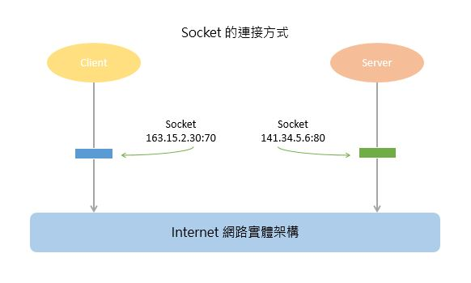
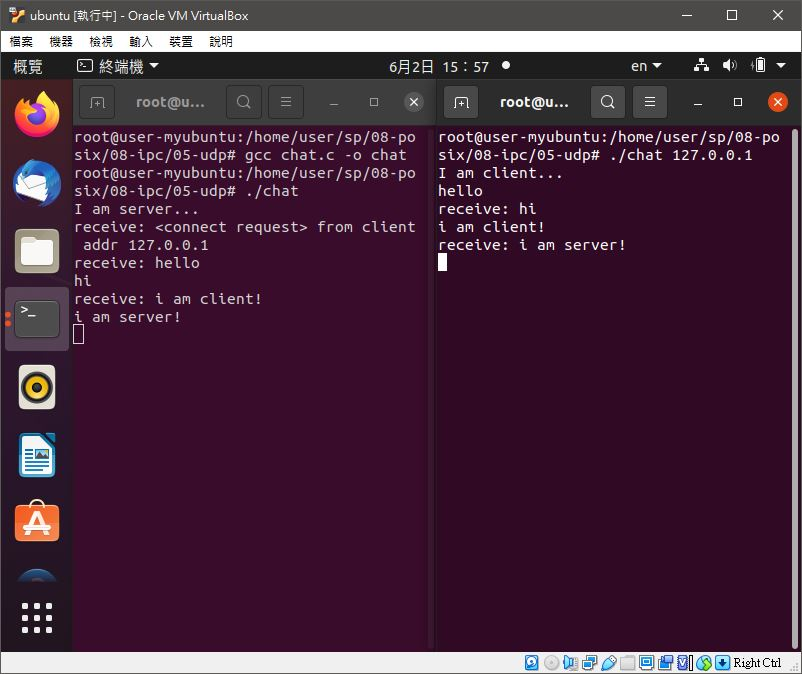

# 📝系統程式第十四週筆記20210602
## 📖 socket通訊

* 是一種作業系統提供的行程間通訊機制
* Socket 就是一個網路上的通訊端點，使用者或應用程式只要連接到 Socket 便可以和網路上任何一個通訊端點連線，Socket 之間通訊就如同作業系統內程序（Process）之間通訊一樣
* 系統內部介面（內部網路），介面描述符（抽象介面描述符）和介面位址之間的差別其實很細微，日常編程用的時候幾乎不做區別

## 💻 程式實際操作
### 🔗 08-posix/08-ipc/02-fifo/chat

<details>
  <summary><b>Show code</b></summary>

  ```
#include <stdio.h>
#include <string.h>
#include <fcntl.h>
#include <sys/stat.h>
#include <sys/types.h>
#include <unistd.h>

#define SMAX 80

int main(int argc, char *argv[]) {
    int fd;
    char *fifo0 = "/tmp/user0";
    char *fifo1 = "/tmp/user1";
    mkfifo(fifo0, 0666);  //權限
    mkfifo(fifo1, 0666);  //權限

    char *me, *you;   //判別使用者
    if (strcmp(argv[1], "0")) { // me:0 => you:1
        me = fifo0;
        you = fifo1;
    } else { // me:1 => you:0
        me = fifo1;
        you = fifo0;
    }

    char msg[SMAX];
    if (fork() == 0) {
        // child: receive message and print(一直讀對方訊息，讀到就印出來)
        fd = open(you, O_RDONLY);  //開啟對方管道
        while (1) {
            int n = read(fd, msg, sizeof(msg));  //讀取對方發的訊息
            if (n <= 0) break;  //如果管道已經關閉，就離開
            printf("receive: %s", msg);  //印出訊息
        }
        close(fd);
    } else {
        // parent: readline and send(一直讀鍵盤，然後把訊息送給對方)
        fd = open(me, O_WRONLY);  //開啟我方管道
        while (1) {
            fgets(msg, SMAX, stdin); //讀一行輸出
            int n = write(fd, msg, strlen(msg)+1); //將該行輸入訊息送上我方管道
            if (n<=0) break;
        }
        close(fd);
    }
    return 0;
}
  ```
</details>

#### The result of execution
```
root@user-myubuntu:/home/user/sp/08-posix/08-ipc/02-fifo# gcc chat.c -o chat
```
##### chat0
```
root@user-myubuntu:/home/user/sp/08-posix/08-ipc/02-fifo# ./chat 0
hi
receive: hello
hello how are you
receive: good!
nice
```
##### chat1
```
root@user-myubuntu:/home/user/sp/08-posix/08-ipc/02-fifo# ./chat 1
receive: hi
hello
receive: hello how are you
good!
receive: nice
```
##### 補充
* fork()會將原本的父程序會分支出子程序，程式中子行程為讀取訊息，父行程為傳送訊息

### 🔗 08-posix/08-ipc/03-mmap/chat

<details>
  <summary><b>Show code</b></summary>

  ```
#include <stdio.h>
#include <string.h>
#include <fcntl.h>
#include <sys/mman.h>
#include <unistd.h>

#define SMAX 80

int main(int argc, char *argv[]) {
    int id = argv[1][0]-'0';
    int fd = open("chat.dat", O_RDWR | O_CREAT);
    char *buf = mmap(NULL, 2*SMAX, PROT_READ|PROT_WRITE, MAP_SHARED, fd, 0);
    char *myMsg, *yourMsg;
    if (id == 0) {
        myMsg = buf;
        yourMsg = buf + SMAX;
    } else {
        myMsg = buf + SMAX;
        yourMsg = buf;
    }
    if (fork() == 0) {
        // child: receive message and print
        while (1) {
            if (yourMsg[0] != '\0') {
                printf("receive: %s", yourMsg);
                yourMsg[0] = '\0';
            }
        }
    } else {
        // parent: readline and put into myMsg in buf
        while (1) {
            fgets(myMsg, SMAX, stdin);
        }
    }
    munmap(buf, 2*SMAX);
    close(fd);
    return 0;
}
  ```
</details>

#### The result of execution
```
root@user-myubuntu:/home/user/sp/08-posix/08-ipc/03-mmap# gcc chat.c -o chat
```
##### chat 0
```
root@user-myubuntu:/home/user/sp/08-posix/08-ipc/03-mmap# ./chat 0
hi
receive: hello
how are you today
receive: nice!
how about you
receive: not bad
```
##### chat 1
```
root@user-myubuntu:/home/user/sp/08-posix/08-ipc/03-mmap# ./chat 1
receive: hi
hello
receive: how are you today
nice!
receive: how about you
not bad
```
##### 補充
* 高速檔案存取，一般的I/O機制通常需要將資料先到緩區中，記憶體對映免去了中間這一層，加速檔案存取速度
* 可執行檔可對映到記憶體空間中，使程式動態載入

### 🔗 08-posix/08-ipc/04-msg/chat

<details>
  <summary><b>Show code</b></summary>

  ```
#include <stdio.h>
#include <string.h>
#include <sys/types.h>
#include <sys/ipc.h>
#include <sys/msg.h>
#include <sys/stat.h>
#include <unistd.h>

#define SMAX 80

struct msg_t {
    long mtype; // type 指定要哪一種消息, 0:取第一個, >0:消息類型為 type 的第一個, <0:消息類型 <=abs(type) 的第一個。
    char mtext[SMAX];
};

int main(int argc, char *argv[]) {
    int id = argv[1][0]-'0';
    int q0 = msgget((key_t) 1235, 0666|IPC_CREAT);
    int q1 = msgget((key_t) 1236, 0666|IPC_CREAT);
    int myQ, yourQ;
    if (id == 0) {
        myQ = q0;
        yourQ = q1;
    } else {
        myQ = q1;
        yourQ = q0;
    }
    struct msg_t msg = {.mtype=1};
    // char msg[SMAX];
    if (fork() == 0) {
        // child: receive message and print
        while (1) {
            msgrcv(yourQ, &msg, SMAX, 0, 0);
            printf("receive: %s", msg.mtext);
        }
    } else {
        // parent: readline and put into myMsg in buf
        while (1) {
            fgets(msg.mtext, SMAX, stdin);
            msgsnd(myQ, &msg, SMAX, 0);
        }
    }
    return 0;
}
  ```
</details>

* `key_t` 強制型態轉換

#### The result of execution
```
root@user-myubuntu:/home/user/sp/08-posix/08-ipc/04-msg# gcc chat.c -o chat
```
##### chat 0
```
root@user-myubuntu:/home/user/sp/08-posix/08-ipc/04-msg# ./chat 0
hi
receive: hello
how are you
receive: gooooooooood!
nice
receive: about you?
```
##### chat 1
```
root@user-myubuntu:/home/user/sp/08-posix/08-ipc/04-msg# ./chat 1
receive: hi
hello
receive: how are you
gooooooooood!
receive: nice
about you?
```

### 🔗 08-posix/08-ipc/05-udp/chat

<details>
  <summary><b>Show code</b></summary>

  ```
#include <stdio.h>
#include <string.h>
#include <stdlib.h>
#include <sys/types.h>
#include <sys/socket.h>
#include <arpa/inet.h>
#include <netinet/in.h>
#include <unistd.h>

#define SMAX 80

int main(int argc, char *argv[]) {
    int sfd = socket(AF_INET, SOCK_DGRAM, 0);
    struct sockaddr_in saddr, raddr;
    memset(&saddr, 0, sizeof(saddr));
    memset(&raddr, 0, sizeof(raddr));
    saddr.sin_family = AF_INET;
    saddr.sin_port = htons(8888);
    char msg[SMAX];
    if (argc==1) { // server
        printf("I am server...\n");
        saddr.sin_addr.s_addr = INADDR_ANY;
        bind(sfd, (struct sockaddr*) &saddr, sizeof(struct sockaddr));
        socklen_t rAddrLen = sizeof(struct sockaddr);
        int rlen = recvfrom(sfd, msg, SMAX, 0, (struct sockaddr*) &raddr, &rAddrLen);
        printf("receive: %s from client addr %s\n", msg, inet_ntoa(raddr.sin_addr));
    } else { // client
        printf("I am client...\n");
        saddr.sin_addr.s_addr = inet_addr(argv[1]);
        memcpy(&raddr, &saddr, sizeof(saddr));
        char *connMsg = "<connect request>";
        sendto(sfd, connMsg, strlen(connMsg)+1, 0, (struct sockaddr*) &saddr, sizeof(struct sockaddr));
    }
    if (fork() == 0) {
        // child: receive message and print
        while (1) {
            socklen_t rAddrLen = sizeof(struct sockaddr);
            recvfrom(sfd, msg, SMAX, 0, (struct sockaddr*) &raddr, &rAddrLen);
            printf("receive: %s", msg);
        }
    } else {
        // parent: readline and send msg
        while (1) {
            fgets(msg, SMAX, stdin);
            sendto(sfd, msg, strlen(msg)+1, 0, (struct sockaddr*) &raddr, sizeof(struct sockaddr));
        }
    }
    close(sfd);
    return 0;
}
  ```
</details>

* 非連接導向

#### The result of execution
```
root@user-myubuntu:/home/user/sp/08-posix/08-ipc/05-udp# gcc chat.c -o chat
```
##### server
```
root@user-myubuntu:/home/user/sp/08-posix/08-ipc/05-udp# ./chat
I am server...
receive: <connect request> from client addr 127.0.0.1
receive: hello
hi
receive: i am client!
i am server!
```
##### client
```
root@user-myubuntu:/home/user/sp/08-posix/08-ipc/05-udp# ./chat 127.0.0.1
I am client...
hello
receive: hi
i am client!
receive: i am server!
```
##### 補充
* 屬於非連接導向，直接通過socket通訊
* 是一個簡單的面向資料報的通信協定，位於OSI模型的傳輸層
* UDP適用於不需要或在程式中執行錯誤檢查和糾正的應用，它避免了協定棧中此類處理的開銷
* 對時間有較高要求的應用程式通常使用UDP，因為丟棄封包比等待或重傳導致延遲更可取

### 🔗 08-posix/08-ipc/06-tcp/chat

<details>
  <summary><b>Show code</b></summary>

  ```
#include <stdio.h>
#include <string.h>
#include <stdlib.h>
#include <sys/types.h>
#include <sys/socket.h>
#include <arpa/inet.h>
#include <netinet/in.h>
#include <unistd.h>

#define SMAX 80

int main(int argc, char *argv[]) {
    int sfd = socket(AF_INET, SOCK_STREAM, 0);
    int cfd, fd;
    struct sockaddr_in saddr, raddr;
    memset(&saddr, 0, sizeof(saddr));
    memset(&raddr, 0, sizeof(raddr));
    saddr.sin_family = AF_INET;
    saddr.sin_port = htons(8888);
    char msg[SMAX];
    if (argc==1) { // server
        printf("I am server...\n");
        saddr.sin_addr.s_addr = INADDR_ANY;
        bind(sfd, (struct sockaddr*) &saddr, sizeof(struct sockaddr));
        listen(sfd, 1);
        socklen_t rAddrLen = sizeof(struct sockaddr);
        cfd = accept(sfd, (struct sockaddr*) &raddr, &rAddrLen);
        printf("accept: cfd=%d client addr %s\n", cfd, inet_ntoa(raddr.sin_addr));
        fd = cfd;
    } else { // client
        printf("I am client...\n");
        saddr.sin_addr.s_addr = inet_addr(argv[1]);
        connect(sfd, (struct sockaddr*) &saddr, sizeof(struct sockaddr));
        fd = sfd;
        printf("connect success: sfd=%d server addr=%s\n", sfd, inet_ntoa(saddr.sin_addr));
    }

    if (fork() == 0) {
        // child: receive message and print
        while (1) {
            int n = recv(fd, msg, SMAX, 0);
            if (n <=0) break;
            printf("receive: %s", msg);
        }
    } else {
        // parent: readline and send msg
        while (1) {
            fgets(msg, SMAX, stdin);
            send(fd, msg, strlen(msg)+1, 0);
        }
    }
    close(sfd);
    return 0;
}
  ```
</details>


* 連接導向

#### The result of execution
```
root@user-myubuntu:/home/user/sp/08-posix/08-ipc/06-tcp# gcc chat.c -o chat
```
##### server
```
root@user-myubuntu:/home/user/sp/08-posix/08-ipc/06-tcp# ./chat
I am server...
accept: cfd=4 client addr 127.0.0.1
receive: hi
hello
receive: i am client!!!
i am server!!!
```
##### client
```
root@user-myubuntu:/home/user/sp/08-posix/08-ipc/06-tcp# ./chat 127.0.0.1
I am client...
connect success: sfd=3 server addr=127.0.0.1
hi    
receive: hello
i am client!!!
receive: i am server!!!
```

## 📖 參考資料
* [socket通訊](https://zh.wikipedia.org/wiki/%E7%B6%B2%E8%B7%AF%E6%8F%92%E5%BA%A7)
* [何謂Socket](https://bluelove1968.pixnet.net/blog/post/222279898)
* [翻轉工作室 第八章 TCP Socket 程式介面](http://www.tsnien.idv.tw/Internet_WebBook/chap8/8-1%20Socket%20%E7%B0%A1%E4%BB%8B.html)


🖊️editor : yi-chien Liu
