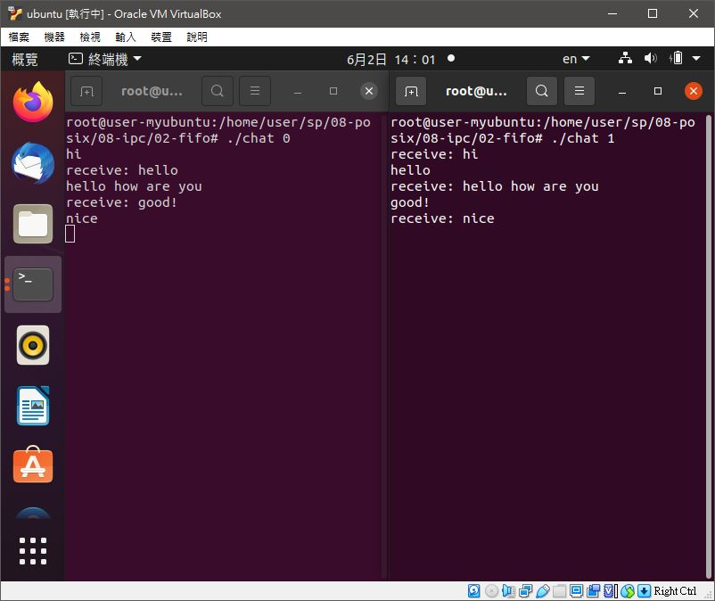
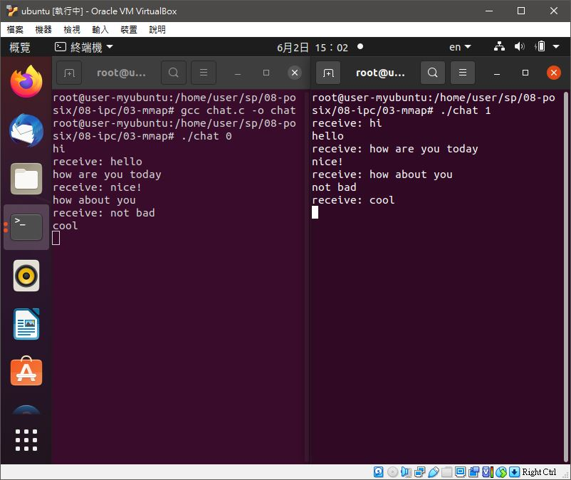

# 📝系統程式第十四週筆記20210602

## 💻 程式實際操作
### 🔗 08-posix/08-ipc/02-fifo/chat

<details>
  <summary><b>Show code</b></summary>

  ```
#include <stdio.h>
#include <string.h>
#include <fcntl.h>
#include <sys/stat.h>
#include <sys/types.h>
#include <unistd.h>

#define SMAX 80

int main(int argc, char *argv[]) {
    int fd;
    char *fifo0 = "/tmp/user0";
    char *fifo1 = "/tmp/user1";
    mkfifo(fifo0, 0666);  //權限
    mkfifo(fifo1, 0666);  //權限

    char *me, *you;
    if (strcmp(argv[1], "0")) { // me:0 => you:1
        me = fifo0;
        you = fifo1;
    } else { // me:1 => you:0
        me = fifo1;
        you = fifo0;
    }

    char msg[SMAX];
    if (fork() == 0) {
        // child: receive message and print(一直讀對方訊息，讀到就印出來)
        fd = open(you, O_RDONLY);  //開啟對方管道
        while (1) {
            int n = read(fd, msg, sizeof(msg));  //讀取對方發的訊息
            if (n <= 0) break;  //如果管道已經關閉，就離開
            printf("receive: %s", msg);  //印出訊息
        }
        close(fd);
    } else {
        // parent: readline and send(一直讀鍵盤，然後把訊息送給對方)
        fd = open(me, O_WRONLY); //開啟我方管道
        while (1) {
            fgets(msg, SMAX, stdin); //讀一行輸出
            int n = write(fd, msg, strlen(msg)+1); //將該行輸入訊息送上我方管道
            if (n<=0) break;
        }
        close(fd);
    }
    return 0;
}
  ```
</details>

#### The result of execution
```
root@user-myubuntu:/home/user/sp/08-posix/08-ipc/02-fifo# gcc chat.c -o chat
```
##### chat0
```
root@user-myubuntu:/home/user/sp/08-posix/08-ipc/02-fifo# ./chat 0
hi
receive: hello
hello how are you
receive: good!
nice
```
##### chat1
```
root@user-myubuntu:/home/user/sp/08-posix/08-ipc/02-fifo# ./chat 1
receive: hi
hello
receive: hello how are you
good!
receive: nice
```

### 🔗 08-posix/08-ipc/03-mmap/chat

<details>
  <summary><b>Show code</b></summary>

  ```
#include <stdio.h>
#include <string.h>
#include <fcntl.h>
#include <sys/mman.h>
#include <unistd.h>

#define SMAX 80

int main(int argc, char *argv[]) {
    int id = argv[1][0]-'0';
    int fd = open("chat.dat", O_RDWR | O_CREAT);
    char *buf = mmap(NULL, 2*SMAX, PROT_READ|PROT_WRITE, MAP_SHARED, fd, 0);
    char *myMsg, *yourMsg;
    if (id == 0) {
        myMsg = buf;
        yourMsg = buf + SMAX;
    } else {
        myMsg = buf + SMAX;
        yourMsg = buf;
    }
    if (fork() == 0) {
        // child: receive message and print
        while (1) {
            if (yourMsg[0] != '\0') {
                printf("receive: %s", yourMsg);
                yourMsg[0] = '\0';
            }
        }
    } else {
        // parent: readline and put into myMsg in buf
        while (1) {
            fgets(myMsg, SMAX, stdin);
        }
    }
    munmap(buf, 2*SMAX);
    close(fd);
    return 0;
}
  ```
</details>

#### The result of execution
```
root@user-myubuntu:/home/user/sp/08-posix/08-ipc/03-mmap# gcc chat.c -o chat
```
##### chat 0
```
root@user-myubuntu:/home/user/sp/08-posix/08-ipc/03-mmap# ./chat 0
hi
receive: hello
how are you today
receive: nice!
how about you
receive: not bad
```
##### chat 1
```
root@user-myubuntu:/home/user/sp/08-posix/08-ipc/03-mmap# ./chat 1
receive: hi
hello
receive: how are you today
nice!
receive: how about you
not bad
```