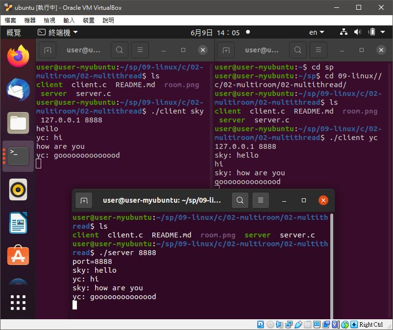
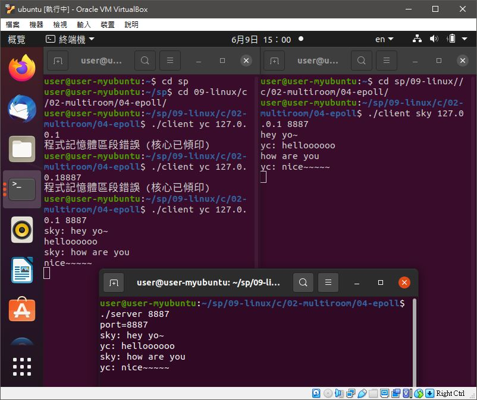

# 📝系統程式第十一週筆記20210609

## 💻 程式實際操作
### 🔗 09-linux/c/02-multiroom/02-multithread/server client

<details>
  <summary><b>Show server.c code</b></summary>

  ```
#include <stdio.h>
#include <string.h>
#include <stdlib.h>
#include <sys/types.h>
#include <sys/socket.h>
#include <arpa/inet.h>
#include <netinet/in.h>
#include <unistd.h>
#include <pthread.h>
#include <assert.h>

#define SMAX 80
#define CMAX 10 // 100000

struct Client_t { // 客戶端的資料結構
    int fd; // 串流代號
    pthread_t thread; // 線程 thread
};

struct Client_t clients[CMAX]; // 所有客戶端

void *receiver(void *argu) {
    int ci = *(int*)argu;
    int cfd = clients[ci].fd;
    char msg[SMAX];
    while (1) {
        int n = recv(cfd, msg, SMAX, 0); // 收到某客戶端傳來的訊息
        if (n <=0) break;
        printf("%s", msg); // 印出該訊息
        for (int i=0; i<CMAX; i++) { // 廣播給其他人
            if (i != ci && clients[i].fd != 0) { // 如果對方不是發訊息者，而且不是空的，那就轉送給他！
                send(clients[i].fd, msg, strlen(msg)+1, 0);
            }
        }
    }
    close(cfd);
    clients[ci].fd = 0;
    return NULL;
}

void connectHandler(int sfd) {
    struct sockaddr_in raddr;
    socklen_t rAddrLen = sizeof(struct sockaddr);
    int cfd = accept(sfd, (struct sockaddr*) &raddr, &rAddrLen);
    for (int i=0; i<CMAX; i++) {
        if (clients[i].fd == 0) {
            memset(&clients[i], 0, sizeof(clients[i]));
            clients[i].fd = cfd;
            pthread_create(&clients[i].thread, NULL, receiver, &i);
            break;
        }
    }
}

int main(int argc, char *argv[]) {
    int port = atoi(argv[1]);
    printf("port=%d\n", port);
    int sfd = socket(AF_INET, SOCK_STREAM, 0);
    struct sockaddr_in saddr, raddr;
    memset(&saddr, 0, sizeof(saddr));
    saddr.sin_family = AF_INET;
    saddr.sin_port = htons(port);
    char msg[SMAX];
    saddr.sin_addr.s_addr = INADDR_ANY;
    int rb = bind(sfd, (struct sockaddr*) &saddr, sizeof(struct sockaddr));
    assert(rb >= 0);
    int rl = listen(sfd, CMAX);
    assert(rl >= 0);
    memset(clients, 0, sizeof(clients));
    while (1) {
        connectHandler(sfd);
    }
    close(sfd);
    return 0;
}
  ```
</details>

<details>
  <summary><b>Show client.c code</b></summary>

  ```
#include <stdio.h>
#include <string.h>
#include <stdlib.h>
#include <sys/types.h>
#include <sys/socket.h>
#include <arpa/inet.h>
#include <netinet/in.h>
#include <unistd.h>
#include <pthread.h>
#include <assert.h>

#define SMAX 80

void *receiver(void *argu) {
    int sfd = *(int*)argu;
    char msg[SMAX];
    while (1) {
        int n = recv(sfd, msg, SMAX, 0);
        if (n <=0) break;
        printf("%s", msg);
    }
    return NULL;
}

int main(int argc, char *argv[]) {
    char *name = argv[1];
    char *ip = argv[2];
    int port = atoi(argv[3]);
    int sfd = socket(AF_INET, SOCK_STREAM, 0);
    struct sockaddr_in saddr, raddr;
    memset(&saddr, 0, sizeof(saddr));
    memset(&raddr, 0, sizeof(raddr));
    saddr.sin_family = AF_INET;
    saddr.sin_port = htons(port);
    saddr.sin_addr.s_addr = inet_addr(ip);
    int rc = connect(sfd, (struct sockaddr*) &saddr, sizeof(struct sockaddr));
    assert(rc >= 0);
    pthread_t thread1;
    pthread_create(&thread1, NULL, receiver, &sfd);
    while (1) {
        char msg[SMAX], fmsg[SMAX];
        fgets(msg, SMAX, stdin);
        sprintf(fmsg, "%s: %s", name, msg);
        send(sfd, fmsg, strlen(fmsg)+1, 0);
    }
    close(sfd);
    return 0;
}
  ```
</details>

#### The result of execution
```
user@user-myubuntu:~/sp/09-linux/c/02-multiroom/02-multithread$ gcc server.c -o server -lpthread
user@user-myubuntu:~/sp/09-linux/c/02-multiroom/02-multithread$ gcc client.c -o client -lpthread
```
##### server
```
user@user-myubuntu:~/sp/09-linux/c/02-multiroom/02-multithread$ ./server 8888
port=8888
sky: hello
yc: hi
sky: how are you
yc: goooooooooooood
```
##### client 1
```
user@user-myubuntu:~/sp/09-linux/c/02-multiroom/02-multithread$ ./client sky 127.0.0.1 8888 
hello
yc: hi
how are you      
yc: goooooooooooood
```
##### client 2
```
user@user-myubuntu:~/sp/09-linux/c/02-multiroom/02-multithread$ ./client yc 127.0.0.1 8888
sky: hello
hi
sky: how are you
goooooooooooood
```

### 🔗 09-linux/c/02-multiroom/04-epoll/server client

<details>
  <summary><b>Show server.c code</b></summary>

  ```
#include <stdio.h>
#include <string.h>
#include <stdlib.h>
#include <sys/types.h>
#include <sys/socket.h>
#include <arpa/inet.h>
#include <netinet/in.h>
#include <unistd.h>
#include <pthread.h>
#include <assert.h>
#include <poll.h>

#define SMAX 80
#define CMAX 10

struct pollfd clients[CMAX], pfds[CMAX];

void *receiver(void *argu) {
    char msg[SMAX];
    while (1) {
        memcpy(pfds, clients, sizeof(clients));
        int timeout = 100;
        int ready = poll(pfds, CMAX, timeout);
        for (int ci = 0; ci < CMAX; ci++) {
            if (pfds[ci].revents != 0) { // 相較於 epoll，這裡還是要一個一個測。
                if (pfds[ci].revents & POLLIN) { // 接收到訊息的事件
                    ssize_t s = read(pfds[ci].fd, msg, sizeof(msg));
                    printf("%s", msg);
                    for (int i=0; i<CMAX; i++) { // 廣播給其他人
                        if (i != ci && clients[i].fd != 0) { // 如果對方不是發訊息者，而且不是空的，那就轉送給他！
                            write(clients[i].fd, msg, strlen(msg)+1);
                        }
                    }
                }
            }
        }
    }
    return NULL;
}

void connectHandler(int sfd) {
    struct sockaddr_in raddr;
    socklen_t rAddrLen = sizeof(struct sockaddr);
    int cfd = accept(sfd, (struct sockaddr*) &raddr, &rAddrLen); // 有客戶端連進來了，其串流為 cfd ...
    for (int i=0; i<CMAX; i++) { 
        if (clients[i].fd == 0) { // 找到一個空的客戶端
            memset(&clients[i], 0, sizeof(clients[i]));
            clients[i].events = POLL_IN; // 監控其輸入
            clients[i].fd = cfd; // 監控對象為 cfd
            break;
        }
    }
}

int main(int argc, char *argv[]) {
    int port = atoi(argv[1]);
    printf("port=%d\n", port);
    int sfd = socket(AF_INET, SOCK_STREAM, 0);
    struct sockaddr_in saddr, raddr;
    memset(&saddr, 0, sizeof(saddr));
    saddr.sin_family = AF_INET;
    saddr.sin_port = htons(port); // htons(8888);
    char msg[SMAX];
    saddr.sin_addr.s_addr = INADDR_ANY;
    int rb = bind(sfd, (struct sockaddr*) &saddr, sizeof(struct sockaddr));
    assert(rb >= 0);
    int rl = listen(sfd, CMAX);
    assert(rl >= 0);
    memset(clients, 0, sizeof(clients));
    pthread_t thread1;
    pthread_create(&thread1, NULL, receiver, NULL);
    while (1) {
        connectHandler(sfd);
    }
    close(sfd);
    return 0;
}
  ```
</details>

<details>
  <summary><b>Show client.c code</b></summary>

  ```
#include <stdio.h>
#include <string.h>
#include <stdlib.h>
#include <sys/types.h>
#include <sys/socket.h>
#include <arpa/inet.h>
#include <netinet/in.h>
#include <unistd.h>
#include <pthread.h>
#include <assert.h>

#define SMAX 80

void *receiver(void *argu) {
    int sfd = *(int*)argu;
    char msg[SMAX];
    while (1) {
        int n = recv(sfd, msg, SMAX, 0);
        if (n <=0) break;
        printf("%s", msg);
    }
    return NULL;
}

int main(int argc, char *argv[]) {
    char *name = argv[1];
    char *ip = argv[2];
    int port = atoi(argv[3]);
    int sfd = socket(AF_INET, SOCK_STREAM, 0);
    struct sockaddr_in saddr, raddr;
    memset(&saddr, 0, sizeof(saddr));
    memset(&raddr, 0, sizeof(raddr));
    saddr.sin_family = AF_INET;
    saddr.sin_port = htons(port);
    saddr.sin_addr.s_addr = inet_addr(ip);
    int rc = connect(sfd, (struct sockaddr*) &saddr, sizeof(struct sockaddr));
    assert(rc >= 0);
    pthread_t thread1;
    pthread_create(&thread1, NULL, receiver, &sfd);
    while (1) {
        char msg[SMAX], fmsg[SMAX];
        fgets(msg, SMAX, stdin);
        sprintf(fmsg, "%s: %s", name, msg);
        send(sfd, fmsg, strlen(fmsg)+1, 0);
    }
    close(sfd);
    return 0;
}
  ```
</details>

#### The result of execution
```
user@user-myubuntu:~/sp/09-linux/c/02-multiroom/04-epoll$ gcc server.c -o server -lpthread
user@user-myubuntu:~/sp/09-linux/c/02-multiroom/04-epoll$ gcc client.c -o client -lpthread
```
##### server
```
user@user-myubuntu:~/sp/09-linux/c/02-multiroom/04-epoll$ ./server 8887
port=8887
sky: hey yo~
yc: helloooooo
sky: how are you
yc: nice~~~~~
```
##### client 1
```
user@user-myubuntu:~/sp/09-linux/c/02-multiroom/04-epoll$ ./client sky 127.0.0.1 8887
hey yo~
yc: helloooooo
how are you
yc: nice~~~~~
```
##### client 2
```
user@user-myubuntu:~/sp/09-linux/c/02-multiroom/04-epoll$ ./client yc 127.0.0.1 8887
sky: hey yo~
helloooooo
sky: how are you
nice~~~~~
```


🖊️editor : yi-chien Liu


https://github.com/snaptoken/kilo-src/blob/prompt-escape/kilo.c