# 📝系統程式第十六週筆記20210616
## 📖 RISC-V 處理器
### 🔖 什麼是[RISC-V](https://zh.wikipedia.org/wiki/RISC-V)
* RISC-V（發音為「risk-five」）是一個基於精簡指令集（RISC）原則的開源指令集架構（ISA），簡易解釋為開源軟體運動相對應的一種「開源硬體」。
* 該專案2010年始於加州大學柏克萊分校，但許多貢獻者是該大學以外的志願者和行業工作者。
* RISC-V指令集的設計考慮了小型、快速、低功耗的現實情況來實做，但並沒有對特定的微架構做過度的設計。

#### 建立 RISC-V 架構的原因有很多，包括：
* 滿足對開放原始碼指令集架構 (ISA) 的需求，能在學術用途下，供學生用於大學專案中
* 藉此分享有關 ISA 開發的設計專業知識
* 藉此避免向目前的晶片公司支付權利金，並進而節省成本
* 保護某個架構 (某公司的 IP) 的設計細節，以維持商業可行性

##### 從設計人員的觀點來看，RISC-V 是個針對速度和低功耗運作而設計的簡化架構。
* 市面上已經有可以使用RISC-V開源架構的CPU設計可以供參考，包括64-bit Berkeley Out of Order Machine (BOOM)[12]、64-bit Rocket[13]、柏克萊設計的五個32-bit Sodor CPU[3]、Clifford Wolf 的 picorv32、Syntacore 的 scr1、蘇黎世聯邦理工學院／波隆納大學的 PULPino (Riscy and Zero-Riscy)[14]，以及很多其他的設計。
* RISC-V目前提供的軟體有 GNU Compiler Collection (GCC) toolchain (具有偵錯器 GDB)、一套 LLVM toolchain、OVPsim模擬器（以及RISC-V快速處理器模式的軟體參考庫）、Spike 模擬器，以及一套在QEMU上運行的模擬器。

### 🔖 指令子集
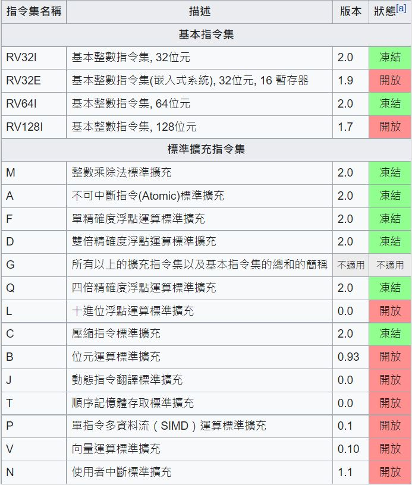

### 🔖 RV32I 是必備的指令集
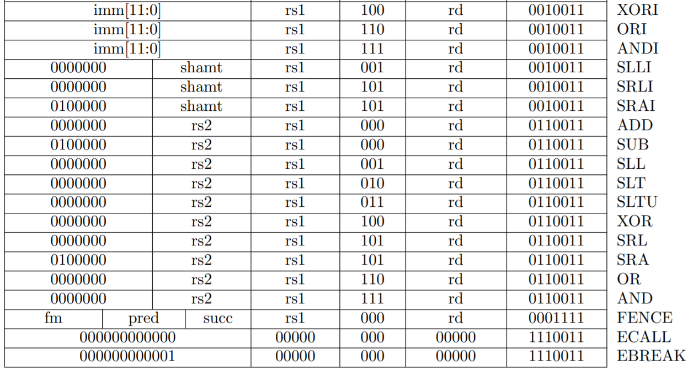

### 🔖 RISC-V 指令格式
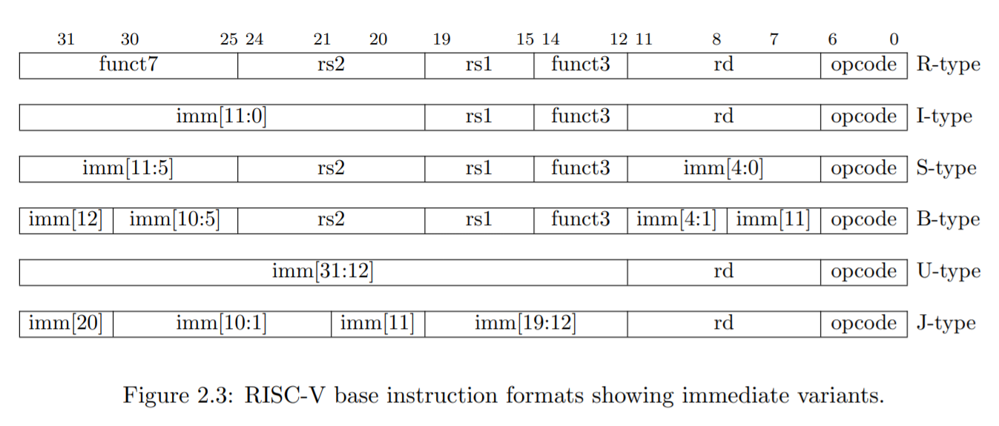

### 🔖 壓縮指令集
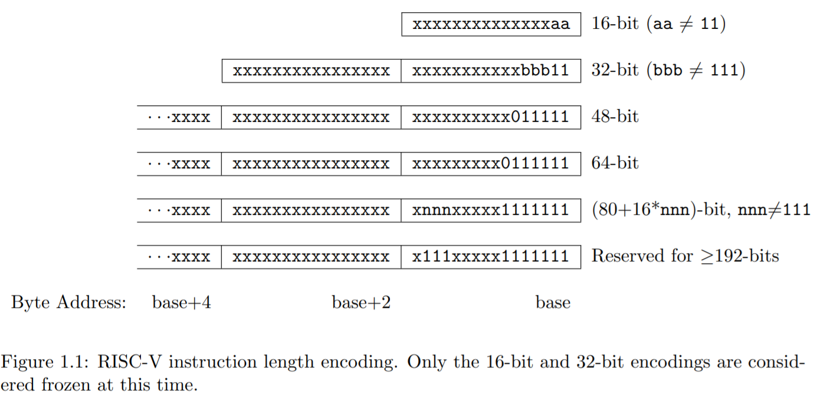

### 🔖 暫存器集
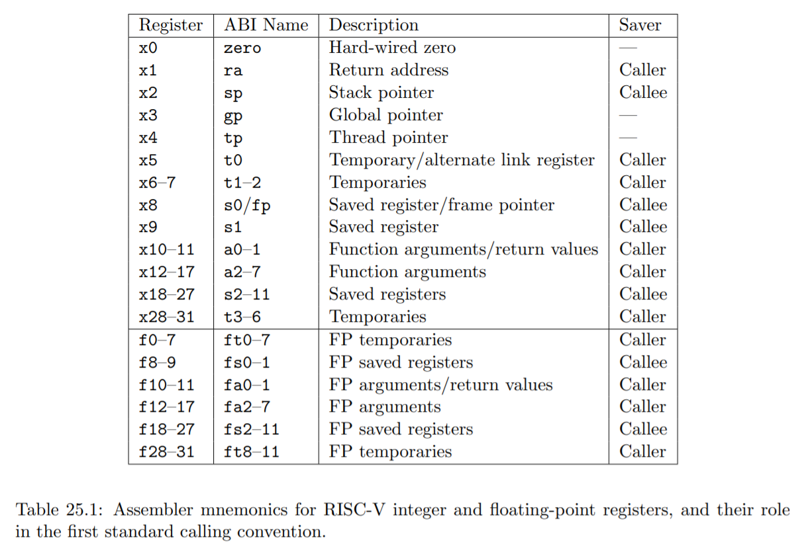
* RISC-V 有 32 個整數暫存器 (在嵌入式版本則是 16 個)。當浮點延伸集被實作的時候，還有 32 個浮點暫存器。
* 如同有些 RISC 指令集（MIPS, SPARC, DEC Alpha），其中一個暫存器為「零暫存器」），剩下的暫存器為通用暫存器。在 RISC 當中，第一個整數暫存器是零暫存器。儲存數值到零暫存器是沒有作用的。
* RISC-V 有提供「控制暫存器」及「狀態暫存器」，但是 user-mode 程式只能存取用來「量測效能」及「浮點管理」的部分。

## 💻 程式實際操作
### 🔗 10-riscv/02-sp/02-gcc
#### The result of execution
##### add.c
```
user@user:~/sp/10-riscv/02-sp/02-gcc$ cat add.c 
int add(int a, int b) {
  return a+b;
}
```
##### add.s(使用 riscv64-unknown-elf-gcc 編譯為組合語言)
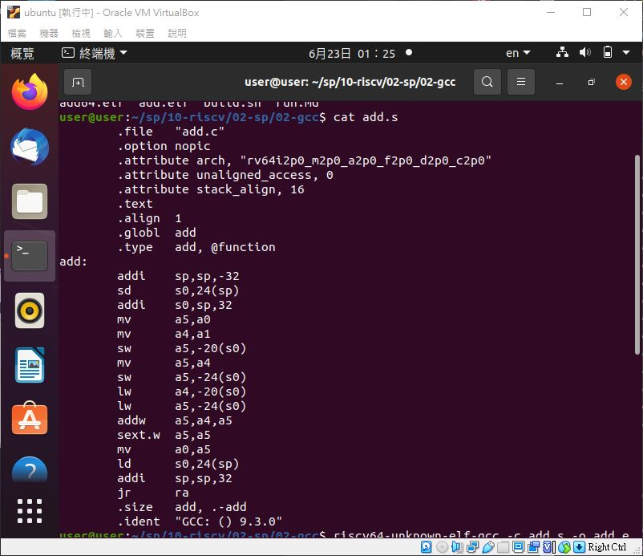
* 這就是一個 RISC-V 的組合語言檔
```
user@user:~/sp/10-riscv/02-sp/02-gcc$ riscv64-unknown-elf-gcc -S add.c -o add.s
user@user:~/sp/10-riscv/02-sp/02-gcc$ cat add.s
	.file	"add.c"
	.option nopic
	.attribute arch, "rv64i2p0_m2p0_a2p0_f2p0_d2p0_c2p0"
	.attribute unaligned_access, 0
	.attribute stack_align, 16
	.text
	.align	1
	.globl	add
	.type	add, @function
add:
	addi	sp,sp,-32
	sd	s0,24(sp)
	addi	s0,sp,32
	mv	a5,a0
	mv	a4,a1
	sw	a5,-20(s0)
	mv	a5,a4
	sw	a5,-24(s0)
	lw	a4,-20(s0)
	lw	a5,-24(s0)
	addw	a5,a4,a5
	sext.w	a5,a5
	mv	a0,a5
	ld	s0,24(sp)
	addi	sp,sp,32
	jr	ra
	.size	add, .-add
	.ident	"GCC: () 9.3.0"
```

##### add.elf(轉換成 ELF 格式的目的檔，再用 objdump 程式將其反組譯回組合語言)
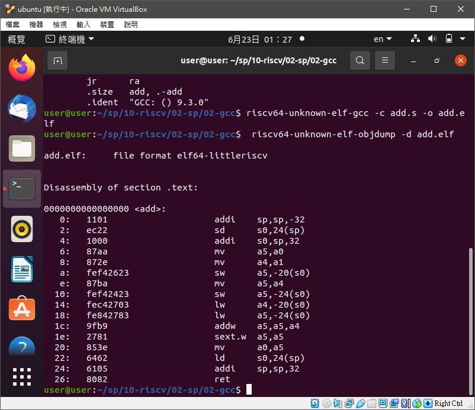
* 先安裝`apt-get install qemu-system-riscv32`
```
user@user:~/sp/10-riscv/02-sp/02-gcc$ riscv64-unknown-elf-gcc -c add.s -o add.elf
user@user:~/sp/10-riscv/02-sp/02-gcc$  riscv64-unknown-elf-objdump -d add.elf

add.elf:     file format elf64-littleriscv


Disassembly of section .text:

0000000000000000 <add>:
   0:	1101                	addi	sp,sp,-32
   2:	ec22                	sd	s0,24(sp)
   4:	1000                	addi	s0,sp,32
   6:	87aa                	mv	a5,a0
   8:	872e                	mv	a4,a1
   a:	fef42623          	sw	a5,-20(s0)
   e:	87ba                	mv	a5,a4
  10:	fef42423          	sw	a5,-24(s0)
  14:	fec42703          	lw	a4,-20(s0)
  18:	fe842783          	lw	a5,-24(s0)
  1c:	9fb9                	addw	a5,a5,a4
  1e:	2781                	sext.w	a5,a5
  20:	853e                	mv	a0,a5
  22:	6462                	ld	s0,24(sp)
  24:	6105                	addi	sp,sp,32
  26:	8082                	ret
```
* 4 碼的代表 16 bits 的壓縮模式指令 (一個十六進位對應到 4 個二進位，4*4=16bit)
* 8碼的代表標準的 32 bits 指令

### 🔗 sp/10-riscv/02-sp/03-asm
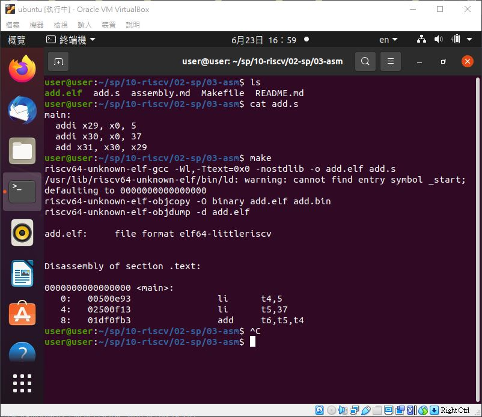
#### The result of execution
```
user@user:~/sp/10-riscv/02-sp/03-asm$ cat add.s
main:
  addi x29, x0, 5
  addi x30, x0, 37
  add x31, x30, x29
user@user:~/sp/10-riscv/02-sp/03-asm$ make
riscv64-unknown-elf-gcc -Wl,-Ttext=0x0 -nostdlib -o add.elf add.s
/usr/lib/riscv64-unknown-elf/bin/ld: warning: cannot find entry symbol _start; defaulting to 0000000000000000
riscv64-unknown-elf-objcopy -O binary add.elf add.bin
riscv64-unknown-elf-objdump -d add.elf

add.elf:     file format elf64-littleriscv


Disassembly of section .text:

0000000000000000 <main>:
   0:	00500e93          	li	t4,5
   4:	02500f13          	li	t5,37
   8:	01df0fb3          	add	t6,t5,t4
```

### ----------------------------------以下使用老師linode操作----------------------------------

### 🔗 sp/10-riscv/02-sp/04-hello/virt
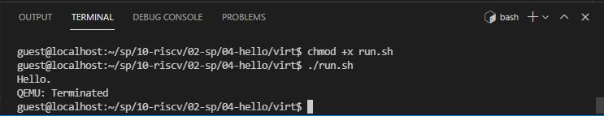
#### The result of execution
```
guest@localhost:~/sp/10-riscv/02-sp/04-hello/virt$ chmod +x run.sh
guest@localhost:~/sp/10-riscv/02-sp/04-hello/virt$ ./run.sh
Hello.
QEMU: Terminated
```

### 🔗 sp/10-riscv/03-mini-riscv-os/01-HelloOs

#### The result of execution
```
guest@localhost:~/sp/10-riscv/03-mini-riscv-os/01-HelloOs$ make
riscv64-unknown-elf-gcc -nostdlib -fno-builtin -mcmodel=medany -march=rv32ima -mabi=ilp32 -T os.ld -o os.elf start.s os.c
guest@localhost:~/sp/10-riscv/03-mini-riscv-os/01-HelloOs$ make qemu
Press Ctrl-A and then X to exit QEMU
qemu-system-riscv32 -nographic -smp 4 -machine virt -bios none -kernel os.elf
Hello OS!
QEMU: Terminated
```

### 🔗 sp/10-riscv/03-mini-riscv-os/02-ContextSwitch
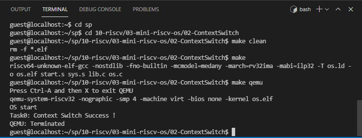
#### The result of execution
```
guest@localhost:~/sp/10-riscv/03-mini-riscv-os/02-ContextSwitch$ make
riscv64-unknown-elf-gcc -nostdlib -fno-builtin -mcmodel=medany -march=rv32ima -mabi=ilp32 -T os.ld -o os.elf start.s sys.s lib.c os.c
guest@localhost:~/sp/10-riscv/03-mini-riscv-os/02-ContextSwitch$ make qemu
Press Ctrl-A and then X to exit QEMU
qemu-system-riscv32 -nographic -smp 4 -machine virt -bios none -kernel os.elf
OS start
Task0: Context Switch Success !
QEMU: Terminated
```

### 🔗 sp/10-riscv/03-mini-riscv-os/03-MultiTasking
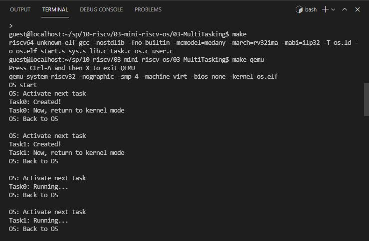
#### The result of execution
```
guest@localhost:~/sp/10-riscv/03-mini-riscv-os/03-MultiTasking$ make
riscv64-unknown-elf-gcc -nostdlib -fno-builtin -mcmodel=medany -march=rv32ima -mabi=ilp32 -T os.ld -o os.elf start.s sys.s lib.c task.c os.c user.c
guest@localhost:~/sp/10-riscv/03-mini-riscv-os/03-MultiTasking$ make qemu
Press Ctrl-A and then X to exit QEMU
qemu-system-riscv32 -nographic -smp 4 -machine virt -bios none -kernel os.elf
OS start
OS: Activate next task
Task0: Created!
Task0: Now, return to kernel mode
OS: Back to OS

OS: Activate next task
Task1: Created!
Task1: Now, return to kernel mode
OS: Back to OS

OS: Activate next task
Task0: Running...
OS: Back to OS

OS: Activate next task
Task1: Running...
OS: Back to OS
QEMU: Terminated
```

### 🔗 sp/10-riscv/03-mini-riscv-os/04-TimerInterrupt
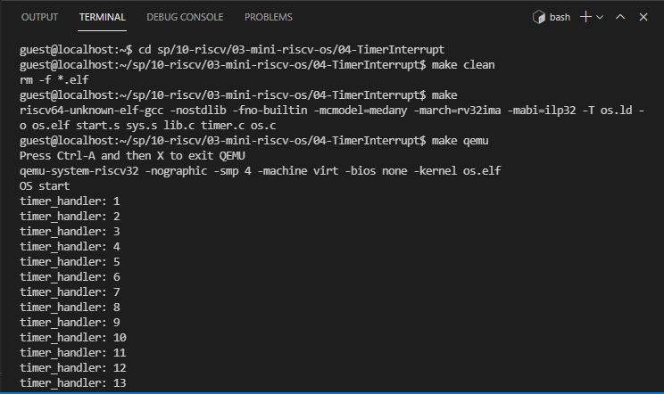
#### The result of execution
```
guest@localhost:~/sp/10-riscv/03-mini-riscv-os/04-TimerInterrupt$ make
riscv64-unknown-elf-gcc -nostdlib -fno-builtin -mcmodel=medany -march=rv32ima -mabi=ilp32 -T os.ld -o os.elf start.s sys.s lib.c timer.c os.c
guest@localhost:~/sp/10-riscv/03-mini-riscv-os/04-TimerInterrupt$ make qemu
Press Ctrl-A and then X to exit QEMU
qemu-system-riscv32 -nographic -smp 4 -machine virt -bios none -kernel os.elf
OS start
timer_handler: 1
timer_handler: 2
timer_handler: 3
timer_handler: 4
timer_handler: 5
timer_handler: 6
timer_handler: 7
timer_handler: 8
timer_handler: 9
timer_handler: 10
timer_handler: 11
timer_handler: 12
QEMU: Terminated
```

### 🔗 sp/10-riscv/03-mini-riscv-os/05-Preemptive
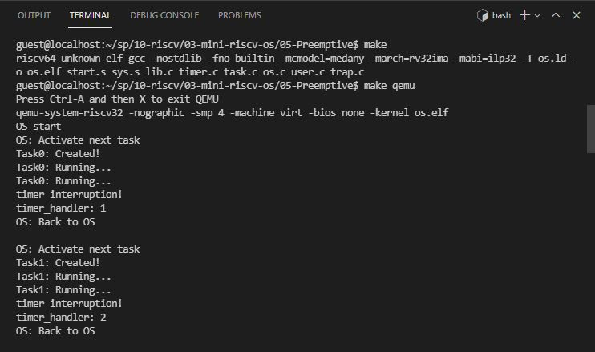
#### The result of execution
```
guest@localhost:~/sp/10-riscv/03-mini-riscv-os/05-Preemptive$ make
riscv64-unknown-elf-gcc -nostdlib -fno-builtin -mcmodel=medany -march=rv32ima -mabi=ilp32 -T os.ld -o os.elf start.s sys.s lib.c timer.c task.c os.c user.c trap.c
guest@localhost:~/sp/10-riscv/03-mini-riscv-os/05-Preemptive$ make qemu
Press Ctrl-A and then X to exit QEMU
qemu-system-riscv32 -nographic -smp 4 -machine virt -bios none -kernel os.elf
OS start
OS: Activate next task
Task0: Created!
Task0: Running...
timer interruption!
timer_handler: 1
OS: Back to OS

OS: Activate next task
Task1: Created!
Task1: Running...
timer interruption!
timer_handler: 2
OS: Back to OS

OS: Activate next task
Task0: Running...
timer interruption!
timer_handler: 3
OS: Back to OS

OS: Activate next task
Task1: Running...
timer interruption!
timer_handler: 4
OS: Back to OS

OS: Activate next task
Task0: Running...
timer interruption!
timer_handler: 5
OS: Back to OS

OS: Activate next task
Task1: Running...
QEMU: Terminated
```


## 📖 參考資料
* [RISC-V](https://zh.wikipedia.org/wiki/RISC-V#%E6%8C%87%E4%BB%A4%E5%AD%90%E9%9B%86)
* [RISC-V 手册 - 一本开源指令集的指南 (PDF)](http://crva.ict.ac.cn/documents/RISC-V-Reader-Chinese-v2p1.pdf)


🖊️editor : yi-chien Liu
