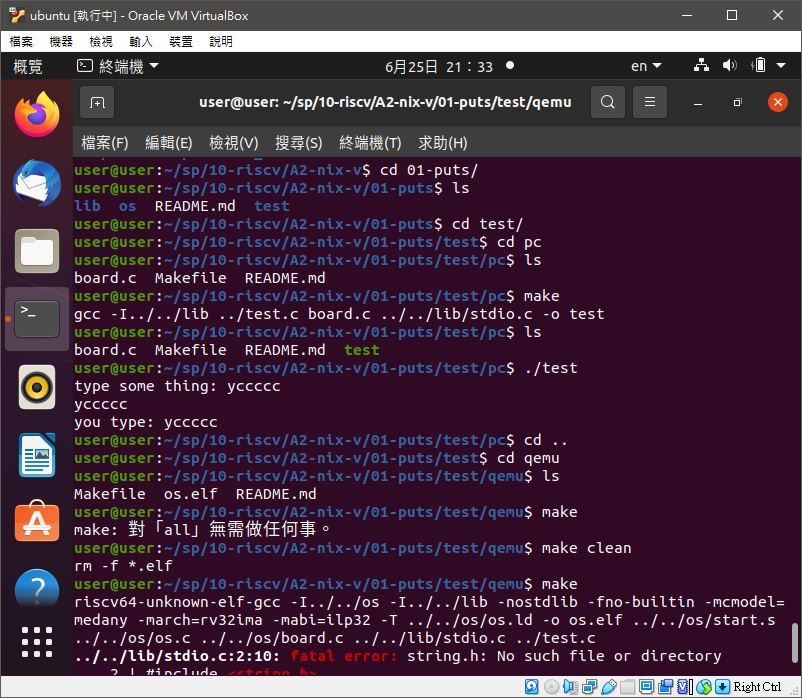
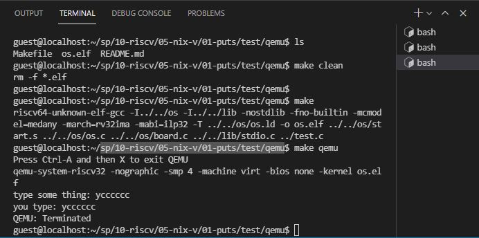

# 📝系統程式第十七週筆記20210623
## 📖 [xv6](https://zh.wikipedia.org/wiki/Xv6)
* xv6是在ANSI C中針對多處理器x86系統的Unix第六版的現代重新實現
* xv6 Makefile的一個特性是能夠以可讀的格式生成整個原始碼清單的PDF文檔

## 💻 程式實際操作
### 🔗 sp/10-riscv/04-xv6os/xv6

#### The result of execution
```
user@user:~/sp/10-riscv/04-xv6os/xv6$ make qemu
qemu-system-riscv64 -machine virt -bios none -kernel kernel/kernel -m 256M -smp 3 -nographic -drive file=fs.img,if=none,format=raw,id=x0 -device virtio-blk-device,drive=x0,bus=virtio-mmio-bus.0

xv6 kernel is booting

hart 2 starting
hart 1 starting
init: starting sh
$ ls
.              1 1 1024
..             1 1 1024
README         2 2 2058
cat            2 3 23976
echo           2 4 22808
forktest       2 5 13184
grep           2 6 27336
init           2 7 23912
kill           2 8 22784
ln             2 9 22736
ls             2 10 26216
mkdir          2 11 22888
rm             2 12 22872
sh             2 13 41760
stressfs       2 14 23880
usertests      2 15 153560
grind          2 16 38016
wc             2 17 25120
zombie         2 18 22280
console        3 19 0
yc             1 20 48
hello.txt      2 22 8
$ echo 'qemu' > qemu.txt
$ ls
.              1 1 1024
..             1 1 1024
README         2 2 2058
cat            2 3 23976
echo           2 4 22808
forktest       2 5 13184
grep           2 6 27336
init           2 7 23912
kill           2 8 22784
ln             2 9 22736
ls             2 10 26216
mkdir          2 11 22888
rm             2 12 22872
sh             2 13 41760
stressfs       2 14 23880
usertests      2 15 153560
grind          2 16 38016
wc             2 17 25120
zombie         2 18 22280
console        3 19 0
yc             1 20 48
hello.txt      2 22 8
qemu.txt       2 23 7
$ cat qemu.txt
'qemu'
$ QEMU: Terminated
```
##### 補充 : qemu退出方式
* `Ctrl-A-X` 三個鍵不要一起按，需要注意`Ctrl-A`同時按住抬起後再按`X`

### 🔗 sp/10-riscv/A2-nix-v/01-puts/test/pc

#### The result of execution
```
user@user:~/sp/10-riscv/A2-nix-v/01-puts/test/pc$ make
gcc -I../../lib ../test.c board.c ../../lib/stdio.c -o test
user@user:~/sp/10-riscv/A2-nix-v/01-puts/test/pc$ ls
board.c  Makefile  README.md  test
user@user:~/sp/10-riscv/A2-nix-v/01-puts/test/pc$ ./test
type some thing: yccccc
yccccc
you type: yccccc
```

### 🔗 sp/10-riscv/05-nix-v/01-puts/test/qemu

#### The result of execution(使用老師linode操作)
```
guest@localhost:~/sp/10-riscv/05-nix-v/01-puts/test/qemu$ make
riscv64-unknown-elf-gcc -I../../os -I../../lib -nostdlib -fno-builtin -mcmodel=medany -march=rv32ima -mabi=ilp32 -T ../../os/os.ld -o os.elf ../../os/start.s ../../os/os.c ../../os/board.c ../../lib/stdio.c ../test.c
guest@localhost:~/sp/10-riscv/05-nix-v/01-puts/test/qemu$ make qemu
Press Ctrl-A and then X to exit QEMU
qemu-system-riscv32 -nographic -smp 4 -machine virt -bios none -kernel os.elf
type some thing: ycccccc
you type: ycccccc
QEMU: Terminated
```

## 📖 參考資料
* [UNIX](https://zh.wikipedia.org/wiki/UNIX)
* [RISC-V 規格書](https://riscv.org/technical/specifications/)
* [各種板子的規格書](https://www.sifive.com/documentation)

🖊️editor : yi-chien Liu