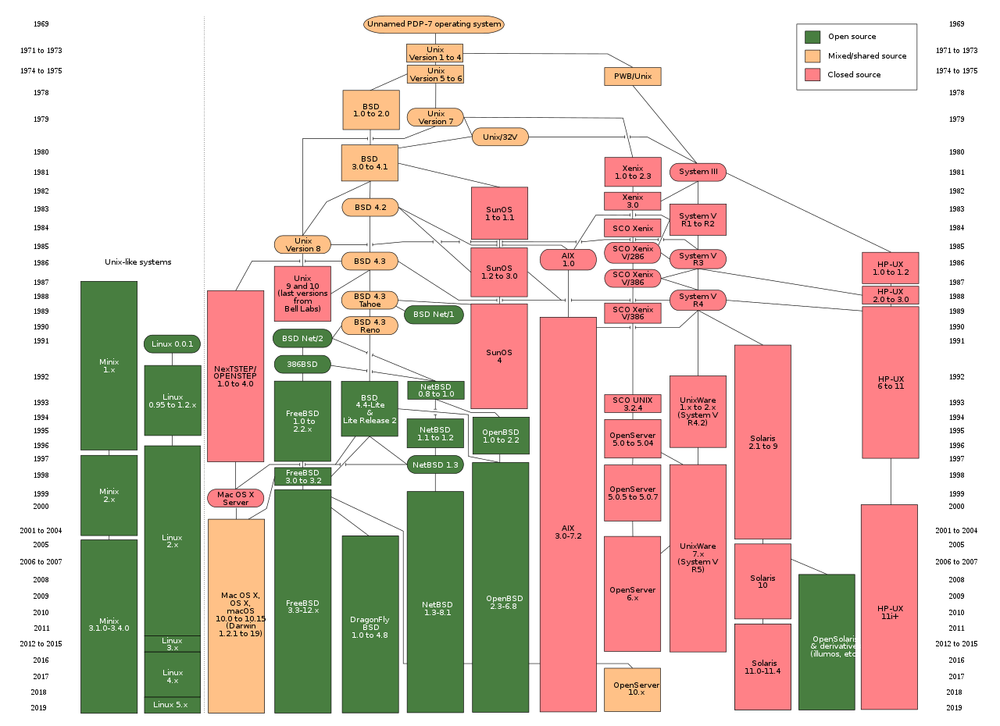

# 📝系統程式第十七週筆記20210623
## 📖 UNIX

UNIX作業系統，是一個強大的多使用者、多工作業系統，支援多種處理器架構，按照作業系統的分類，屬於分時作業系統，最早由肯·湯普遜、丹尼斯·里奇和道格拉斯·麥克羅伊於1969年在AT&T的貝爾實驗室開發

### 🔖 UNIX常用指令介紹
* 請參考此[連結](http://www2.thu.edu.tw/~cc/network_team/unix/command.htm)

## 💻 程式實際操作
### 🔗 sp/10-riscv/04-xv6os/xv6

#### The result of execution
```
user@user:~/sp/10-riscv/04-xv6os/xv6$ make qemu
qemu-system-riscv64 -machine virt -bios none -kernel kernel/kernel -m 256M -smp 3 -nographic -drive file=fs.img,if=none,format=raw,id=x0 -device virtio-blk-device,drive=x0,bus=virtio-mmio-bus.0

xv6 kernel is booting

hart 1 starting
hart 2 starting
init: starting sh
$ ls
.              1 1 1024
..             1 1 1024
README         2 2 2058
cat            2 3 23976
echo           2 4 22808
forktest       2 5 13184
grep           2 6 27336
init           2 7 23912
kill           2 8 22784
ln             2 9 22736
ls             2 10 26216
mkdir          2 11 22888
rm             2 12 22872
sh             2 13 41760
stressfs       2 14 23880
usertests      2 15 153560
grind          2 16 38016
wc             2 17 25120
zombie         2 18 22280
console        3 19 0
hello.txt      2 20 8
$ echo 'qemu' > qemu.txt
$ ls
.              1 1 1024
..             1 1 1024
README         2 2 2058
cat            2 3 23976
echo           2 4 22808
forktest       2 5 13184
grep           2 6 27336
init           2 7 23912
kill           2 8 22784
ln             2 9 22736
ls             2 10 26216
mkdir          2 11 22888
rm             2 12 22872
sh             2 13 41760
stressfs       2 14 23880
usertests      2 15 153560
grind          2 16 38016
wc             2 17 25120
zombie         2 18 22280
console        3 19 0
hello.txt      2 20 8
qemu.txt       2 21 7
$ cat qemu.txt
'qemu'
$ QEMU 4.2.1 monitor - type 'help' for more information
(qemu) quit
```

### 🔗 sp/10-riscv/04-xv6os/xv6


#### The result of execution


## 📖 參考資料
* [UNIX](https://zh.wikipedia.org/wiki/UNIX)


🖊️editor : yi-chien Liu