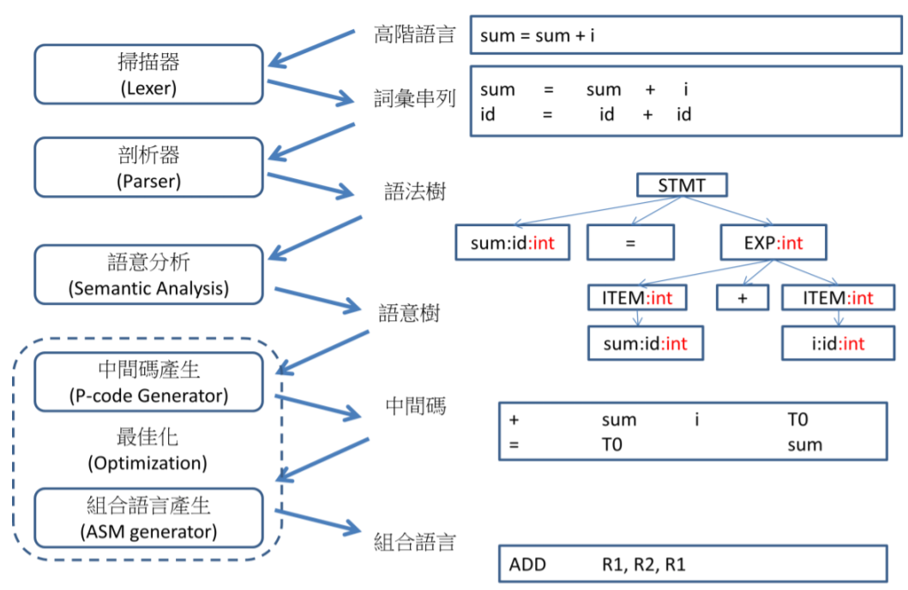
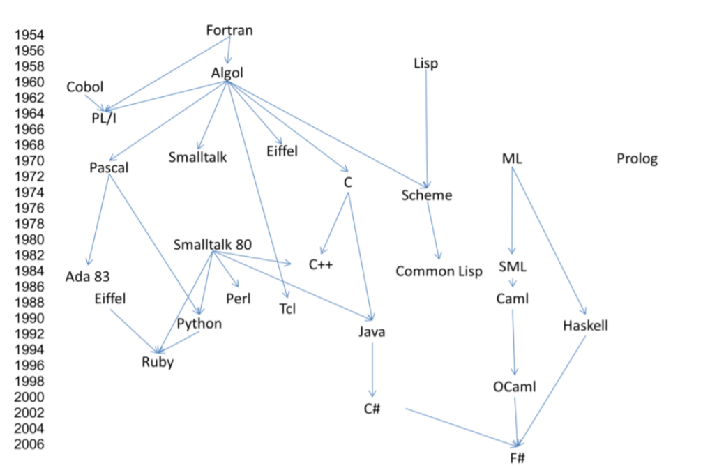
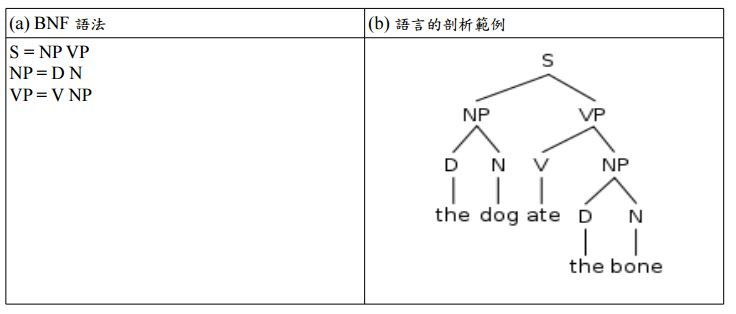

# 📝系統程式第二週筆記20210303

## 📖 編譯器 & 組譯器 & 虛擬機

 * 原始碼（source code）→ 預處理器（preprocessor）→ 編譯器（compiler）→ 組譯程式（assembler）→ 目的碼（object code）→ 連結器（linker）→ 執行檔（executables）   
## 💻 編譯器(Compiler)
* main.c → Compiler → main.s
* 簡介:將人編寫、閱讀、維護的進階電腦語言所寫作的原始碼程式，翻譯為電腦能解讀、執行的低階機器語言的程式，也就是執行檔
### 執行步驟:

* STEP1 : 先進行文法處理(Syntax)
* STEP2 : 詞彙解析(Lexer)，將字符序列轉換為標記序列的過程
* STEP3 : 語法剖析器(Parser)，進行語法檢查、並構建由輸入的單詞組成的資料結構(語法樹)
* STEP4 : 再來進行語意處理(Semantics Analysis)產生語意樹
* STEP5 : 最佳化並產生Code Generation(IR檔 → ASM檔 → OBJ檔)
## 💻 組譯器(Assembler)
* main.s → Assembler → main.o/.exe(即機器語言)
## 💻 虛擬機(Virtual Machine)
* 簡介:電腦系統的仿真器，通過軟體類比具有完整硬體系統功能的、執行在一個完全隔離環境中的完整電腦系統，能提供物理電腦的功能 (EX:VirtualBox)
## 💻 作業系統(Operating System)
## 📖 高階語言發展歷史年表


## 什麼是[BNF & EBNF](https://kknews.cc/zh-tw/news/3x3a59g.html)??

### BNF：
* 是一種用遞歸的思想來表述計算機語言符號集的定義規範，又稱巴科斯範式(Backus-Naur form)

符號 | 內容
-----|--------
尖括號< > | 包含的為必選項
方括號[ ] | 內包含的為可選項
大括號{ } | 內包含的為可重複0至無數次的項
豎線 | 表示在其左右兩邊任選一項，相當於"OR"的意思
::= | 是「被定義為」的意思。
引號 | 裡面的內容代表其本身。

### EBNF：
* 又稱擴展的巴科斯範式EBNF，用來排除了BNF的缺陷

符號 | 內容
-----|--------
問號 | 意思是操作符左邊的符號（或括號中的一組符號）是可選項（可以出現0到多次）
星號 | 是指可以重複多次。
加號 | 是指可以出現多次。

##  程式實際操作
#### genExp.c(運算式生成)
##### The result of execution
```
yichien@MSI MINGW64 /d/VScode/WP/ccc/109b/sp109b/sp/03-compiler/00-gen (master)
$ gcc genExp.c rlib.c -o genExp

yichien@MSI MINGW64 /d/VScode/WP/ccc/109b/sp109b/sp/03-compiler/00-gen (master)
$ ./genExp
7*(8+5/1)-1*2-8/1(7)/2
4/8
2
(1)/2
0*(5/0)-((4*6)*9)/((9/9)*6)
5*9
7*1
7*2+4*1
7
5
```
#### genEnglish.c(英語生成)
##### The result of execution
```
yichien@MSI MINGW64 /d/VScode/WP/ccc/109b/sp109b/sp/03-compiler/00-gen (master)
$ gcc genEnglish.c rlib.c -o genEnglish

yichien@MSI MINGW64 /d/VScode/WP/ccc/109b/sp109b/sp/03-compiler/00-gen (master)
$ ./genEnglish
the dog chase a dog

yichien@MSI MINGW64 /d/VScode/WP/ccc/109b/sp109b/sp/03-compiler/00-gen (master)
$ ./genEnglish
the cat eat the cat
```
#### exp0.c(編譯成中間碼)
##### Code
```
#include <stdio.h>
#include <assert.h>
#include <string.h>
#include <ctype.h>

int tokenIdx = 0;
char *tokens;

int E();
int F();

void error(char *msg) {
  printf("%s", msg);
  assert(0);
}

// 取得目前字元
char ch() {
  char c = tokens[tokenIdx];
  return c;
}

// 取得目前字元，同時進到下一格
char next() {
  char c = ch();
  tokenIdx++;
  return c;
}

// ex: isNext("+-") 用來判斷下一個字元是不是 + 或 -
int isNext(char *set) {
  char c = ch();
  return (c!='\0' && strchr(set, c)!=NULL);
}

// 產生下一個臨時變數的代號， ex: 3 代表 t3。
int nextTemp() {
  static int tempIdx = 0;
  return tempIdx++;
}

// F =  Number | '(' E ')'
int F() {
  int f;
  char c = ch();
  if (isdigit(c)) {
    next(); // skip c
    f = nextTemp();
    printf("t%d=%c\n", f, c);
  } else if (c=='(') { // '(' E ')'
    next();
    f = E();
    assert(ch()==')');
    next();
  } else {
    error("F = (E) | Number fail!");
  }
  return f; 
}

// E = F ([+-] F)*
int E() {
  int i1 = F();
  while (isNext("+-")) {
    char op=next();
    int i2 = F();
    int i = nextTemp();
    printf("t%d=t%d%ct%d\n", i, i1, op, i2);
    i1 = i;
  }
  return i1;
}

void parse(char *str) {
  tokens = str;
  E();
}

int main(int argc, char * argv[]) {
  printf("argv[0]=%s argv[1]=%s\n", argv[0], argv[1]);
  printf("=== EBNF Grammar =====\n");
  printf("E=F ([+-] F)*\n");
  printf("F=Number | '(' E ')'\n");
  printf("==== parse:%s ========\n", argv[1]);
  parse(argv[1]);
}

```
##### The result of execution
```
yichien@MSI MINGW64 /d/VScode/WP/ccc/109b/sp109b/sp/03-compiler/01-exp0 (master)
$ gcc exp0.c -o exp0

yichien@MSI MINGW64 /d/VScode/WP/ccc/109b/sp109b/sp/03-compiler/01-exp0 (master)
$ ./exp0 '3+5'
argv[0]=D:\VScode\WP\ccc\109b\sp109b\sp\03-compiler\01-exp0\exp0.exe argv[1]=3+5
=== EBNF Grammar =====
E=F ([+-] F)*
F=Number | '(' E ')'
==== parse:3+5 ========
t0=3
t1=5
t2=t0+t1

```
##### 補充
* argc : 輸入數量
* argv : 輸入位置
#### exp0hack.c(編譯後產生 hack CPU 的組合語言)
##### The result of execution
```
yichien@MSI MINGW64 /d/VScode/WP/ccc/109b/sp109b/sp/03-compiler/01-exp0 (master)
$ gcc exp0hack.c -o exp0hack

yichien@MSI MINGW64 /d/VScode/WP/ccc/109b/sp109b/sp/03-compiler/01-exp0 (master)
$ ./exp0hack '3+(5-8)'
=== EBNF Grammar =====
E=F ([+-] F)*
F=Number | '(' E ')'       
==== parse:3+(5-8) ========
# t0=3
@3
D=A
@t0
M=D
# t1=5
@5
D=A
@t1
M=D
# t2=8
@8
D=A
@t2
M=D
# t3=t1-t2
@t1
D=M
@t2
D=D-M
@t3
M=D
# t4=t0+t3
@t0
D=M
@t3
D=D+M
@t4
M=
```


#### exp0var.c(支援變數)
##### The result of execution
```
yichien@MSI MINGW64 /d/VScode/WP/ccc/109b/sp109b/sp/03-compiler/01-exp0 (master)
$ gcc exp0var.c -o exp0var

yichien@MSI MINGW64 /d/VScode/WP/ccc/109b/sp109b/sp/03-compiler/01-exp0 (master)
$ ./exp0var 'x+5-y'
=== EBNF Grammar =====
E=F ([+-] F)*
F=Number | '(' E ')'
==== parse:x+5-y ========
# t0=x
@x
D=M
@t0
M=D
# t1=5
@5
D=A
@t1
M=D
# t2=t0+t1
@t0
D=M
@t1
D=D+M
@t2
M=D
# t3=y
@y
D=M
@t3
M=D
# t4=t2-t3
@t2
D=M
@t3
D=D-M
@t4
M=D

```