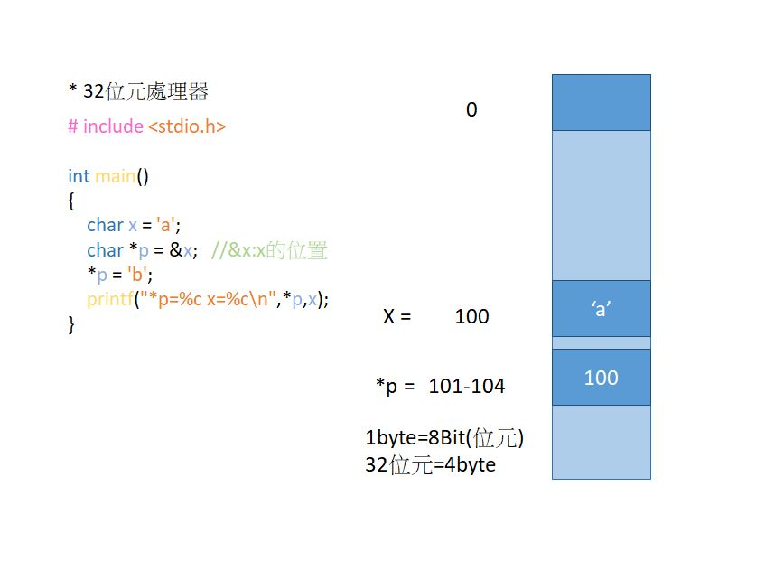

# 📝系統程式第三週筆記20210310

## 📖 compiler 
> 1.bnf ebnf 生成語法<br>
> 2.運算是 編譯器<br>
> 3.lexer 讓字串變成token<br> 
> 4.exp/if/while<br>

## 📖 openfile模式
模式 | 內容
------ | -----
r | 讀取(檔案需存在)
w | 新建檔案寫入(檔案可不存在，若存在則清空)
a | 附加到文件中。寫入操作的數據追加在文件末尾的。該文件如果它不存在會被創建
r+ | 讀取舊資料並寫入(檔案需存在且游標指在開頭)
w+ | 清空檔案內容，新寫入的東西可在讀出(檔案可不存在，會自行新增)
a+ | 資料附加到舊檔案後面(游標指在EOF)，可讀取資料
b | 二進位模式
rw+ | 可讀取可寫入 若已存在就直接寫入 沒有就開新的檔案
## 📖 指標


## 💻 程式實際操作
### Lexer(詞彙解析) 
#### Code(加註解)
[lexer.c](./lexer.c)
```
#include <stdio.h>
#include <string.h>
#include <ctype.h>

#define TMAX 10000000
#define SMAX 100000

enum { Id, Int, Keyword, Literal, Char }; //列舉 0,1,2,3,4

char *typeName[5] = {"Id", "Int", "Keyword", "Literal", "Char"};

char code[TMAX];
char strTable[TMAX], *strTableEnd=strTable;
char *tokens[TMAX];  //字元指標
int tokenTop=0;
int types[TMAX];

#define isDigit(ch) ((ch) >= '0' && (ch) <='9')

#define isAlpha(ch) (((ch) >= 'a' && (ch) <='z') || ((ch) >= 'A' && (ch) <= 'Z'))

int readText(char *fileName, char *text, int size) {
  FILE *file = fopen(fileName, "r");
  int len = fread(text, 1, size, file);
  text[len] = '\0';
  fclose(file);
  return len;
}

/* strTable =
#\0include\0"sum.h"\0int\0main\0.....
*/
char *next(char *p) {
  while (isspace(*p)) p++;  //跳過空白

  char *start = p; //         include "sum.h"
                   //         ^      ^
                   //  start= p      p
  int type;
  if (*p == '\0') return NULL;  //如跳過空白就沒有直接傳回null
  if (*p == '"') {
    p++;
    while (*p != '"') p++;
    p++;
    type = Literal;
  } else if (*p >='0' && *p <='9') { // 數字
    while (*p >='0' && *p <='9') p++;
    type = Int;  //只支援整數
  } else if (isAlpha(*p) || *p == '_') {  // 變數名稱或關鍵字id //不能數字開頭
    while (isAlpha(*p) || isDigit(*p) || *p == '_') p++;
    type = Id;
  } else { // 單一字元 ex.等號,括號,星號
    p++;
    type = Char;
  }
  int len = p-start;
  char *token = strTableEnd;
  strncpy(strTableEnd, start, len);
  strTableEnd[len] = '\0';
  strTableEnd += (len+1);
  types[tokenTop] = type;
  tokens[tokenTop++] = token;
  printf("token=%s\n", token);
  return p;
}

void lex(char *code) {
  char *p = code;
  while (1) {
    p = next(p);
    if (p == NULL) break;
  }
}

void dump(char *strTable[], int top) {
  for (int i=0; i<top; i++) {
    printf("%d:%s\n", i, strTable[i]);
  }
}

int main(int argc, char * argv[]) {
  readText(argv[1], code, sizeof(code));  //要減一才不會有非法存取問題
  puts(code);
  lex(code);
  dump(tokens, tokenTop);
}


```

#### The result of execution
```
yichien@MSI MINGW64 /d/VScode/WP/ccc/109b/sp109b/sp/03-compiler/02-lexer (master)
$ ./lexer sum.c
#include "sum.h"

int main() {
  int t = sum(10);
  printf("sum(10)=%d\n", t);
}
token=#
token=include
token="sum.h"
token=int
token=main
token=(
token=)
token={
token=int
token=t
token==
token=sum
token=(
token=10
token=)
token=;
token=printf
token=(
token="sum(10)=%d\n"
token=,
token=t
token=)
token=;
token=}
0:#
1:include
2:"sum.h"
3:int
4:main
5:(
6:)
7:{
8:int
9:t
10:=
11:sum
12:(
13:10
14:)
15:;
16:printf
17:(
18:"sum(10)=%d\n"
19:,
20:t
21:)
22:;
23:}
```
## 📖 補充資料
* [RISC-V](https://zh.wikipedia.org/wiki/RISC-V)
* [QEMU](https://www.qemu.org/)
* [GCC disable warning](https://gcc.gnu.org/onlinedocs/gcc/Warning-Options.html)

🖊️editor : yi-chien Liu