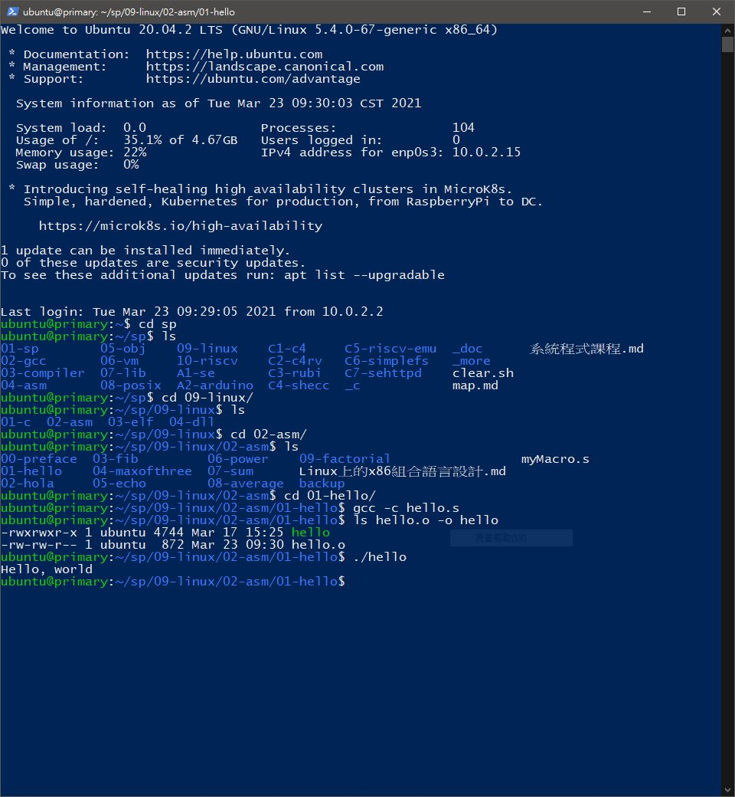
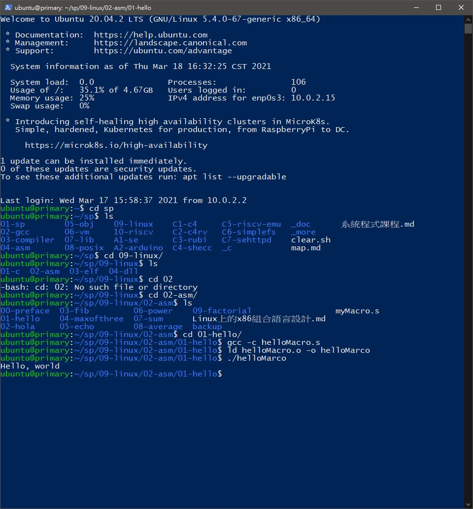

# 📝系統程式第四週筆記20210317
## 💻 安裝[multipass](https://multipass.run/)

### 1.執行linux--asm--hello--hello.s

### 2.執行linux--asm--hello--helloMacro.s

## 📖 補充資料
* [LLVM](https://zh.wikipedia.org/wiki/LLVM)

       