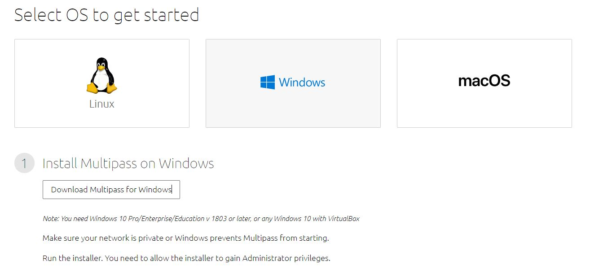
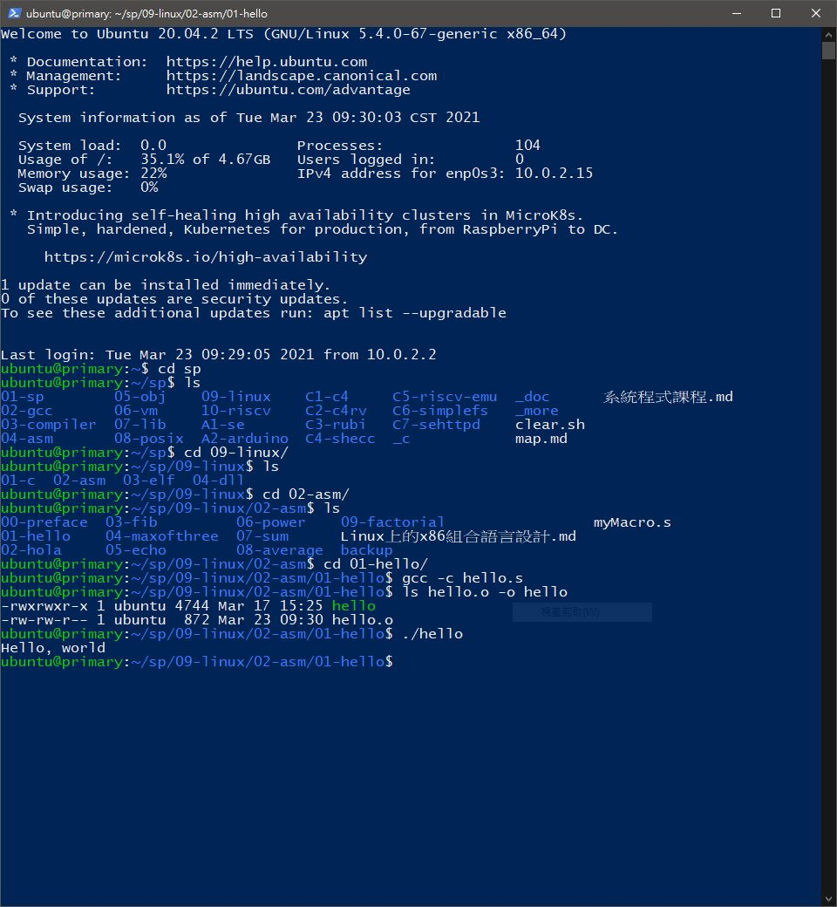
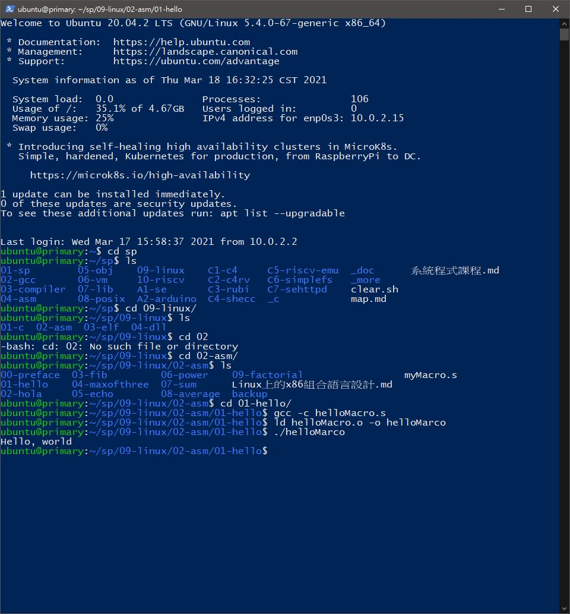

# 📝系統程式第四週筆記20210317
## 💻 課前安裝[multipass](https://multipass.run/)

### 操作步驟
> 1.安裝multipass<br>
> 2.確認multipass可以執行,並在裡面安裝gcc   ``sudo apt install gcc``<br>
> 3.把老師的gitlab抓進來   ``git clone https://gitlab.com/ccc109/sp/``<br>
> 4.cd到要執行的資料夾即可執行

## 💻 程式實際操作
### hello > hello.s 

#### The result of execution
```
ubuntu@primary:~/sp/09-linux/02-asm/01-hello$ gcc -c hello.s
ubuntu@primary:~/sp/09-linux/02-asm/01-hello$ ld hello.o -o hello
ubuntu@primary:~/sp/09-linux/02-asm/01-hello$ ./hello
Hello, world
```

### hello > helloMacro.s

#### The result of execution
```
ubuntu@primary:~/sp/09-linux/02-asm/01-hello$ gcc -c helloMacro.s
ubuntu@primary:~/sp/09-linux/02-asm/01-hello$ ld helloMacro.o -o helloMacro
ubuntu@primary:~/sp/09-linux/02-asm/01-hello$ ./helloMacro
Hello, world
```


## 📖 補充資料
* [LLVM](https://zh.wikipedia.org/wiki/LLVM)

       