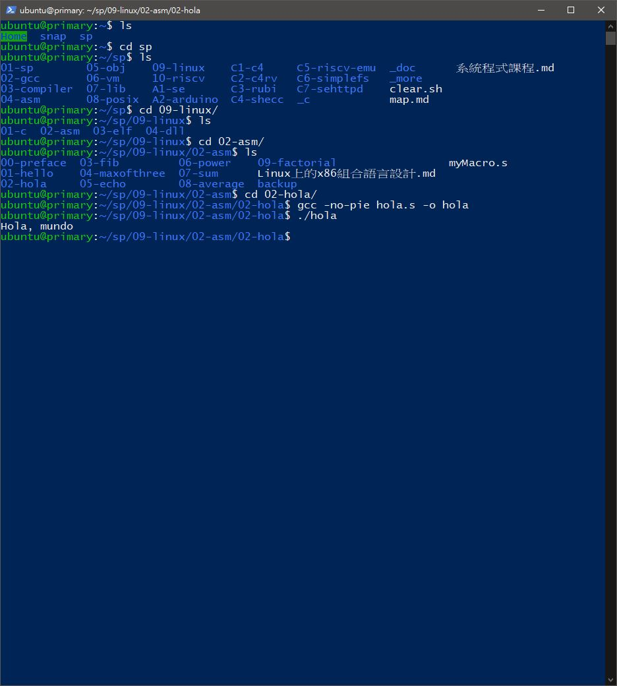

# 📝系統程式第四週筆記20210317
## 💻 課前安裝[multipass](https://multipass.run/)

### 操作步驟
> 1.安裝multipass<br>
> 2.確認multipass可以執行,並在裡面安裝gcc   ``sudo apt install gcc``<br>
> 3.clone老師的gitlab    ``git clone https://gitlab.com/ccc109/sp/``<br>
> 4.cd到要執行的資料夾即可執行

## 💻 程式實際操作
### 09-linux/02-asm/01-hello/hello

``ld是連結器``
#### The result of execution
```
ubuntu@primary:~/sp/09-linux/02-asm/01-hello$ gcc -c hello.s
ubuntu@primary:~/sp/09-linux/02-asm/01-hello$ ld hello.o -o hello
ubuntu@primary:~/sp/09-linux/02-asm/01-hello$ ./hello
Hello, world
```

### 09-linux/02-asm/01-hello/helloMacro

#### The result of execution
```
ubuntu@primary:~/sp/09-linux/02-asm/01-hello$ gcc -c helloMacro.s
ubuntu@primary:~/sp/09-linux/02-asm/01-hello$ ld helloMacro.o -o helloMacro
ubuntu@primary:~/sp/09-linux/02-asm/01-hello$ ./helloMacro
Hello, world
```

### hola > hola.s

``-no-pie 代表 no position independent executable就是不要編成與位址無關的目的檔``
#### The result of execution
```
ubuntu@primary:~/sp/09-linux/02-asm/02-hola$ gcc -no-pie hola.s -o hola
ubuntu@primary:~/sp/09-linux/02-asm/02-hola$ ./hola
Hola, mundo
```

## 📖 補充資料
* [LLVM](https://zh.wikipedia.org/wiki/LLVM)
* [GNU Assembler Examples](https://cs.lmu.edu/~ray/notes/gasexamples/?fbclid=IwAR3bWaJvlBeUDCldDf2B-y2eQoxZH11Q0UUwJP1IM-lGKzP-bxznPgmk8j4)
       
🖊️editor : yi-chien Liu