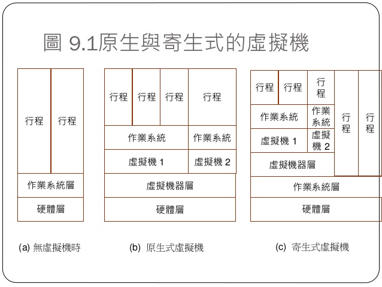
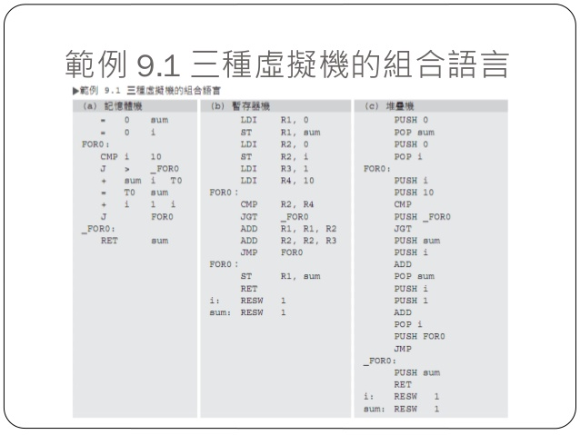
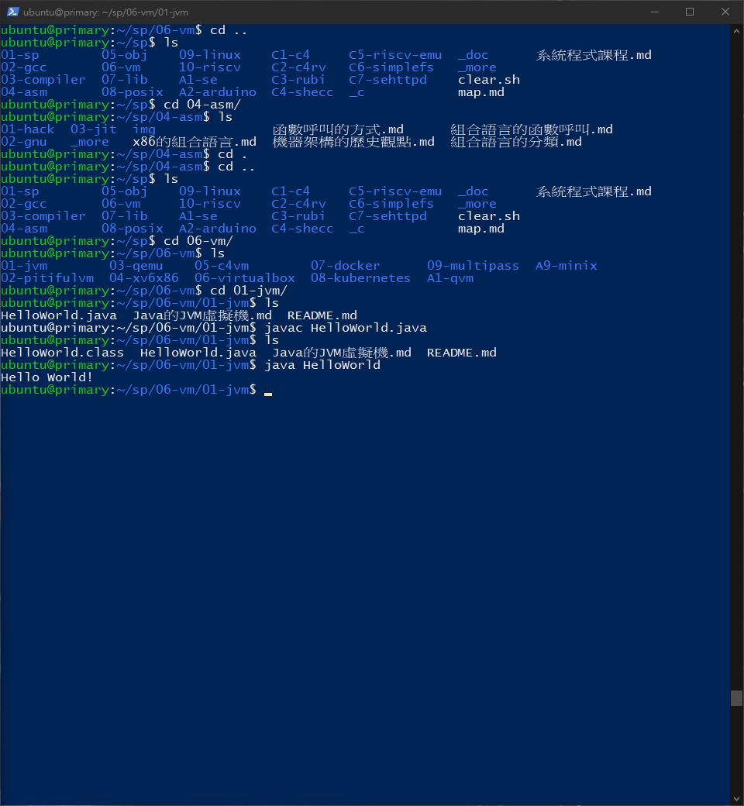
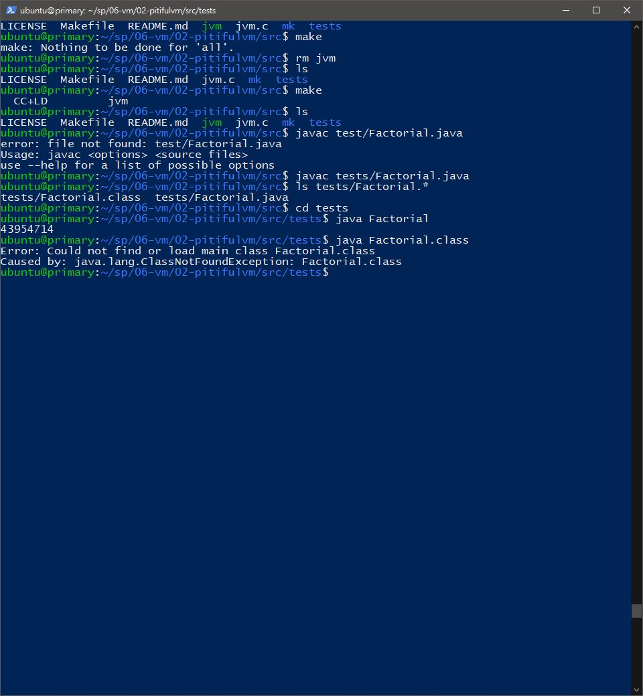
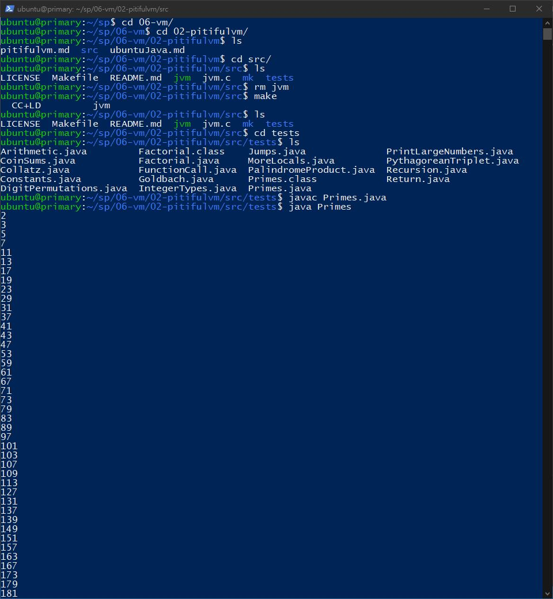

# 📝系統程式第五週筆記20210324
## 📖 虛擬機
### 虛擬機 V.S. 模擬器
* 模擬器 : 模擬電腦行為的軟體
* 虛擬機 : 模擬處理器指令級的軟體

### 虛擬機架構
* 記憶體機 : 可以直接對記憶體變數進行運算
* 暫存器機 : 必須將變數載入暫存器中，才能進行運算
* 堆疊機 : 取出堆疊上層元素進行運算，結果存回堆疊中



## 💻 程式實際操作
### 06-vm/01-jvm/HelloWorld


#### The result of execution
```
ubuntu@primary:~/sp/06-vm/01-jvm$ javac HelloWorld.java
ubuntu@primary:~/sp/06-vm/01-jvm$ ls
HelloWorld.class  HelloWorld.java  Java的JVM虛擬機.md  README.md
ubuntu@primary:~/sp/06-vm/01-jvm$ java HelloWorld
Hello World!
```
### 06-vm/02-pitifulvm/src/tests/Factorial


#### The result of execution
```
ubuntu@primary:~/sp/06-vm/02-pitifulvm/src$ javac tests/Factorial.java
ubuntu@primary:~/sp/06-vm/02-pitifulvm/src$ ls tests/Factorial.*
tests/Factorial.class  tests/Factorial.java
ubuntu@primary:~/sp/06-vm/02-pitifulvm/src$ cd tests
ubuntu@primary:~/sp/06-vm/02-pitifulvm/src/tests$ java Factorial
43954714
```
### 06-vm/02-pitifulvm/src/tests/Primes

#### The result of execution
```
ubuntu@primary:~/sp/06-vm/02-pitifulvm/src$ make
  CC+LD         jvm
ubuntu@primary:~/sp/06-vm/02-pitifulvm/src$ ls
LICENSE  Makefile  README.md  jvm  jvm.c  mk  tests
ubuntu@primary:~/sp/06-vm/02-pitifulvm/src$ cd tests
ubuntu@primary:~/sp/06-vm/02-pitifulvm/src/tests$ javac Primes.java
ubuntu@primary:~/sp/06-vm/02-pitifulvm/src/tests$ java Primes
```

## 📖 補充資料
* [JVM](https://www.guru99.com/java-virtual-machine-jvm.html?fbclid=IwAR1hnhkJMrl2wCRRq-CBoeTsISNvNSFwagEhaJ3cRCOcD2l6Hq29apIltWw)
* [Java virtual machine](https://en.wikipedia.org/wiki/Java_virtual_machine?fbclid=IwAR0U8LW8QqhLhx3ErFI6-Gfokdgd-h7oYdz3O633ocfDATqyarZnmT1bSWU)
* [Fabrice Bellard](https://en.wikipedia.org/wiki/Fabrice_Bellard?fbclid=IwAR2b0O2ayX2rr4jH0TDDqx6XO6uF3WpHXv3J41LGr2zBkORgUiAO6AV4xC8)
* [QEMU](https://zh.wikipedia.org/wiki/QEMU)

🖊️editor : yi-chien Liu