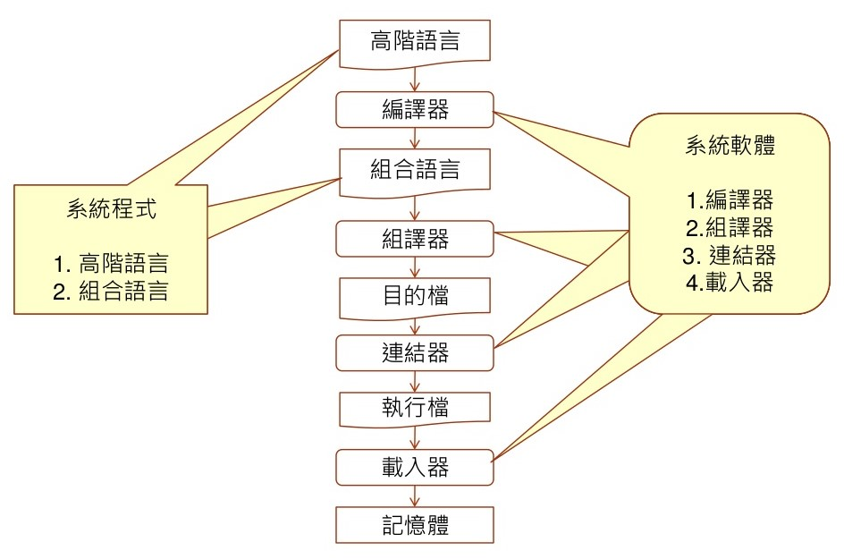
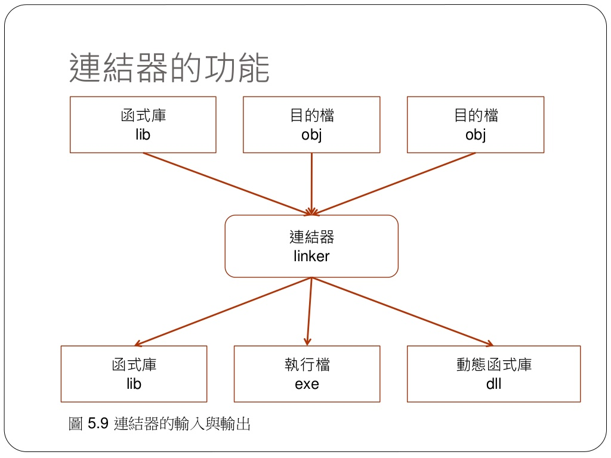
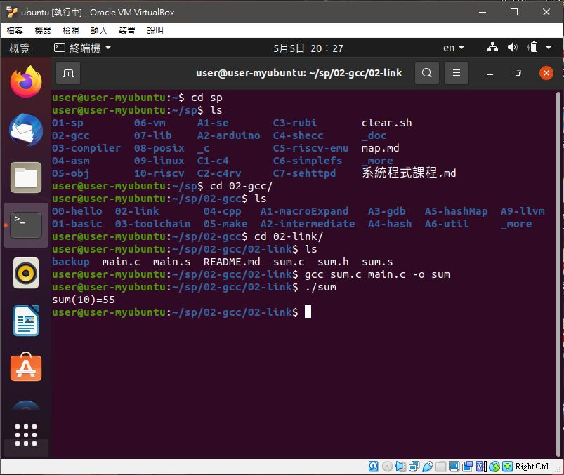
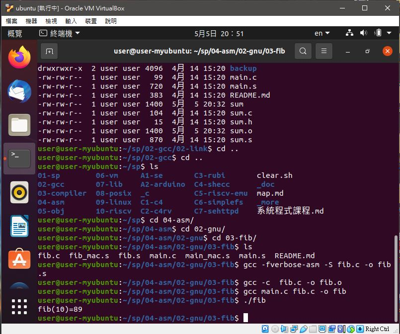

# 📝系統程式第六週筆記20210331
## 📖 程式的編譯、組譯、連結、載入之流程


## 📖 GNU工具使用基本流程

* ld抓取libc.c的printf後連結得到執行檔
### 連結與載入
#### 目的檔 : 一種由程式機器碼與資料碼所組成的格式化檔案結構
>1.具有交互引用的C語言程式<br>
>2.具有交互引用的組合語言<br>
>3.標記:
>>.global : 全域標記，可供外部程式引用<br>
>>.extern : 外部標記，引用其他程式標記時使用<br>
#### 執行檔 : 目的檔連結完成後，就會輸出可執行檔
#### 連結器 : 將許多目的檔連結成一個執行檔、函式庫、動態函式庫

>1.消除外部引用，確定外部變數的位置，讓程式盡可能的接近可執行狀態<br>
>2.進行區段合併的動作 
>  內文段(.text)、資料段(.data)、BSS(.bss)段合併<br>
>3.更新符號表與修改紀錄<br>
#### 載入器 : 將可執行檔載入到記憶體當中的執行程式
>1.將各分段載入到記憶體<br>
>2.利用修正紀錄修改記憶體內容<br>
>3.設定程式計數器，開始執行<br>
## 💻 程式實際操作
### 🔗 02-gcc/02-link/sum
<details>
  <summary><b>Show code</b></summary>

  ```
#include "sum.h"

int sum(int n) {
  int s=0;
  for (int i=0; i<=n; i++) {
    s=s+i;
  }
  return s;
}
  ```
</details>

#### The result of execution
```
user@user-myubuntu:~/sp/02-gcc/02-link$ gcc sum.c main.c -o sum
user@user-myubuntu:~/sp/02-gcc/02-link$ ./sum
sum(10)=55
```

### 🔗 04-asm/02-gnu/03-fib/fib

<details>
  <summary><b>Show code</b></summary>

  ```
int fib(int n) {
  if (n <= 1) return 1;
  return fib(n-1) + fib(n-2);
}
  ```
</details>

#### The result of execution
```
user@user-myubuntu:~/sp/04-asm/02-gnu/03-fib$ gcc -fverbose-asm -S fib.c -o fib.s
user@user-myubuntu:~/sp/04-asm/02-gnu/03-fib$ gcc -c  fib.c -o fib.o
user@user-myubuntu:~/sp/04-asm/02-gnu/03-fib$ gcc main.c fib.c -o fib
user@user-myubuntu:~/sp/04-asm/02-gnu/03-fib$ ./fib
fib(10)=89
```

* 加上-fverbose-asm參數產生出來的組合語言黨比較好讀，只限於c語言的gcc

## 📖 補充資料
* [Where the top of the stack is on x86](https://eli.thegreenplace.net/2011/02/04/where-the-top-of-the-stack-is-on-x86?fbclid=IwAR2AZzNMY4Jqr7GgSA_vDIHVUqS6S7H0dsOMS1sM55Vj8fFno93XFcNvzo4)


🖊️ editor : yi-chien Liu