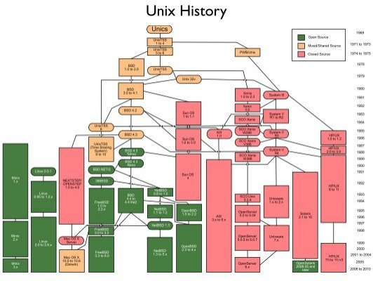
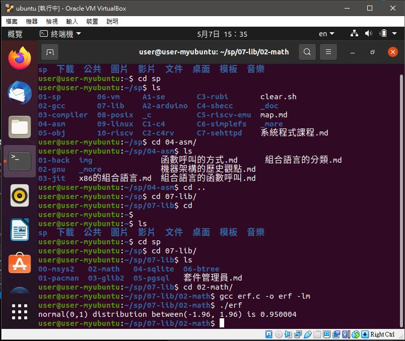
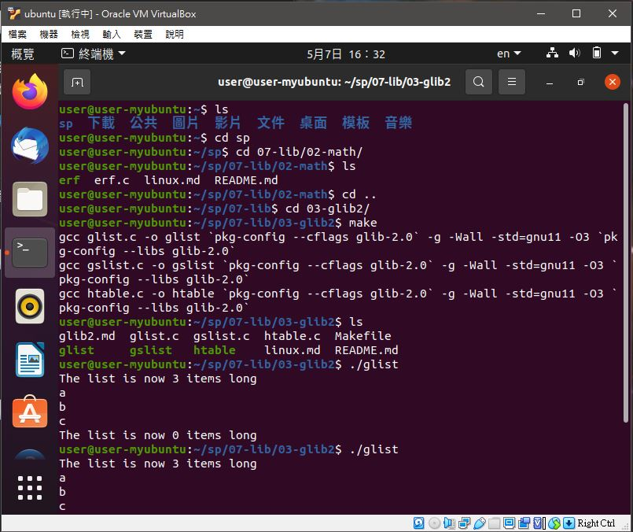
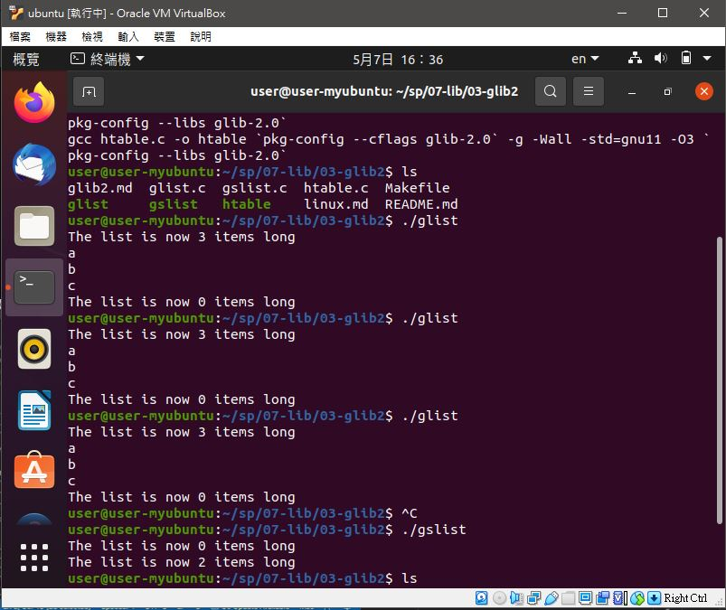
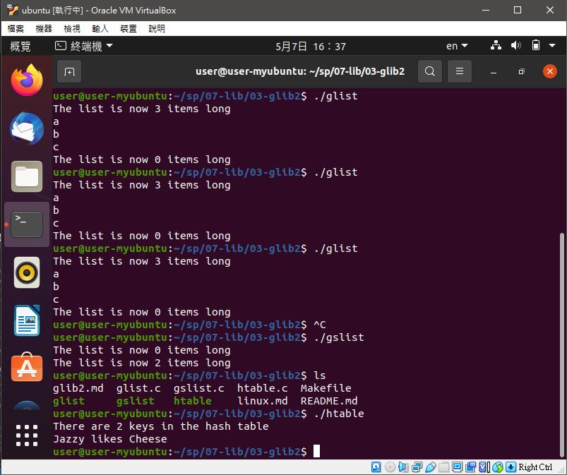
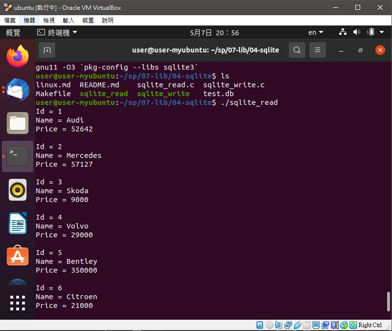
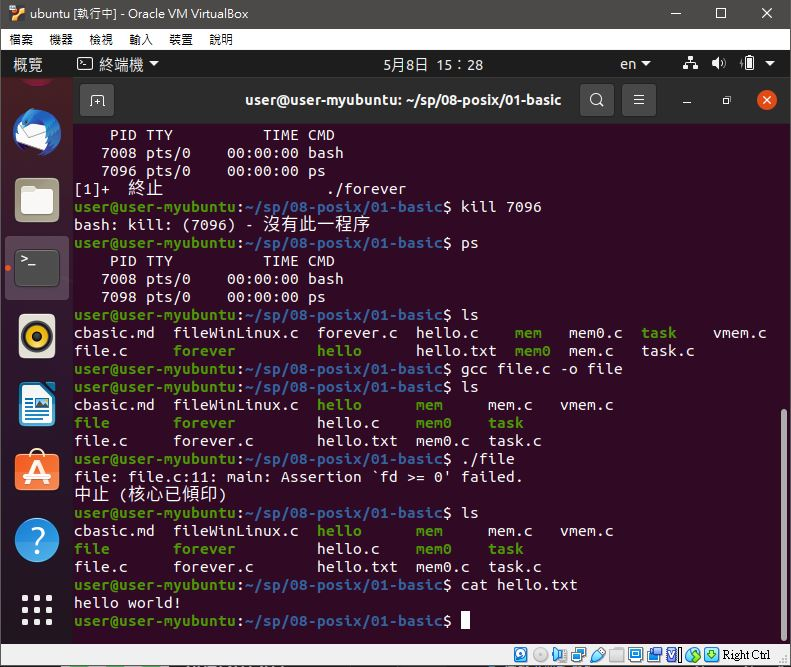

# 📝系統程式第七週筆記20210414
## 📖 [UNIX](https://en.wikipedia.org/wiki/History_of_Unix)

* 簡介 : UNIX作業系統，是一個強大的多使用者、多工作業系統，支援多種處理器架構，按照作業系統的分類，屬於分時作業系統
* 最早由肯·湯普遜、丹尼斯·里奇和道格拉斯·麥克羅伊於1969年在AT&T的貝爾實驗室開發
## 📖 [vim](https://ipcmen.com/vi-vim)


## 💻 程式實際操作
### 🔗 07-lib/02-math/erf

#### The result of execution
```
user@user-myubuntu:~/sp/07-lib/02-math$ gcc erf.c -o erf -lm
user@user-myubuntu:~/sp/07-lib/02-math$ ./erf
normal(0,1) distribution between(-1.96, 1.96) is 0.950004
```
* -lm m為math函示庫縮寫，因為他不是標準函示庫
### 🔗 07-lib/03-glib2/glist

#### The result of execution
```
user@user-myubuntu:~/sp/07-lib/03-glib2$ ./glist
The list is now 3 items long
a
b
c
The list is now 0 items long
```
### 🔗 07-lib/03-glib2/gslist

#### The result of execution
```
user@user-myubuntu:~/sp/07-lib/03-glib2$ ./gslist
The list is now 0 items long
The list is now 2 items long
```
### 🔗 07-lib/03-glib2/htable

#### The result of execution
```
user@user-myubuntu:~/sp/07-lib/03-glib2$ ./htable
There are 2 keys in the hash table
Jazzy likes Cheese
```

### 🔗 07-lib/03-glib2/sqlite/sqlite_read

#### The result of execution
```
user@user-myubuntu:~/sp/07-lib/04-sqlite$ ./sqlite_read 
Id = 1
Name = Audi
Price = 52642

Id = 2
Name = Mercedes
Price = 57127

Id = 3
Name = Skoda
Price = 9000

Id = 4
Name = Volvo
Price = 29000

Id = 5
Name = Bentley
Price = 350000

Id = 6
Name = Citroen
Price = 21000

Id = 7
Name = Hummer
Price = 41400

Id = 8
Name = Volkswagen
Price = 21600
```

### 🔗 8-posix/01-basic/file

#### The result of execution
```
ser@user-myubuntu:~/sp/08-posix/01-basic$ gcc file.c -o file
user@user-myubuntu:~/sp/08-posix/01-basic$ ./file
file: file.c:11: main: Assertion `fd >= 0' failed.
中止 (核心已傾印)
user@user-myubuntu:~/sp/08-posix/01-basic$ ls
cbasic.md  fileWinLinux.c  hello      mem     mem.c   vmem.c
file       forever         hello.c    mem0    task
file.c     forever.c       hello.txt  mem0.c  task.c
user@user-myubuntu:~/sp/08-posix/01-basic$ cat hello.txt
hello world!
```
## 📖 補充資料
* [POSIX](https://en.wikipedia.org/wiki/POSIX)
* [CMake](https://cmake.org/?fbclid=IwAR2pwZLYEiQSfRFkxkQzK4oqA8huE_bYP8ZEtg9va8MQ6eDcycvVXfRPoyI)
* [CONANMake](https://conan.io/)
* [Ninja](https://ninja-build.org/) 
* [程式人雜誌](https://github.com/programmermagazine)


🖊️ editor : yi-chien Liu
