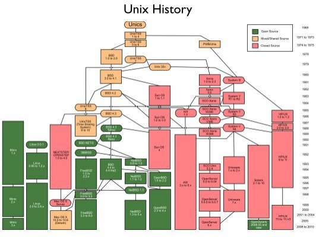
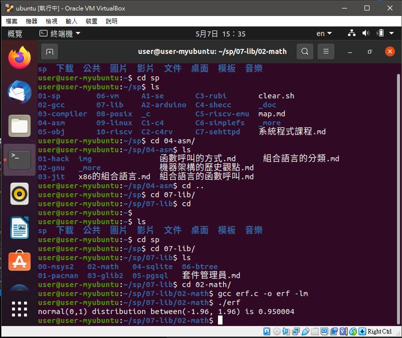
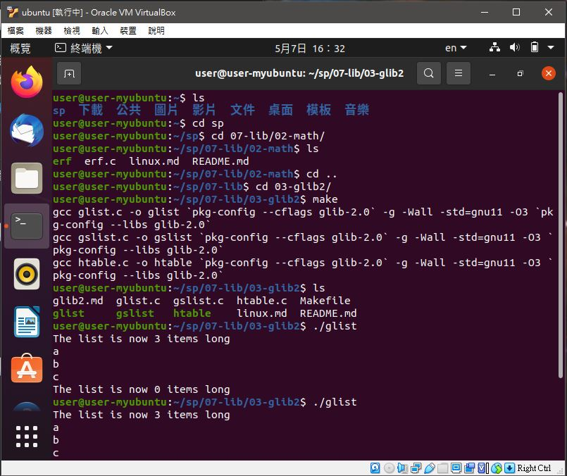
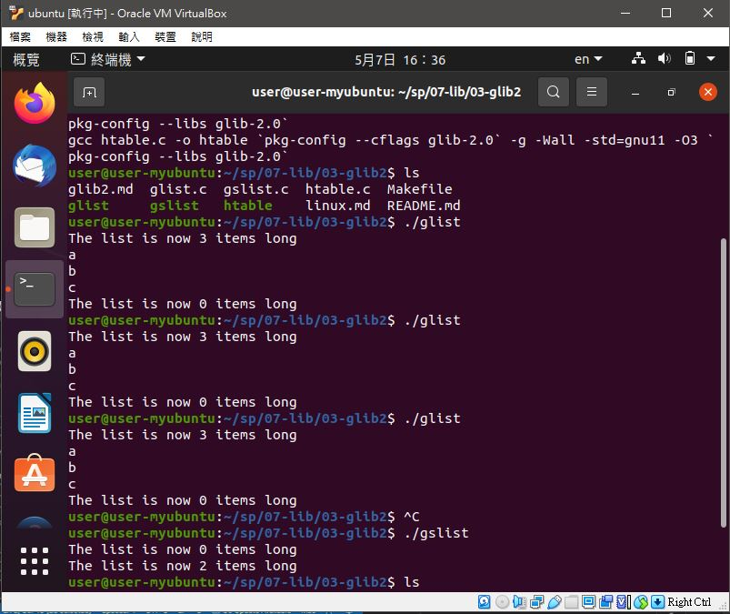
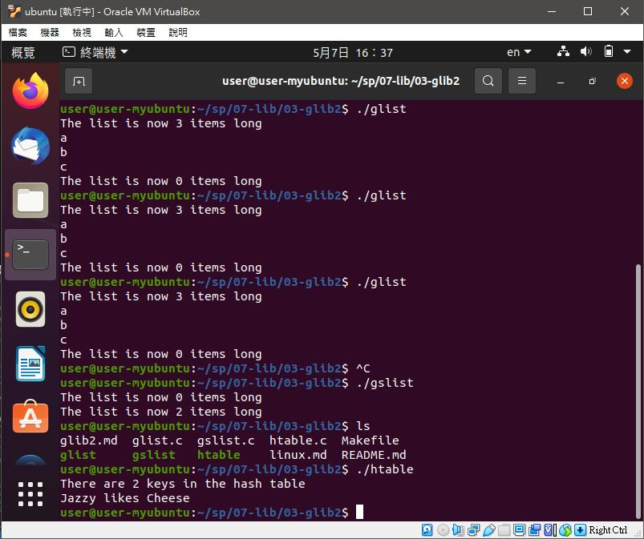
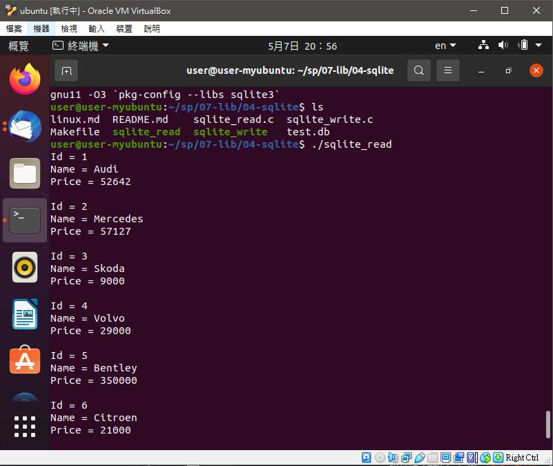
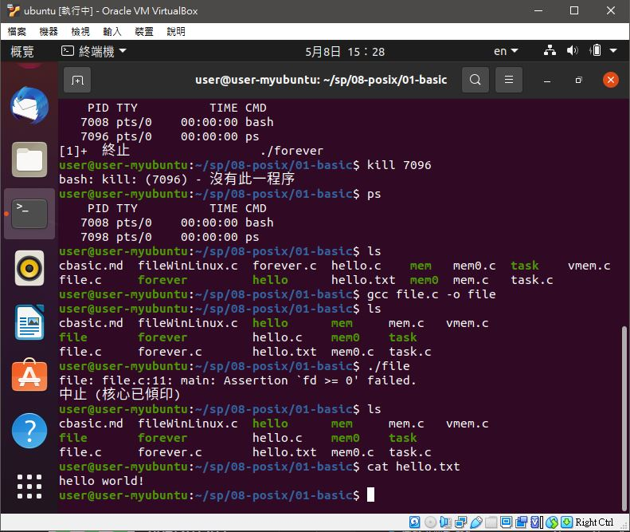

# 📝系統程式第七週筆記20210414
## 📖 [UNIX](https://en.wikipedia.org/wiki/History_of_Unix)

* 簡介 : UNIX作業系統，是一個強大的多使用者、多工作業系統，支援多種處理器架構，按照作業系統的分類，屬於分時作業系統
* 最早由肯·湯普遜、丹尼斯·里奇和道格拉斯·麥克羅伊於1969年在AT&T的貝爾實驗室開發

### 🔖 UNIX常用指令介紹
* 請參考此[連結](http://www2.thu.edu.tw/~cc/network_team/unix/command.htm)

## 📖 [vim](https://ipcmen.com/vi-vim)


## 💻 程式實際操作
### 🔗 07-lib/02-math/erf

<details>
  <summary><b>Show code</b></summary>

  ```
#include <math.h>
#include <stdio.h>

int main() {
  printf("normal(0,1) distribution between(-1.96, 1.96) is %g\n", erf(1.96*sqrt(1/2.)));
}
  ```
</details>

#### The result of execution
```
user@user-myubuntu:~/sp/07-lib/02-math$ gcc erf.c -o erf -lm
user@user-myubuntu:~/sp/07-lib/02-math$ ./erf
normal(0,1) distribution between(-1.96, 1.96) is 0.950004
```
* -lm m為math函示庫縮寫，因為他不是標準函示庫

### 🔗 07-lib/03-glib2/glist

<details>
  <summary><b>Show code</b></summary>

  ```
/* Compile with:
export CFLAGS="`pkg-config --cflags glib-2.0` -g -Wall -std=gnu11 -O3"
export LDLIBS="`pkg-config --libs   glib-2.0`"
make glist
*/
#include <stdio.h>
#include <glib.h>

GList *list;

int main(){
    list = g_list_append(list, "a");
    list = g_list_append(list, "b");
    list = g_list_append(list, "c");
    printf("The list is now %d items long\n", g_list_length(list));

    for ( ; list!= NULL; list=list->next)
        printf("%s\n", (char*)list->data);

    printf("The list is now %d items long\n", g_list_length(list));
}
  ```
</details>

#### The result of execution
```
user@user-myubuntu:~/sp/07-lib/03-glib2$ ./glist
The list is now 3 items long
a
b
c
The list is now 0 items long
```

### 🔗 07-lib/03-glib2/gslist

<details>
  <summary><b>Show code</b></summary>

  ```
//ex-gslist-1.c
#include <glib.h>
#include <stdio.h>

int main(int argc, char** argv) {
  GSList* list = NULL;
  printf("The list is now %d items long\n", g_slist_length(list));
  list = g_slist_append(list, "first");
  list = g_slist_append(list, "second");
  printf("The list is now %d items long\n", g_slist_length(list));
  g_slist_free(list);
  return 0;
}
/*
***** Output *****
 
The list is now 0 items long
The list is now 2 items long
*/
  ```
</details>

#### The result of execution
```
user@user-myubuntu:~/sp/07-lib/03-glib2$ ./gslist
The list is now 0 items long
The list is now 2 items long
```

### 🔗 07-lib/03-glib2/htable

<details>
  <summary><b>Show code</b></summary>

  ```
// Example from IBM tutorial

#include <glib.h>
#include <stdio.h>

int main(int argc, char *argv[]) {
    GHashTable* hash = g_hash_table_new(g_str_hash, g_str_equal);
    
    g_hash_table_insert(hash,"Jazzy","Cheese");
    g_hash_table_insert(hash,"Mr Darcy","Treats");

    printf("There are %d keys in the hash table\n",
        g_hash_table_size(hash));

    printf("Jazzy likes %s\n",(char*)g_hash_table_lookup(hash,"Jazzy"));

    g_hash_table_destroy(hash);
    return 0;
}
  ```
</details>

#### The result of execution
```
user@user-myubuntu:~/sp/07-lib/03-glib2$ ./htable
There are 2 keys in the hash table
Jazzy likes Cheese
```

### 🔗 07-lib/04-sqlite$/sqlite_read 

<details>
  <summary><b>Show code</b></summary>

  ```
#include <sqlite3.h>
#include <stdio.h>


int callback(void *, int, char **, char **);


int main(void) {
    
    sqlite3 *db;
    char *err_msg = 0;
    
    int rc = sqlite3_open("test.db", &db);
    
    if (rc != SQLITE_OK) {
        
        fprintf(stderr, "Cannot open database: %s\n", 
                sqlite3_errmsg(db));
        sqlite3_close(db);
        
        return 1;
    }
    
    char *sql = "SELECT * FROM Cars";
        
    rc = sqlite3_exec(db, sql, callback, 0, &err_msg);
    
    if (rc != SQLITE_OK ) {
        
        fprintf(stderr, "Failed to select data\n");
        fprintf(stderr, "SQL error: %s\n", err_msg);

        sqlite3_free(err_msg);
        sqlite3_close(db);
        
        return 1;
    } 
    
    sqlite3_close(db);
    
    return 0;
}

int callback(void *NotUsed, int argc, char **argv, 
                    char **azColName) {
    
    NotUsed = 0;
    
    for (int i = 0; i < argc; i++) {

        printf("%s = %s\n", azColName[i], argv[i] ? argv[i] : "NULL");
    }
    
    printf("\n");
    
    return 0;
}
  ```
</details>

#### The result of execution
```
user@user-myubuntu:~/sp/07-lib/04-sqlite$ ./sqlite_read 
Id = 1
Name = Audi
Price = 52642

Id = 2
Name = Mercedes
Price = 57127

Id = 3
Name = Skoda
Price = 9000

Id = 4
Name = Volvo
Price = 29000

Id = 5
Name = Bentley
Price = 350000

Id = 6
Name = Citroen
Price = 21000

Id = 7
Name = Hummer
Price = 41400

Id = 8
Name = Volkswagen
Price = 21600
```

### 🔗 8-posix/01-basic/file

<details>
  <summary><b>Show code</b></summary>

  ```
#include <stdio.h>
#include <unistd.h>
#include <assert.h>
#include <fcntl.h>
#include <sys/stat.h>
#include <sys/types.h>
#include <string.h>

int main(int argc, char *argv[]) {
    int fd = open("hello.txt", O_WRONLY | O_CREAT | O_TRUNC, S_IRUSR | S_IWUSR);
    assert(fd >= 0);
    char buffer[20];
    sprintf(buffer, "hello world!\n");
    int rc = write(fd, buffer, strlen(buffer));
    assert(rc == (strlen(buffer)));
    fsync(fd);
    close(fd);
    return 0;
}
  ```
</details>

#### The result of execution
```
ser@user-myubuntu:~/sp/08-posix/01-basic$ gcc file.c -o file
user@user-myubuntu:~/sp/08-posix/01-basic$ ./file
file: file.c:11: main: Assertion `fd >= 0' failed.
中止 (核心已傾印)
user@user-myubuntu:~/sp/08-posix/01-basic$ ls
cbasic.md  fileWinLinux.c  hello      mem     mem.c   vmem.c
file       forever         hello.c    mem0    task
file.c     forever.c       hello.txt  mem0.c  task.c
user@user-myubuntu:~/sp/08-posix/01-basic$ cat hello.txt
hello world!
```

## 📖 補充資料
* [POSIX](https://en.wikipedia.org/wiki/POSIX)
* [CMake](https://cmake.org/?fbclid=IwAR2pwZLYEiQSfRFkxkQzK4oqA8huE_bYP8ZEtg9va8MQ6eDcycvVXfRPoyI)
* [CONANMake](https://conan.io/)
* [Ninja](https://ninja-build.org/) 
* [程式人雜誌](https://github.com/programmermagazine)


🖊️ editor : yi-chien Liu
