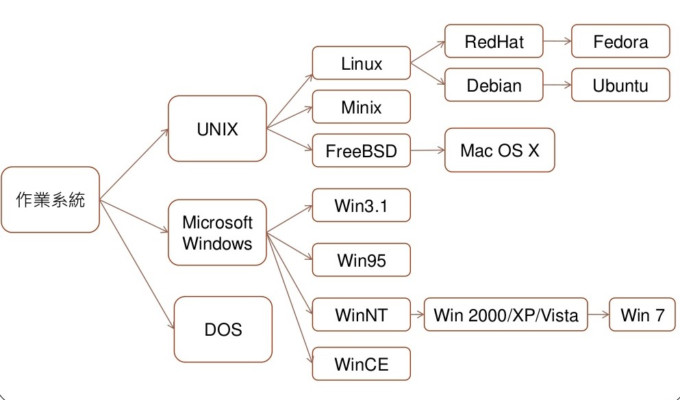
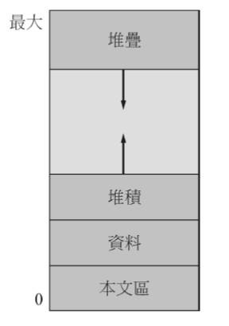
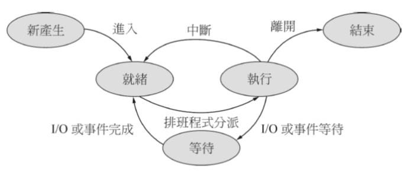
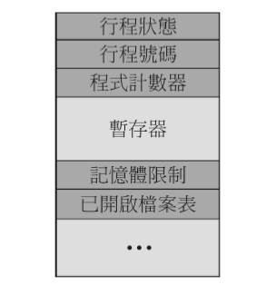
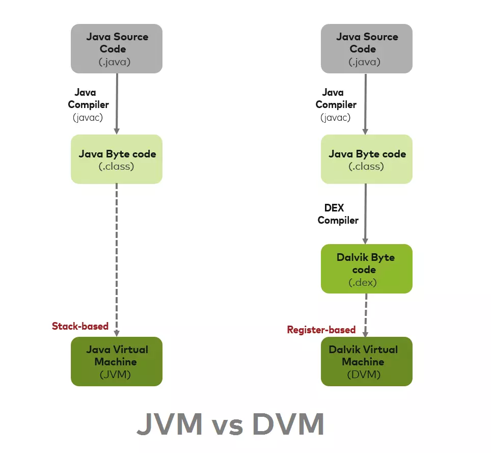
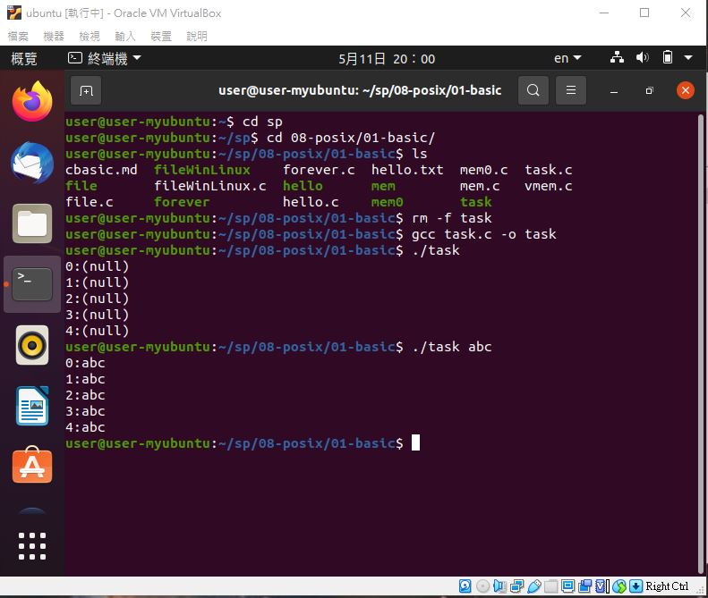
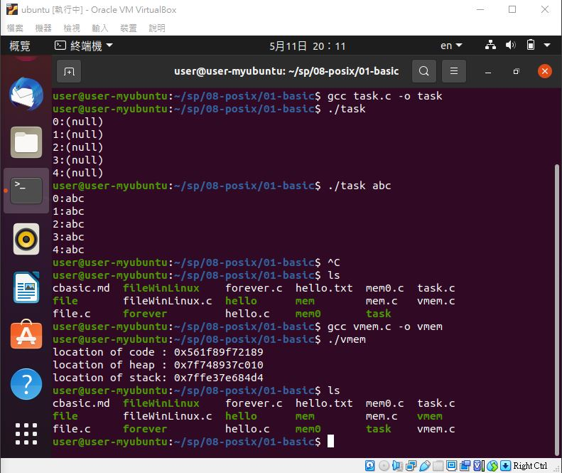
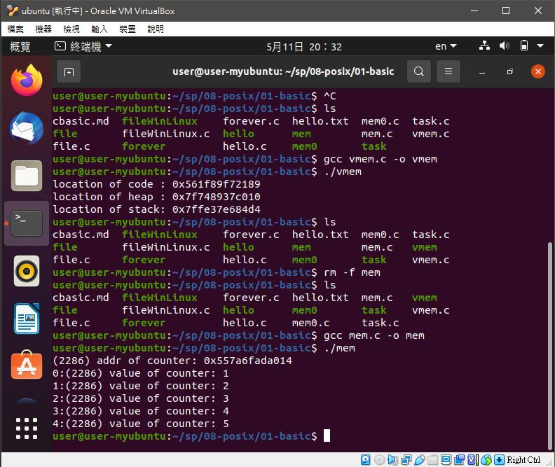
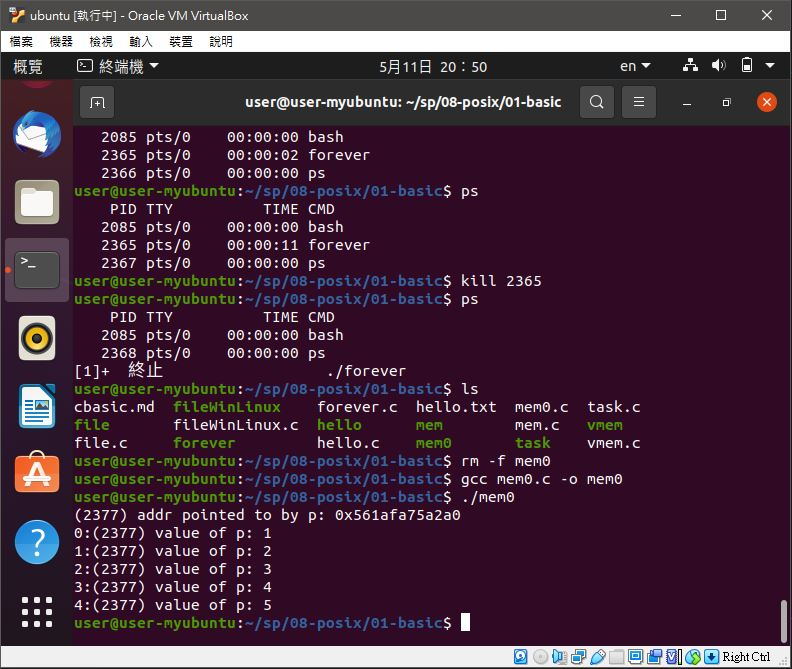
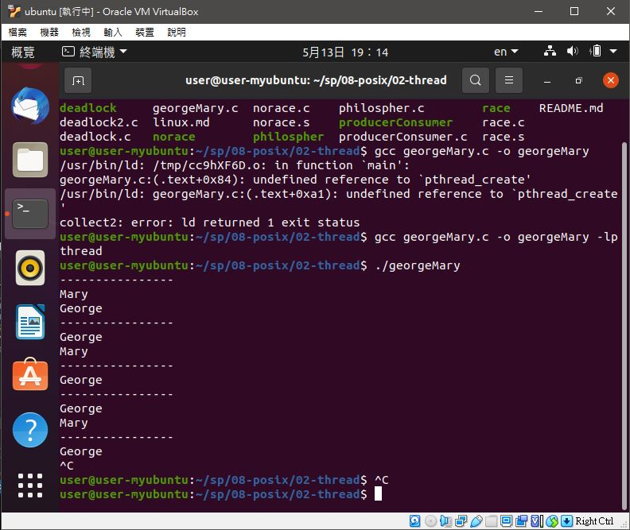

# 📝系統程式第八週筆記20210421
## 📖 作業系統
### 🔖 常見作業系統


### 🔖 五大功能模組
#### 1.行程管理
* 打造出一個環境，讓任何系統能輕易地執行，而不受到其他程式干擾
#### 2.記憶體管理
* 打造出一個記憶體配置環境，當成是需要記憶體十，只要透過系統呼叫提出請求，就可以獲得所要的記憶體空間，完全不用去考慮其他城市是否存在，或者應該用哪一個區域的記憶體等問題
#### 3.輸出入管理
* 將輸入裝置包裝成函示庫，讓城市師部用直接面對複雜且多樣的裝置。
#### 4.檔案系統
* 是輸出入系的延伸，主要針對永久除純裝置的設計，目的是讓城市施予使用者能輕易存取資料，而不需考慮各種不同儲存裝置的技術細節
* 程式設計師只要透過作業系統所提供的＂檔案輸出入函數＂就能存取檔案
* 一般使用者只要透過＂命令列＂或＂視窗介面＂就能存取檔案
#### 5.使用者介面
* 視窗介面被發明後，逐漸取代命令列介面，成為主要的使用者介面

## 📖 [行程(process)](https://zh.wikipedia.org/wiki/%E8%A1%8C%E7%A8%8B)
### 🔖 概述
* 多道程序在執行時，需要共享系统資源，從而導致各程序在執行過程中出現相互制約的關係，程序的執行表現出間斷性的特徵。這些特徵都是在程序的執行過程中發生的，是動態的過程，而傳统的程序本身是一组指令的集合，是一个靜態的概念，無法描述程序在内存中的執行情况，即我們無法從程序的字面上看出它何時執行，何时停頓，也無法看出它與其它執行程序的關係，因此，程序這個静態概念已不能如實反映程序並發執行過程的特徵

### 🔖 概念
* 行程是一個實體。每一個行程都有它自己的地址空間
* 行程是一個“執行中的程序”。程序是一個有生命的實體，只有處理器賦予程序生命時，它才能成為一個活動的實體

### 🔖 行程記憶體結構

* 行程不只是程式碼 ，有時也稱為本文區(text section)。
* 它包含代表目前運作的程式計數器 (program counter)數值和處理器(processor)的暫存器(registrers)內容。
* 行程堆疊 (stack)：存放暫用資料 (副程式的參數、返回位址，及暫時性變數)
* 資料區間(data section)：包含全域變數(global variables)
* 堆積 (heap)：堆積就是在行程執行期間動態配置的記憶體。

### 🔖 行程狀態

行程的基本狀態有三種：就緒、執行、等待(阻塞)。
* 就緒狀態：當行程已分配到除CPU以外的所有必要資源後，只要在獲得CPU，便可立即執行，行程這時的狀態稱為就緒狀態。處於該狀態的行程構成緒列隊。
* 執行狀態：行程正在處理器上運行的狀態，該行程已獲得必要的資源，也獲得了處理器，用戶程序正在處理器上運行。
* 等待(阻塞)狀態：正在執行的行程由於發生某事件而暫時無法繼續執行時，變放棄處理器而處於暫停狀態，即行程的執行收到阻塞，成為阻塞狀態，也成為等待狀態。

### 🔖 行程控制表

* 行程狀態(Process state)：running、waiting
* 程式計數器(Program counter)：指出行程接著要執行的指令位址
* CPU暫存器(CPU registers)：所有暫存器內容
* CPU排班法則相關資訊(CPU scheduling information)：行程的優先順序 (Priorities)、排班佇列(scheduling queue)指標以及其它的排班參數
* 記憶體管理資訊(Memory-management information)：分配給行程的記憶體
帳號資訊(Accounting information)：CPU和實際時間的使用數量、時限、帳號工作或行程號碼。
* 輸入/輸出狀態資訊(I/O status information)：配置給行程的輸入/輸出裝置，開啟檔案的串列

## 📖 JVM & DVM
### 🔖 [JVM(Java Virtual Machine)](https://codertw.com/%E7%A8%8B%E5%BC%8F%E8%AA%9E%E8%A8%80/654140/)
* JVM是通過在實際的計算機上仿真模擬各種計算機功能來實現的。由一套字節碼指令集、一組寄存器、一個棧、一個垃圾回收堆和一個存儲方法域等組成。JVM屏蔽了與操作系統平臺相關的信息，使得Java程序只需要生成在Java虛擬機上運行的目標代碼（字節碼），就可在多種平臺上不加修改的運行，這也是Java能夠“一次編譯，到處運行的”原因。

### 🔖 [DVM(Dalvik Virtual Machine)](https://ithelp.ithome.com.tw/articles/10011817)
* DVM(Dalvik虛擬機器)是一種暫存器型態的虛擬機器。簡稱DVM，DVM在撰寫開發時就已經設想用最少的記憶體資源來執行，以及同時可執行多個VM為前提來開發的。

### 🔖 [JVM & DVM的差異](https://kknews.cc/zh-tw/tech/ql8yvo.html)

* 1.dvm執行的是.dex格式文件 jvm執行的是.class文件 android程序編譯完之後生產.class文件，然後，dex工具會把.class文件處理成.dex文件，然後把資源文件和.dex文件等打包成.apk文件。apk就是android package的意思。 jvm執行的是.class文件。
* 2.dvm是基於寄存器的虛擬機 而jvm執行是基於虛擬棧的虛擬機。寄存器存取速度比棧快的多，dvm可以根據硬體實現最大的優化，比較適合移動設備。
* 3..class文件存在很多的冗餘信息，dex工具會去除冗餘信息，並把所有的.class文件整合到.dex文件中。減少了I/O操作，提高了類的查找速度。

## 💻 程式實際操作
### 🔗 08-posix/01-basic/task

#### The result of execution
```
user@user-myubuntu:~/sp/08-posix/01-basic$ gcc task.c -o task
user@user-myubuntu:~/sp/08-posix/01-basic$ ./task
0:(null)
1:(null)
2:(null)
3:(null)
4:(null)
user@user-myubuntu:~/sp/08-posix/01-basic$ ./task abc
0:abc
1:abc
2:abc
3:abc
4:abc
```

### 🔗 08-posix/01-basic/vmem

#### The result of execution
```
user@user-myubuntu:~/sp/08-posix/01-basic$ gcc vmem.c -o vmem
user@user-myubuntu:~/sp/08-posix/01-basic$ ./vmem
location of code : 0x561f89f72189
location of heap : 0x7f748937c010
location of stack: 0x7ffe37e684d4
```

### 🔗 08-posix/01-basic/mem

#### The result of execution
```
user@user-myubuntu:~/sp/08-posix/01-basic$ gcc mem.c -o mem
user@user-myubuntu:~/sp/08-posix/01-basic$ ./mem
(2286) addr of counter: 0x557a6fada014
0:(2286) value of counter: 1
1:(2286) value of counter: 2
2:(2286) value of counter: 3
3:(2286) value of counter: 4
4:(2286) value of counter: 5
```

### 🔗 08-posix/01-basic/mem0

#### The result of execution
```
user@user-myubuntu:~/sp/08-posix/01-basic$ gcc mem0.c -o mem0
user@user-myubuntu:~/sp/08-posix/01-basic$ ./mem0
(2377) addr pointed to by p: 0x561afa75a2a0
0:(2377) value of p: 1
1:(2377) value of p: 2
2:(2377) value of p: 3
3:(2377) value of p: 4
4:(2377) value of p: 5
```

### 🔗 08-posix/02-thread/georgeMary

#### The result of execution
```
user@user-myubuntu:~/sp/08-posix/02-thread$ gcc georgeMary.c -o georgeMary -lpthread
user@user-myubuntu:~/sp/08-posix/02-thread$ ./georgeMary 
----------------
Mary
George
----------------
George
Mary
----------------
George
----------------
George
Mary
----------------
George
```
* -lpthread : -l是連結函示庫，連結pthread函示庫


## 📖 補充資料
* [HITCON 台灣駭客年會](https://hacker.org.tw/)
* [SITCON 學生計算機年會](https://sitcon.org/)


🖊️editor : yi-chien Liu