# 📝系統程式第九週筆記20210428
## 📖 單行程系統 & 多工系統
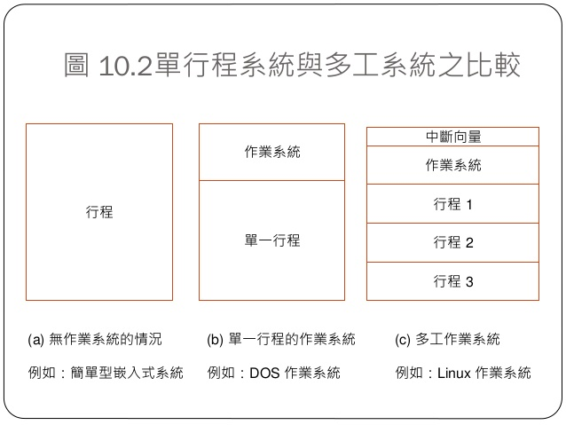

## 📖 Process & Thread
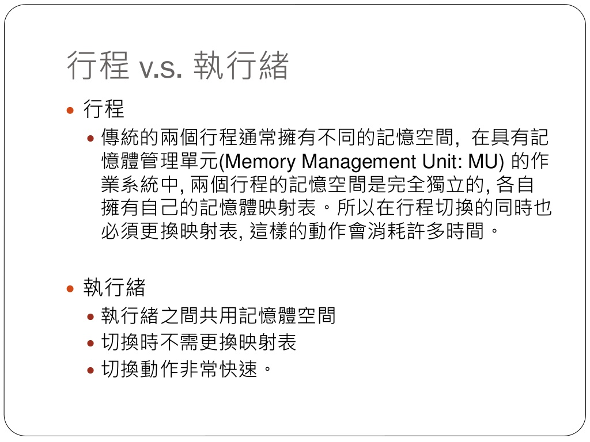
### 🔖 作業系統行程
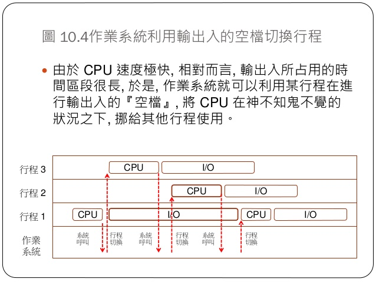
* Thread 在台灣被稱為『執行緒』，作業系統教科書中通常會定義 Process 為：執行中的程式。因此假如您開了一個 Word 檔案，那就是有一個 Word 行程在執行，如果您又開了個命令列，那就是又有一個命令列行程在執行，如果又開第二個命令列，那就有兩個命令列行程在執行。
* 每個 Process 與 Thread 都會執行，而且執行到一半很可能就會因為進行輸出入或佔用 CPU 過久而被作業系統切換出去，改換另一個 Process 或 Thread 執行，這種概念稱為 Multitasking (多工)。
### 🔖 行程的狀態
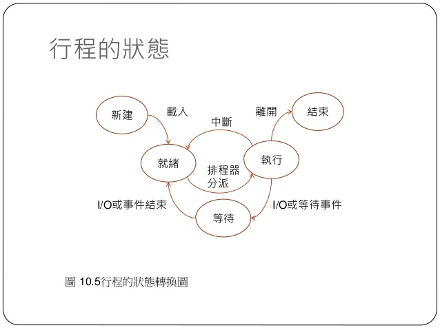
### 🔖 排程的方法
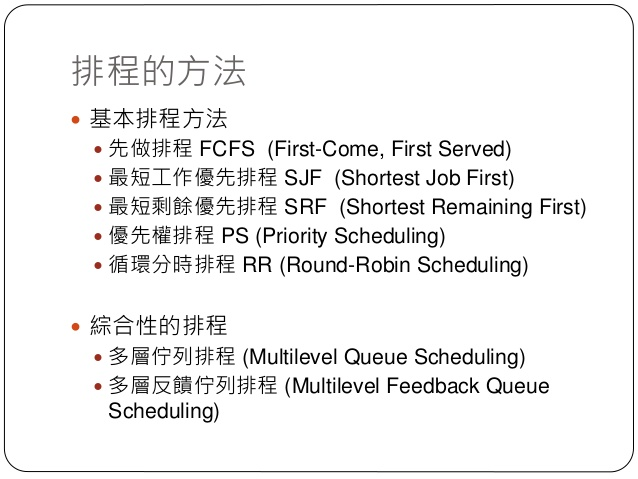

## 📖 記憶體管理
### 🔖 用途
* 有效管理記憶體除了能提高電腦的效率外，還可以保護電腦不受到駭客或惡意程式的入侵。
* C語言的記憶體分配與回收<br>
1.分配 : malloc()<br>
2.回收 : free()<br>
### 🔖 記憶體分配

### 🔖 遇到問題
#### 記憶體不足 : <br>
1.直接回報錯誤 <br>
2.試圖處理記憶體不足的情況(記憶體聚集法 or 垃圾收集法)

## 📖 記憶體管理單元(MMU)硬體
### 🔖 重定位暫存器
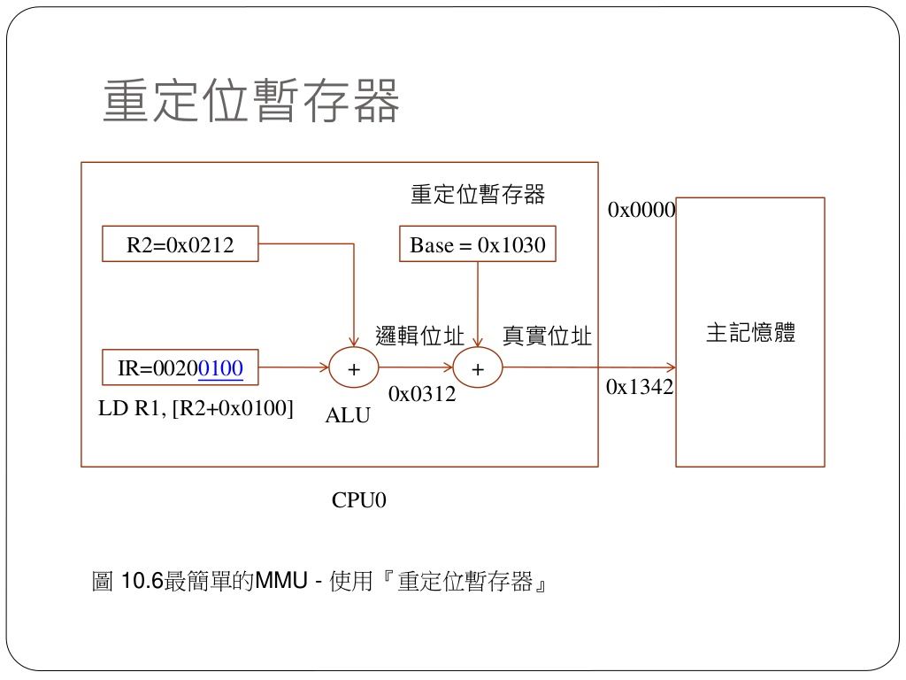
* 真實位置 = 邏輯位置 + 重定位暫存器位置
### 🔖 基底界限暫存器
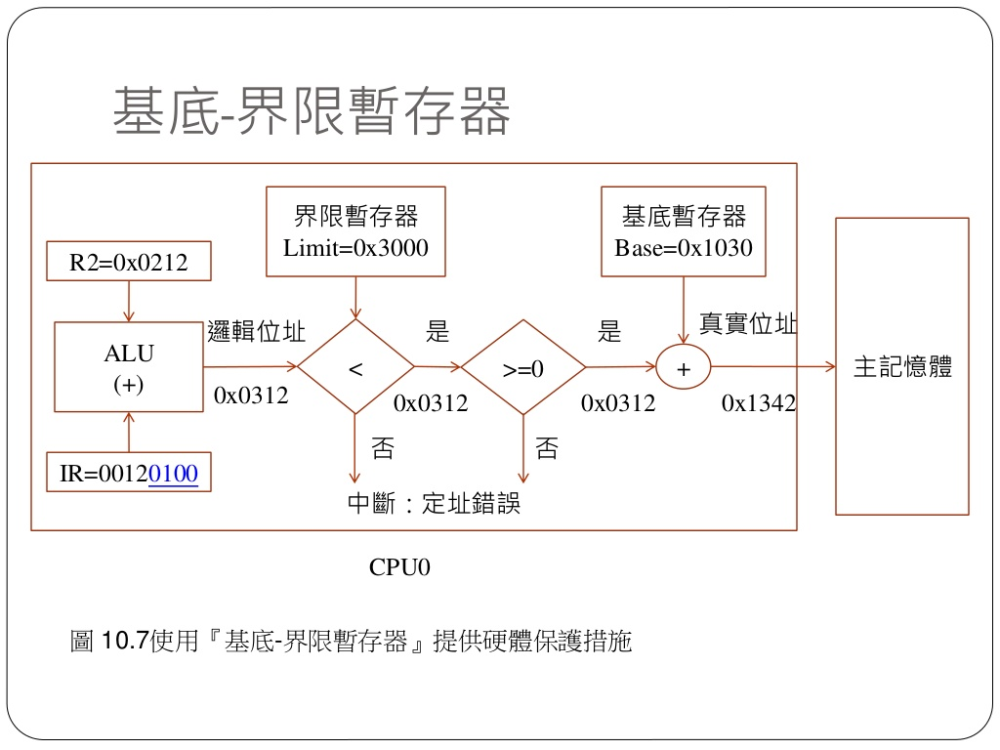
### 🔖 分段機制
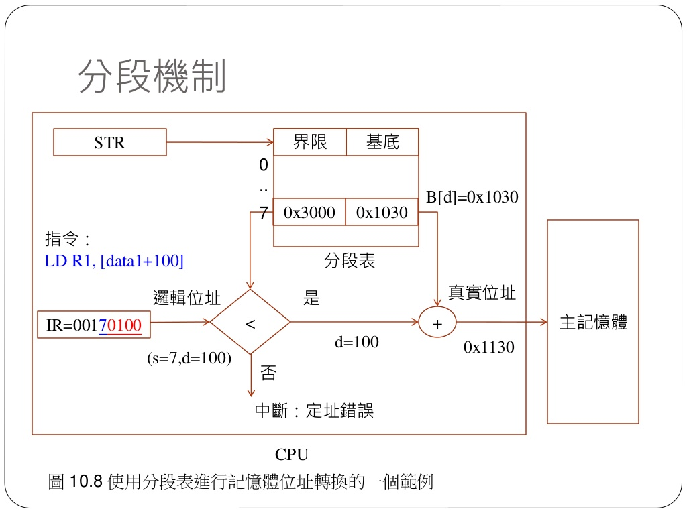
* 將程式所需要的記憶體空間大小的虛擬空間，通過對映機制對映到某個實體地址空間(對映的操作由硬體完成)。<br>
分段對映機制解決了之前作業系統存在的兩個問題：<br>
(1)地址空間沒有隔離<br>
(2)程式執行的地址不確定
### 🔖 分頁機制
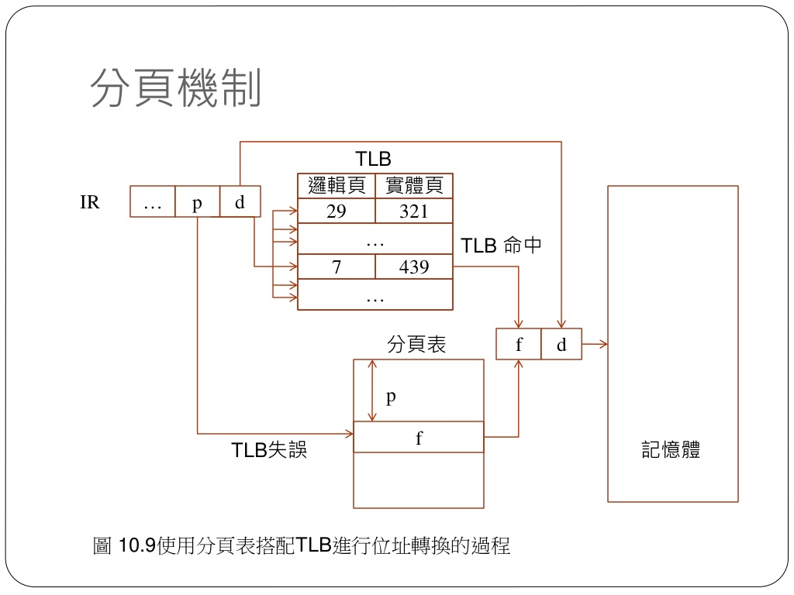
* 分頁機制解決了上面分段方法所存在的一個記憶體使用效率問題；其核心思想是系統為程式執行檔案中的第x頁分配了記憶體中的第y頁，同時y頁會新增到程序虛擬空間地址的對映表中(頁表)，這樣程式就可以通過對映訪問到記憶體頁y了。

## 📖 死結(deadlock)
* 當兩個以上的運算單元，雙方都在等待對方停止執行，以取得系統資源，但是沒有一方提前登出時，就稱為死結
* 在多工作業系統中，作業系統為了協調不同行程，能否取得系統資源時，為了讓系統正常運作，必須要解決這個問題。另一種相似的情況稱為「活結」
### 🔖 發生條件
* 禁止搶占（no preemption）：系統資源不能被強制從一個行程中登出
* 持有和等待（hold and wait）：一個行程可以在等待時持有系統資源
* 互斥（mutual exclusion）：資源只能同時分配給一個行程，無法多個行程共享
* 循環等待（circular waiting）：一系列行程互相持有其他行程所需要的資源
死結只有在四個條件同時滿足時發生，預防死結必須至少破壞其中一項
### 🔖 消除方法
* 最簡單的消除死結的辦法是重新啟動系統。更好的辦法是終止一個行程的執行
* 同樣也可以把一個或多個行程回滾到先前的某個狀態。如果一個行程被多次回滾，遲遲不能占用必需的系統資源，可能會導致資源匱乏

## 💻 程式實際操作
### 🔗 08-posix/02-thread/race
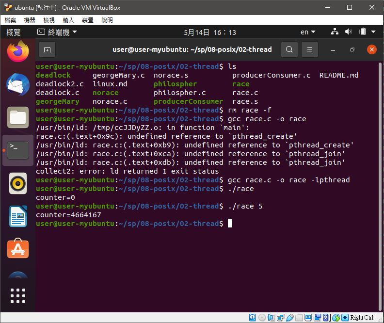
<details>
  <summary><b>Show code</b></summary>

  ```
#include <stdio.h>
#include <pthread.h>

#define LOOPS 100000000
int counter = 0;

void *inc()
{
  for (int i=0; i<LOOPS; i++) {
    counter = counter + 1;
  }
  return NULL;
}

void *dec()
{
  for (int i=0; i<LOOPS; i++) {
    counter = counter - 1;
  }
  return NULL;
}


int main() 
{
  pthread_t thread1, thread2;

  pthread_create(&thread1, NULL, inc, NULL);
  pthread_create(&thread2, NULL, dec, NULL);

  pthread_join( thread1, NULL);
  pthread_join( thread2, NULL);
  printf("counter=%d\n", counter);
}
  ```
</details>

#### The result of execution
```
user@user-myubuntu:~/sp/08-posix/02-thread$ gcc race.c -o race -lpthread
user@user-myubuntu:~/sp/08-posix/02-thread$ ./race
counter=0
user@user-myubuntu:~/sp/08-posix/02-thread$ ./race
counter=4664167
```
#### 補充說明
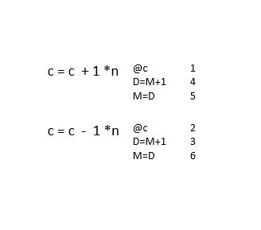

### 🔗 08-posix/02-thread/norace
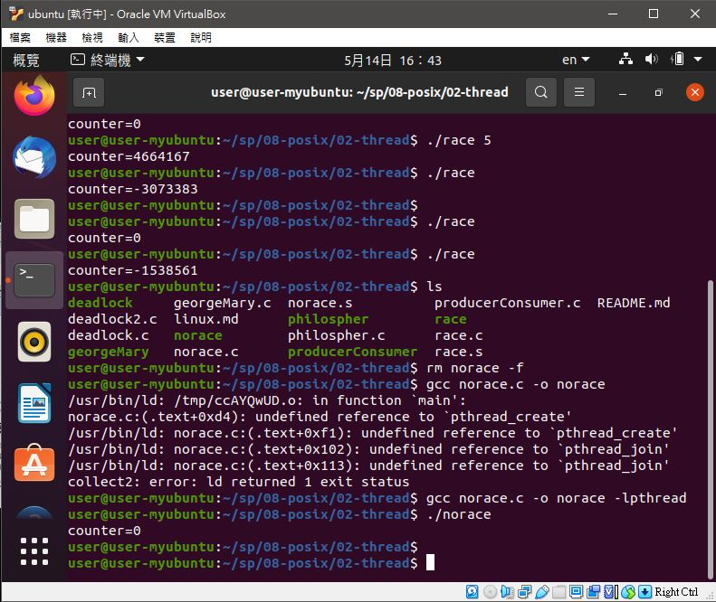
<details>
  <summary><b>Show code</b></summary>

  ```
#include <stdio.h>
#include <pthread.h>

pthread_mutex_t mutex1 = PTHREAD_MUTEX_INITIALIZER;
#define LOOPS 100000
int counter = 0;

void *inc()
{
  for (int i=0; i<LOOPS; i++) {
    pthread_mutex_lock( &mutex1 );
    counter = counter + 1;
    pthread_mutex_unlock( &mutex1 );
  }
  return NULL;
}

void *dec()
{
  for (int i=0; i<LOOPS; i++) {
    pthread_mutex_lock( &mutex1 );
    counter = counter - 1;
    pthread_mutex_unlock( &mutex1 );
  }
  return NULL;
}


int main() 
{
	pthread_t thread1, thread2;

	pthread_create(&thread1, NULL, inc, NULL);
  pthread_create(&thread2, NULL, dec, NULL);

  pthread_join( thread1, NULL);
  pthread_join( thread2, NULL);
  printf("counter=%d\n", counter);
}
  ```
</details>

#### The result of execution
```
user@user-myubuntu:~/sp/08-posix/02-thread$ gcc norace.c -o norace -lpthread
user@user-myubuntu:~/sp/08-posix/02-thread$ ./norace 
counter=0
```

### 🔗 08-posix/02-thread/deadlock
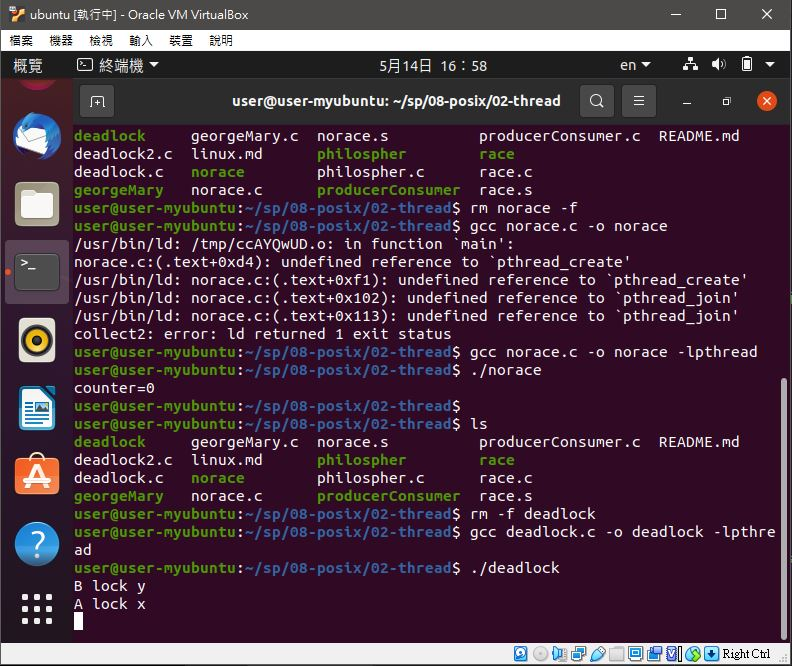
<details>
  <summary><b>Show code</b></summary>

  ```
#include <pthread.h>
#include <stdio.h>
#include <unistd.h>

pthread_mutex_t x;
pthread_mutex_t y;

void *A(); 
void *B(); 

int main(int argc, char *argv[])
{
    pthread_t threadA, threadB;
    pthread_attr_t attr;

    pthread_attr_init(&attr);
    pthread_mutex_init(&x, NULL);
    pthread_mutex_init(&y, NULL);

    pthread_create(&threadA, &attr, A, NULL);
    pthread_create(&threadB, &attr, B, NULL);

    pthread_join(threadA, NULL);
    pthread_join(threadB, NULL);

    pthread_mutex_destroy(&x);
    pthread_mutex_destroy(&y);
}

void *A() 
{
    pthread_mutex_lock(&x);
    printf("A lock x\n");

    sleep(1);
    pthread_mutex_lock(&y);
    printf("A lock y\n");

    pthread_mutex_unlock(&y); 
    pthread_mutex_unlock(&x); 

    printf("finished A\n");

    pthread_exit(0);
}

void *B()
{
    
    pthread_mutex_lock(&y);
    printf("B lock y\n");
    sleep(1);
    pthread_mutex_lock(&x);
    printf("B lock x\n");
    pthread_mutex_unlock(&x);
    pthread_mutex_unlock(&y);

    pthread_exit(0);
}
  ```
</details>

#### The result of execution
```
user@user-myubuntu:~/sp/08-posix/02-thread$ gcc deadlock.c -o deadlock -lpthread
user@user-myubuntu:~/sp/08-posix/02-thread$ ./deadlock 
B lock y
A lock x
```
#### 補充說明
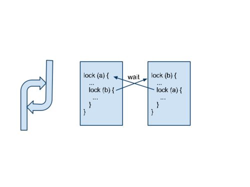
* 當程式 1 抓住資源 A，卻又在等程式 2 釋放資源 B，而程式 2 則抓住資源 B ，卻又在等程式 1 釋放資源 A 的時候，就會進入死結狀態。

### 🔗 08-posix/02-thread/deadlock2
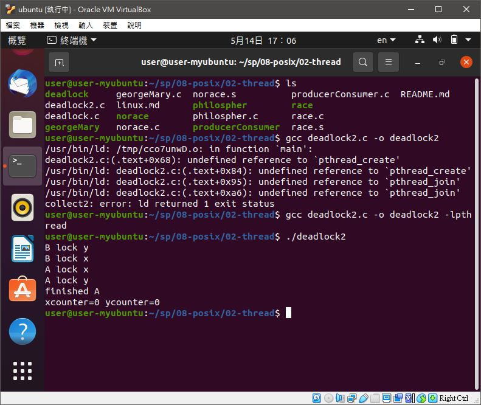
<details>
  <summary><b>Show code</b></summary>

  ```
#include <pthread.h>
#include <stdio.h>
#include <unistd.h>

pthread_mutex_t x;
pthread_mutex_t y;

int xcounter = 0;
int ycounter = 0;

void *A(); 
void *B(); 

int main(int argc, char *argv[])
{
    pthread_t threadA, threadB;
    pthread_attr_t attr;

    pthread_attr_init(&attr);
    pthread_mutex_init(&x, NULL);
    pthread_mutex_init(&y, NULL);

    pthread_create(&threadA, &attr, A, NULL);
    pthread_create(&threadB, &attr, B, NULL);

    pthread_join(threadA, NULL);
    pthread_join(threadB, NULL);

    pthread_mutex_destroy(&x);
    pthread_mutex_destroy(&y);
    printf("xcounter=%d ycounter=%d\n", xcounter, ycounter);
}

void *A() 
{
    pthread_mutex_lock(&x);
    printf("A lock x\n");
    xcounter ++;
    sleep(1);
    pthread_mutex_lock(&y);
    printf("A lock y\n");
    ycounter ++;
    pthread_mutex_unlock(&y); 
    pthread_mutex_unlock(&x); 

    printf("finished A\n");

    pthread_exit(0);
}

void *B()
{
    pthread_mutex_lock(&x);
    pthread_mutex_lock(&y);
    printf("B lock y\n");
    ycounter --;
    sleep(1);

    printf("B lock x\n");
    xcounter --;
    pthread_mutex_unlock(&x);
    pthread_mutex_unlock(&y);

    pthread_exit(0);
}
  ```
</details>

#### The result of execution
```
user@user-myubuntu:~/sp/08-posix/02-thread$ gcc deadlock2.c -o deadlock2 -lpthread
user@user-myubuntu:~/sp/08-posix/02-thread$ ./deadlock2
B lock y
B lock x
A lock x
A lock y
finished A
xcounter=0 ycounter=0
```

## 📖 補充資料
* [程式人月刊](https://medium.com/%E7%A8%8B%E5%BC%8F%E4%BA%BA%E6%9C%88%E5%88%8A)
* [死結deadlock](https://zh.wikipedia.org/wiki/%E6%AD%BB%E9%94%81)

🖊️editor : yi-chien Liu
