# 📝系統程式第九週筆記20210428
## 📖 單行程系統 & 多工系統
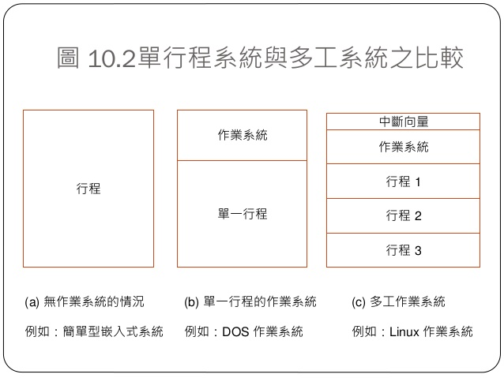

## 📖 Process & Thread

### 🔖 作業系統行程
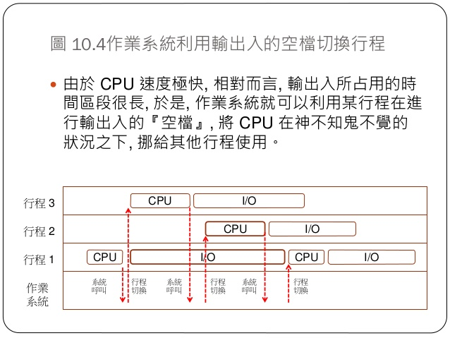
* Thread 在台灣被稱為『執行緒』，作業系統教科書中通常會定義 Process 為：執行中的程式。因此假如您開了一個 Word 檔案，那就是有一個 Word 行程在執行，如果您又開了個命令列，那就是又有一個命令列行程在執行，如果又開第二個命令列，那就有兩個命令列行程在執行。
* 每個 Process 與 Thread 都會執行，而且執行到一半很可能就會因為進行輸出入或佔用 CPU 過久而被作業系統切換出去，改換另一個 Process 或 Thread 執行，這種概念稱為 Multitasking (多工)。
### 🔖 行程的狀態
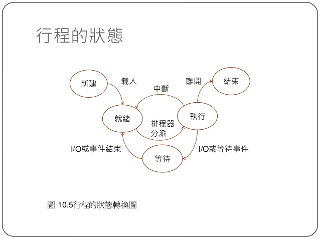
### 🔖 排程的方法
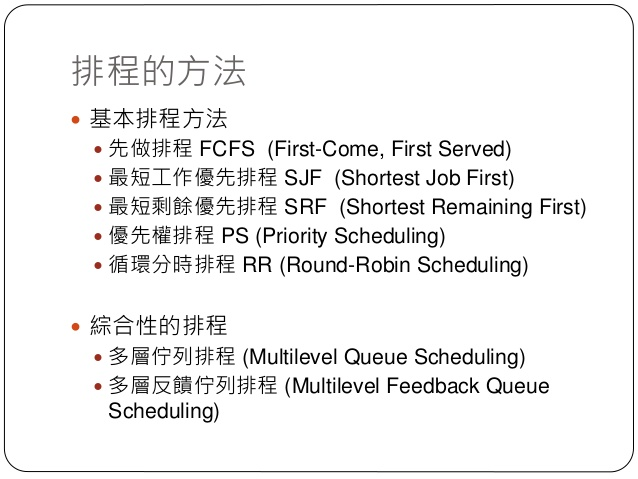

## 📖 記憶體管理
### 🔖 用途
* 有效管理記憶體除了能提高電腦的效率外，還可以保護電腦不受到駭客或惡意程式的入侵。
* C語言的記憶體分配與回收<br>
1.分配 : malloc()<br>
2.回收 : free()<br>
### 🔖 記憶體分配
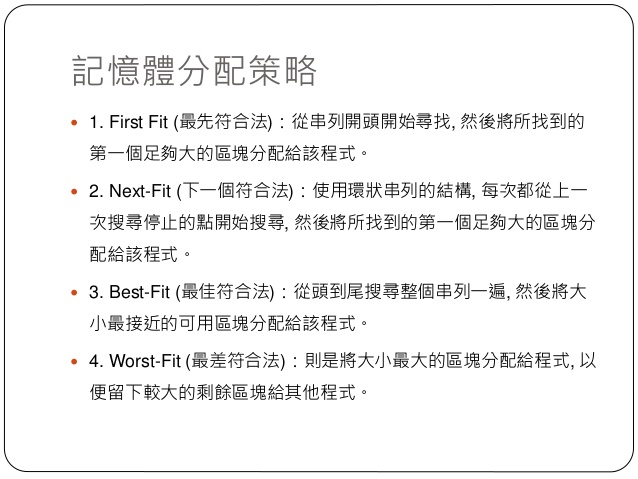
### 🔖 遇到問題
#### 記憶體不足 : <br>
1.直接回報錯誤 <br>
2.試圖處理記憶體不足的情況(記憶體聚集法 or 垃圾收集法)

## 📖 記憶體管理單元(MMU)硬體
### 🔖 重定位暫存器
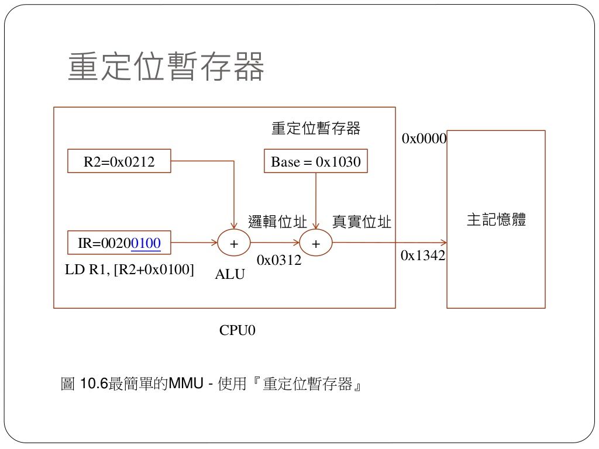
* 真實位置 = 邏輯位置 + 重定位暫存器位置
### 🔖 基底界限暫存器
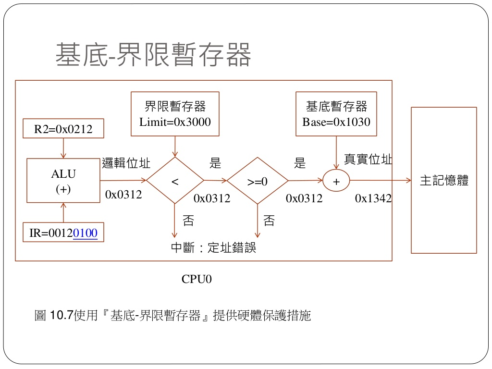
### 🔖 分段機制
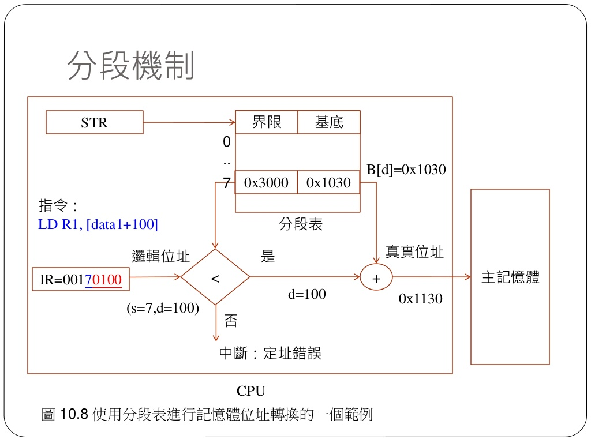
* 將程式所需要的記憶體空間大小的虛擬空間，通過對映機制對映到某個實體地址空間(對映的操作由硬體完成)。<br>
分段對映機制解決了之前作業系統存在的兩個問題：<br>
(1)地址空間沒有隔離<br>
(2)程式執行的地址不確定
### 🔖 分頁機制
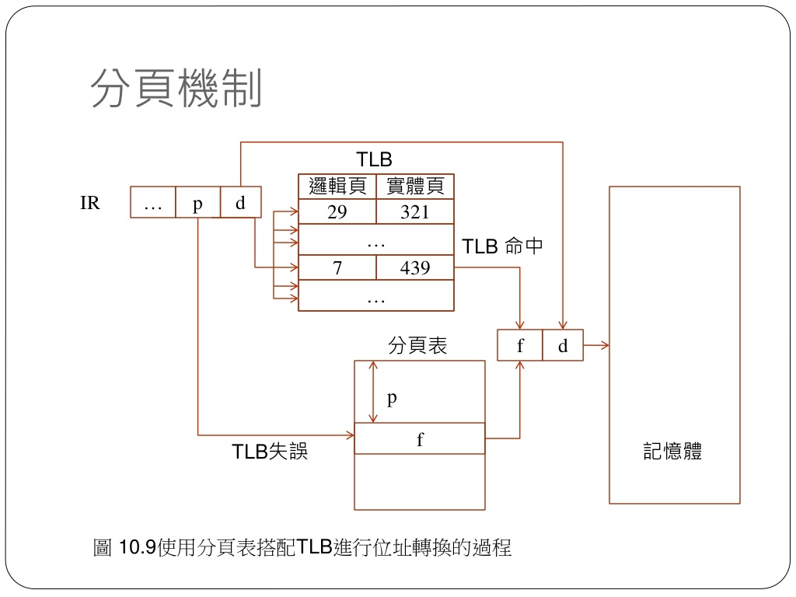
* 分頁機制解決了上面分段方法所存在的一個記憶體使用效率問題；其核心思想是系統為程式執行檔案中的第x頁分配了記憶體中的第y頁，同時y頁會新增到程序虛擬空間地址的對映表中(頁表)，這樣程式就可以通過對映訪問到記憶體頁y了。

## 💻 程式實際操作
### 🔗 08-posix/02-thread/race
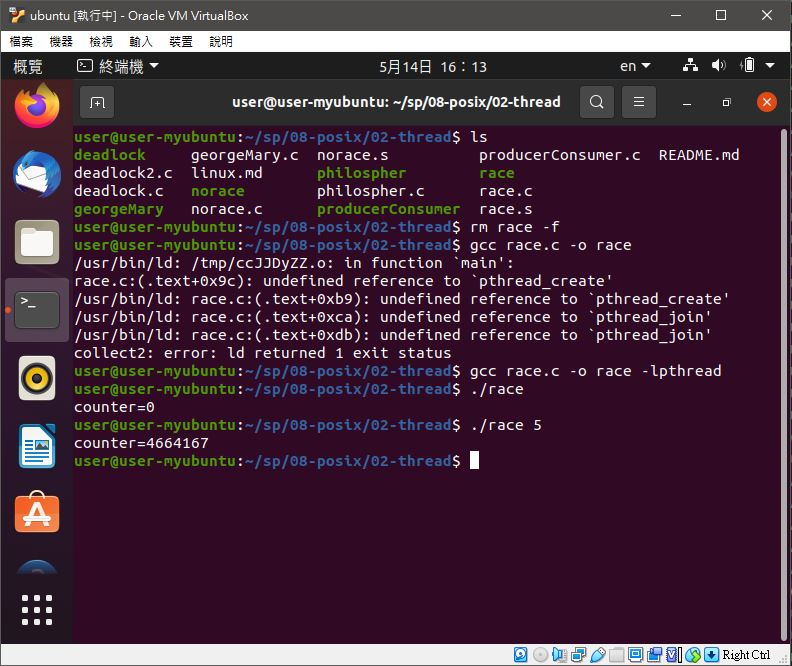
#### The result of execution
```
user@user-myubuntu:~/sp/08-posix/02-thread$ gcc race.c -o race -lpthread
user@user-myubuntu:~/sp/08-posix/02-thread$ ./race
counter=0
user@user-myubuntu:~/sp/08-posix/02-thread$ ./race
counter=4664167
```
#### 補充說明
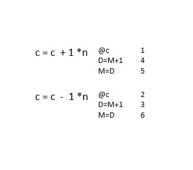

### 🔗 08-posix/02-thread/norace
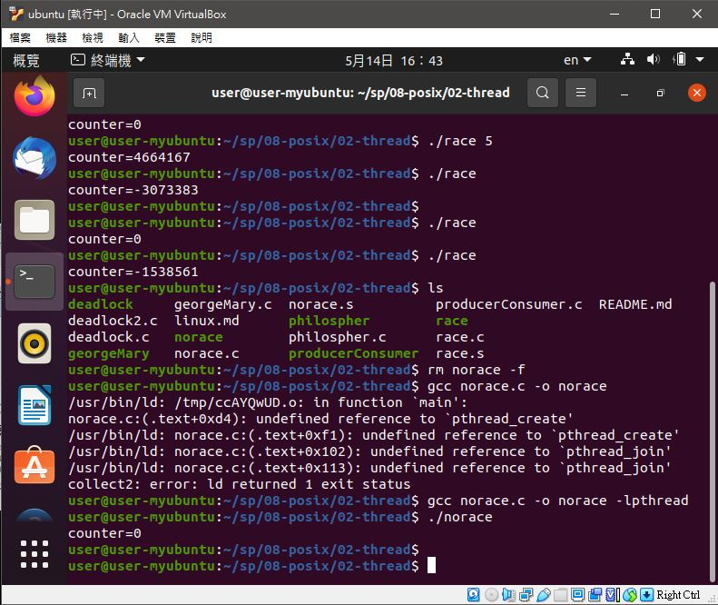
#### The result of execution
```
user@user-myubuntu:~/sp/08-posix/02-thread$ gcc norace.c -o norace -lpthread
user@user-myubuntu:~/sp/08-posix/02-thread$ ./norace 
counter=0
```

### 🔗 08-posix/02-thread/deadlock
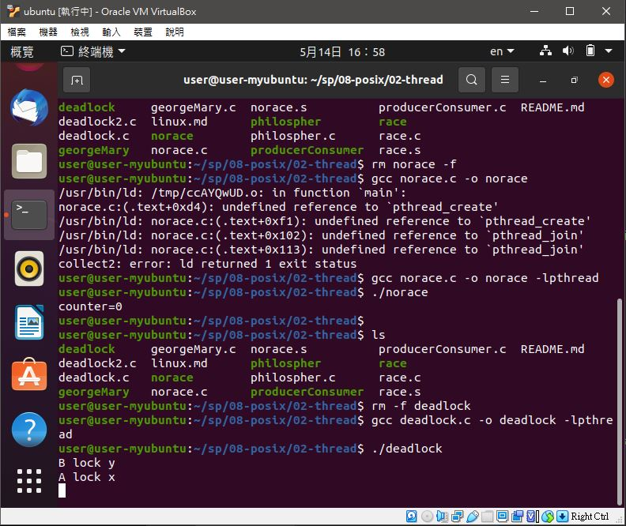
#### The result of execution
```
user@user-myubuntu:~/sp/08-posix/02-thread$ gcc deadlock.c -o deadlock -lpthread
user@user-myubuntu:~/sp/08-posix/02-thread$ ./deadlock 
B lock y
A lock x
```
#### 補充說明
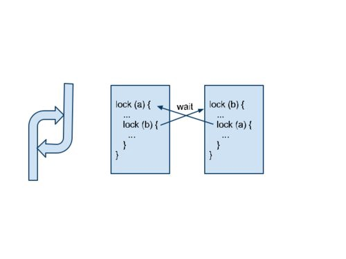
* 當程式 1 抓住資源 A，卻又在等程式 2 釋放資源 B，而程式 2 則抓住資源 B ，卻又在等程式 1 釋放資源 A 的時候，就會進入死結狀態。

### 🔗 08-posix/02-thread/deadlock2
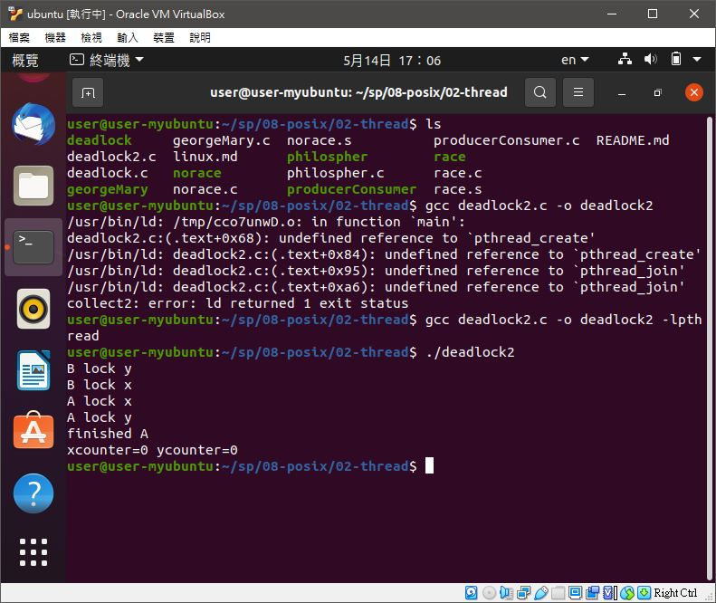
#### The result of execution
```
user@user-myubuntu:~/sp/08-posix/02-thread$ gcc deadlock2.c -o deadlock2 -lpthread
user@user-myubuntu:~/sp/08-posix/02-thread$ ./deadlock2
B lock y
B lock x
A lock x
A lock y
finished A
xcounter=0 ycounter=0
```

## 📖 補充資料
* [程式人月刊](https://medium.com/%E7%A8%8B%E5%BC%8F%E4%BA%BA%E6%9C%88%E5%88%8A)


🖊️editor : yi-chien Liu
